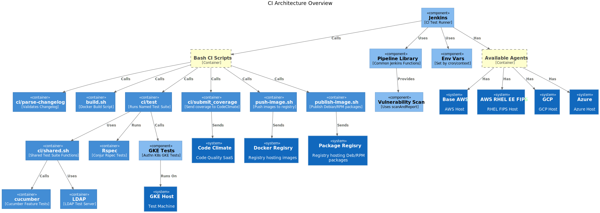
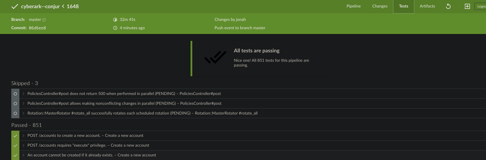
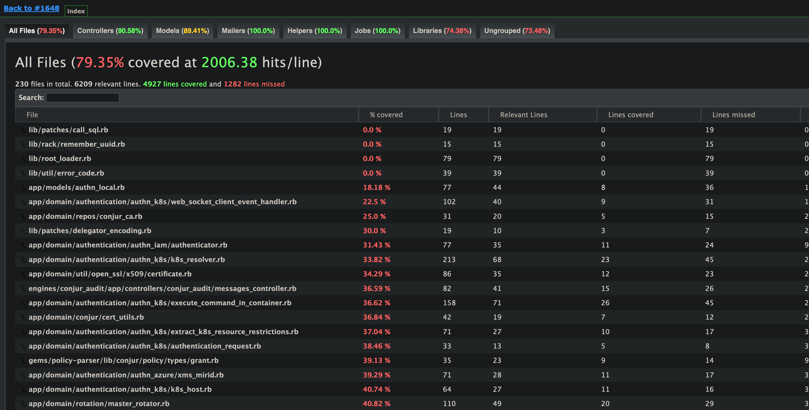

# Jenkins CI Architecture

- [Jenkins CI Architecture](#jenkins-ci-architecture)
  - [Overview](#overview)
  - [Jenkins Best Practice](#jenkins-best-practice)
  - [Jenkins Immediate Dependencies](#jenkins-immediate-dependencies)
  - [Bash Scripts](#bash-scripts)
    - [`ci/test`](#citest)
    - [GKE Tests](#gke-tests)
    - [`ci/submit_coverage`](#cisubmit_coverage)
    - [`ci/parse-changelog`](#ciparse-changelog)
  - [Displaying Test Results](#displaying-test-results)
    - [`junit`](#junit)
    - [`publishHTML`](#publishhtml)
 
## Overview

<i>Note: The diagram's categories (system, container, component) follow the
[C4 diagramming model](https://c4model.com/). In particular, the word
"container" in this context is unrelated to Docker containers.</i>

<!-- Note: This diagram can be re-regenerated by editing
public/img/README_CI.puml. The VS Code PlantUML extension provides a good
live-preview experience. -->

Our CI pipeline runs on Jenkins, and the main entrypoint is the `Jenkinsfile`
in the root directory.

The diagram above shows the relationships between the systems (external
services) and software components (bash scripts, ruby gems, etc) used by
Jenkins

Jenkins has many dependencies, relies on multiple external systems, and
delegates to many scripts to achieve its testing and reporting goals.

## Jenkins Best Practice

We try to keep the workload on the main Jenkins executor
as light as possible, with individual tests
or other CPU or memory intensive work running on separate agents.  The main executor should be a coordinator, kicking off other processes and collecting 
their results.

## Jenkins Immediate Dependencies

The `Jenkinsfile` itself has 3 main dependencies:

1. **Our many bash scripts.** These are located in the root directory root
and under `ci`, and perform, or delegate, the real work of the CI -- running
tests in cucumber or rspec, processing test results, and spinning up
infrastructure in cases where Jenkins agents aren't available (see the GKE
section).

2. **Jenkins functions.** In addition to the [built-in Jenkins
functionality](https://www.jenkins.io/doc/book/pipeline/syntax/), this
includes a number of [custom Jenkins
functions](https://github.com/conjurinc/jenkins-pipeline-library/tree/master/vars)
that we maintain ourselves.

   One notable example is `scanAndReport`, which, with a single function call
   from the `Jenkinsfile`, runs vulnerability scans and reports their results.

3. **Environment variables.** These are set automatically by Jenkins,
depending on the context that triggers the CI run. It includes variables like
`env.BRANCH_NAME` and `env.STAGE_NAME`, for example. [Here is a full
list](https://devopsqa.wordpress.com/2019/11/19/list-of-available-jenkins-environment-variables/).

More on these below.

## Bash Scripts

### `ci/test`

The is the standard and recommended way to run a test suite. It should always
be used when possible. Specific instructions for creating a new test suite,
and for calling cucumber from within it, are in the top comments of the
`ci/test` file.

### GKE Tests

Our Jenkins infrastructure does not provide GKE agents because:

> GKE is kubernetes, and docker on kubernetes is a massive nightmare, and
> Jenkins executors on kubernetes is a nightmare, and we wouldn’t really gain
> anything beyond it running within the google cloud environment.
>
> -- Matthew Brace

This means that to test on GKE we must handle spinning up GKE hosts manually.
The code that does this lives under `ci/authn-k8s`.

This GKE tests' entrypoint -- `ci/authn-k8s/test.sh` -- is an exception to
the normal pattern. It hasn't yet been refactored to fit the `ci/test`
pattern, but should be.

### `ci/submit_coverage`

This is the script that submits our coverage reports to CodeClimate.

It's worth calling out, because it's more complex than you might expect. Its
complexity stems from the constraint that the entire report must be sent to
CodeClimate in one go. Because of this, we have to wait till all tests are
complete and merge their json before sending them.

### `ci/parse-changelog`

This validates that the `CHANGELOG.md` is correctly formatted. It runs
quickly and is invoked on every CI run.

## Displaying Test Results

### `junit`

The Jenkins `junit` command is a plugin that processes test results and can
then render them in different ways -- like this display in the Blue Ocean
"Test" tab:

### `publishHTML`

Similarly, publishHTML makes test coverage reports available:

