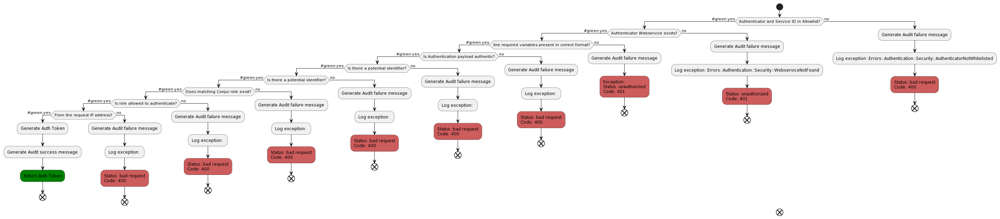
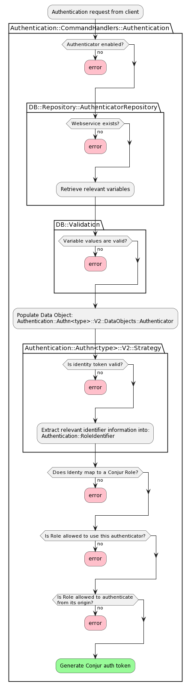

# Authenticators

Version 2 of the Conjur Authenticator Architecture marks substantial deviation
from the version 1 architecture.

*Note: this document will not cover V1 architecture, only V2.*

## Overview

- [Authenticators](#authenticators)
  - [Overview](#overview)
    - [Authentication Workflow Paths](#authentication-workflow-paths)

  - [Components](#components)
    - [Generic Components](#generic-components)

    - [Authenticator-specific Components](#authenticator-specific-components)
      - [Component Interfaces](#component-interfaces)
      - [Authenticator Data Object](#authenticator-data-object)

    - [Authenticator Validations](#authenticator-validations)
      - [Strategy](#strategy)
      - [Authenticator Repository](#authenticator-repository)
      - [Authentication Handler](#authentication-handler)

  - [Developing Authenticators](#developing-authenticators)

### Authentication Workflow Paths

The following diagram provides an overview of the authentication steps:



## Components

### Generic Components

These components are related to the overall authentication process.

- `Authentication::CommandHandlers::Authentication` - handles all aspects of
  the authentication cycle. This class delegates Strategy and Validation to the
  specific authenticator being used.

- `DB::Repository::AuthenticatorRepository` - interface for querying for all
  or a single authenticator. This allows all relevant authenticator variable
  values to be retrieved in a single request.

- `DB::Validation` - runs a provided set of validations against a target set
  of data. This interface provides a generic interface for re-mapping
  `Dry::Validation::Contract` errors to Conjur specific errors.

- `Authentication::Util::NamespaceSelector` - \[Temporary Shim] selects the
correct authenticator namespace to load authenticators components from.

- `Authentication::Util::V2::KlassLoader` - interface which attempts to load
  validation libraries. This allows authenticator validations to be optional.

- `Authentication::Util::NetworkTransporter` - provides a generic mechanism
  for making HTTP calls. This utility handles setting CA certificates on a
  per-call basis.

- `Authentication::RoleIdentifier` - data object returned by an authenticator
  strategy. This object includes the target Conjur role as well as any potential
  values which should be compared to the Role's annotations.

- `Authentication::InstalledAuthenticators` - provides an allowlist of
  authenticators which have been enabled.

- `RBAC::Permission` - provides a generic interface to resolve the "does 'x'
   have 'y' permissions on 'z'?" question.

- `TokenFactory` - mints Conjur authentication tokens for a provided role.

### Authenticator-specific Components

These components are unique to each of our various authenticators.

- **(Required)** `Authentication::Authn<type>::V2::Strategy` - defines the
  process through which a provided credential is validated and mapped to a
  potential Conjur resource.

- **(Required)** `Authentication::Authn<type>::V2::DataObjects::Authenticator` -
  defines the variables (and optionally default values) an authenticator
  requires. These are instantiated via data from the
  `DB::Repository::AuthenticatorRepository`.

- **(Optional)** `Authentication::Authn<type>::V2::Validations::AuthenticatorConfiguration` -
defines the specific. These validations are loaded via the `KlassLoader`.

The following diagram provides an overview of the components used during the
authentication cycle:



#### Component Interfaces

#### Authenticator Data Object

Authenticator Data objects are dumb objects. They are initialized with all
relevant authenticator data and should include reader methods for all
attributes. Additional helper methods can be added, but these methods should
be limited to providing alternative views of its core data.

The following is the simplest example of an Authenticator Data Object:

```ruby
# frozen_string_literal: true

module Authentication
  module Authn<type>
    module V2
      module DataObjects

        # This DataObject encapsulates the data required for an Authn-<type> authenticator.
        #
        # DataObjects must enherit from the Base data object (which includes a variety of helper methods).
        class Authenticator < Authentication::Base::DataObject

          # add additional variables (if any).
          # attr_reader()

          # Authn <type> has no variables. Add named params if this authenticator has variables.
          def initialize(account:, service_id:)
            super(account: account, service_id: service_id)

            # If this authenticator has a non-standard TTL:
            # @token_ttl = token_ttl.present? ? token_ttl : 'PT60M'
          end
        end
      end
    end
  end
end
```

### Authenticator Validations

Authenticator validations provide a mechanism for validating authenticator data
prior to initializing an Authenticator Data Object.

Example: `Authentication::AuthnOidc::V2::Validations::AuthenticatorConfiguration`

Contracts are extended from the
[Dry RB Validation library](https://dry-rb.org/gems/dry-validation/1.8/).
They work by defining a schema:

```ruby
module Authentication
  module AuthnOidc
    module V2
      module Validations
        class AuthenticatorConfiguration < Authentication::Base::Validations
          schema do
            required(:account).value(:string)
            required(:service_id).value(:string)

            optional(:provider_uri).value(:string)
            optional(:ca_cert).value(:string)
            ...
          end
          ...
        end
      end
    end
  end
end
```

This defines the required and optional data as well as the type. As Conjur
Variables store values as strings, they type will always be `String`.

With a schema defined, we can check data validity with rules:

```ruby
# Ensure claims has only one `:` in it
rule(:claim_aliases) do
  bad_claim = values[:claim_aliases].to_s.split(',').find do |item|
    item.count(':') != 1
  end
  if (bad_claim.present?)
    key.failure(
      **response_from_exception(
        Errors::Authentication::AuthnOidc::ClaimAliasNameInvalidCharacter.new(
          bad_claim
        )
      )
    )
  end
end
```

These rules are executed, top to bottom, additively.

Contracts return a Success or Failure response, with either the successful
result or a list of errors. We are using some trickery to mimic the existing
Exception driven workflow for validation. By calling `failure` with desired
exception formatted with `response_from_exception`, we are defining the
desired exception that should be raised. The `AuthenticatorRepository` will
raise the first exception resulting from the contract validation.

#### Strategy

A strategy handles the external validation of the provided identity. It
follows the Command class pattern.

Example: `Authentication::AuthnOidc::V2::Strategy`

At minimum, a Strategy requires the following methods

```ruby
# Initializer
#
# @param [Authenticator] authenticator - Authenticator Data Object that holds
#       all relevant authenticator specific information.
#
# Note: additional dependencies should be defined as default parameters
def initialize(authenticator:)
  @authenticator = authenticator
  ...
end
```

```ruby
# Verifies the validity of the contents of the provided request body and/or
#       request parameters
#
# @param [String] request_body - authentication request body
# @param [Hash] parameters - authentication request parameters
#
# @return something suitable for identifying a Conjur Role (usually a String
#        or Hash)
def callback(request_body:, parameters:)
  ...
end
```

Strategies should be stateless and follow the pattern of dependency injection to
allow network requests to be mocked during testing.

#### Authenticator Repository

Class: `DB::Repository::AuthenticatorRepository`

The Authenticator provides a high-level interface over the Conjur Policy and
Variables associated with an Authenticator. The Authenticator Repository can
query for a single authenticator or all authenticators of a certain type.

The repository works by identifying the relevant authenticator webservice(s)
and loading the relevant authenticator variables and values. These variables
are returned as either a Hash or an Array of Hashes.

For a more detailed overview of how the Authenticator Repository works,
[review its implementation](https://github.com/cyberark/conjur/blob/master/app/db/repository/authenticator_repository.rb).

#### Authentication Handler

class `Authentication::CommandHandlers::Authentication`

The Authentication Handler encapsulates the authentication process. It handles
the mix of generic checks (authenticator exists, is enabled, role is allowed to
authenticate from IP address, etc.) as well as calling the appropriate Strategy
and Identity Resolution implementations.

The Authentication Handler handles the following:

- Selects the appropriate Authenticator Data Object, Contract, Strategy, and
  Identity Resolver based on the desired authenticator type (`authn-jwt`/
  `authn-oidc`/etc.)

- Verifies that authenticator:

  - Can be used (is enabled)
  - Is available (exists for desired account)
  - Includes a webservice
  - Is not misconfigured (using the Validations)

- Performs verification and role resolution

- Verifies role is allowed to authenticate from its origin (IP address or
    network mask)

- Audits success/failure

- Generates an auth token with appropriate TTL (time to live)

## Developing Authenticators

The prior authenticator implementation placed an emphasis on functional
isolation. This created challenges when authenticators used common mechanisms
for validating and identifying token. For example, `authn-azure` and
`authn-gcp` both use OpenID Connect JWT tokens. This means they duplicate
functionality in `authn-oidc` and `authn-jwt`, which makes development quite
complicated.

The new architecture emphasizes stateless strategies. This allows us to easily
create authenticators which are specific implementations of a more generic
authenticator. As an example, `authn-oidc` performs two actions:

1. Exchange a code for n bearer token
1. Validates a JWT token from that bearer token

To avoid code duplication, the `authn-oidc` extends the `authn-jwt` strategy.
The OIDC strategy handles the code exchange and extracts the JWT token. It then
delegates the JWT validation to the `authn-jwt` strategy. This follows the
Single Responsibility Principle, and keeps the scope of our strategies easy to
reason about.
