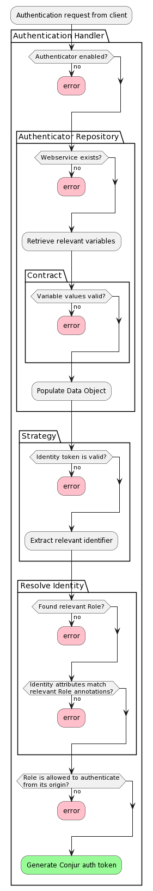

# Authenticators (V2)

Version 2 of the Conjur Authenticator Architecture marks substantial deviation
from the version 1 architecture.

*Note: this document will not cover V1 architecture, only V2.*

## Workflow

The following is a high-level overview of how a request moves through the
authentication cycle.



## Architecture

The new Authenticator Framework consists of several components, both
authenticator agnostic and specific.

**Authenticator Agnostic Components**:

- Authentication Handler - Handles all aspects of the authentication cycle,
 delegating authenticator-specific bits out to that authenticator via a
 standard interface.
- Status Handler - Handles all aspects of the authenticator status checks,
  delegating authenticator-specific bits out to that authenticator via a
  standard interface.
- Authenticator Repository - Retrieves relevant authenticator variable secrets
  relevant for a particular authenticator, or a set of authenticators.

**Authenticator Specific Components**:

- Data Object - a simple class to hold data relevant to an authenticator
  implementation.
- Data Contract - defines the allowed characteristics of data intended for the
  Data Object.
- Strategy - validates the authenticity of an external identity token (ex. JWT
  token).
- Identity Resolver - identifies the appropriate Conjur Role based on the
  identity resolved in the strategy.

### Interfaces

#### Authenticator Data Object

Authenticator Data objects are dumb objects. They are initialized with all
relevant authenticator data and should include reader methods for all attributes.
Additional helper methods can be added, but these methods should be limited to
providing alternative views of its core data (ex. `resource_id` method below).

Example: `Authentication::AuthnJwt::V2::DataObjects::Authenticator`

At minimum, the authenticator data object requires the following methods:

```ruby
def initialize(account:, service_id:, token_ttl: 'PT8M', ...)
```

```ruby
# Provides the resource webservice identifier
def resource_id
  "#{@account}:webservice:conjur/authn-jwt/#{@service_id}"
end
```

```ruby
# Returns a parsed ISO8601 duration
def token_ttl
  ActiveSupport::Duration.parse(@token_ttl)
rescue ActiveSupport::Duration::ISO8601Parser::ParsingError
  raise Errors::Authentication::DataObjects::InvalidTokenTTL.new(
    resource_id,
    @token_ttl
  )
end
```

#### Authenticator Data Contract

The data contract provides validation for data prior to initializing an
Authenticator Data Object.

Example: `Authentication::AuthnJwt::V2::DataObjects::AuthenticatorContract`

Contracts are extended from the
[Dry RB Validation library](https://dry-rb.org/gems/dry-validation/1.8/).
They work by defining a schema:

##### **Schemas**

```rb
module Authentication
  module AuthnJwt
    module V2
      module DataObjects
        class AuthenticatorContract < Dry::Validation::Contract

          schema do
            required(:account).value(:string)
            required(:service_id).value(:string)

            optional(:jwks_uri).value(:string)
            optional(:public_keys).value(:string)
            ...
          end
          ...
        end
      end
    end
  end
end
```

which defines the required and optional data as well as the type. As Conjur
Variables store values as strings, they type will always be `String`.

##### **Validation Rules**

With a schema defined, we can check data validity with rules:

```ruby
# Ensure claims has only one `:` in it
rule(:claim_aliases) do
  bad_claim = values[:claim_aliases].to_s.split(',').find do |item|
    item.count(':') != 1
  end
  if (bad_claim.present?)
    key.failure(
      **response_from_exception(
        Errors::Authentication::AuthnJwt::ClaimAliasNameInvalidCharacter.new(
          bad_claim
        )
      )
    )
  end
end
```

These rules are executed, top to bottom, additively.

Contracts return a Success or Failure response, with either the successful
result or a list of errors. We are using some trickery to mimic the existing
Exception driven workflow for validation. By calling `failure` with desired
exception formatted with `response_from_exception`, we are defining the
desired exception that should be raised. The `AuthenticatorRepository` will
raise the first exception resulting from the contract validation.

#### Strategy

A strategy handles the external validation of the provided identity. It
follows the Command class pattern.

Example: `Authentication::AuthnJwt::V2::Strategy`

At minimum, a Strategy requires the following methods

```ruby
# Initializer
#
# @param [Authenticator] authenticator - Authenticator Data Object that holds
#       all relevant authenticator specific information.
#
# Note: additional dependencies should be defined as default parameters
def initialize(authenticator:)
  @authenticator = authenticator
  ...
end
```

```ruby
# Verifies the validity of the contents of the provided request body and/or
#       request parameters
#
# @param [String] request_body - authentication request body
# @param [Hash] parameters - authentication request parameters
#
# @return something suitable for identifying a Conjur Role (usually a String
#        or Hash)
def callback(request_body:, parameters:)
  ...
end
```

Strategies should be stateless and follow the pattern of dependency injection to
allow network requests to be mocked during testing.

#### Identity Resolver

An Identity Resolver matches the external identity, identified and verified in
the Strategy, to a Conjur identity.

Example: `Authentication::AuthnJwt::V2::ResolveIdentity`

At minimum, an Identity Resolver requires the following methods:

```ruby
# Initializer
#
# @param [Authenticator] authenticator - Authenticator Data Object that holds
# all relevant authenticator specific information.
#
# Note: additional dependencies should be defined as default parameters
def initialize(authenticator:)
  @authenticator = authenticator
end
```

```ruby
# Resolves the provided identifier or id to one of the allowed roles
#
# @param [Hash/String] identifier - the role identifier established by the
#     Strategy
# @param [String] account - request account
# @param [Array] allowed_roles  - an array of roles with permission to
#     authenticate using this authenticator
# @param [String] id - the request id parameter if present in the URL
#
# @return [Role] - Conjur Role corresponding to the provided identity
def call(identifier:, account:, allowed_roles:, id: nil)
  ...
end
```

#### Authenticator Repository

Class: `DB::Repository::AuthenticatorRepository`

The Authenticator provides a high-level interface over the Conjur Policy and
Variables associated with an Authenticator. The Authenticator Repository can
query for a single authenticator or all authenticators of a certain type.

The repository works by identifying the relevant authenticator webservice(s)
and loading the relevant authenticator variables and values. These variables
are validated against the relevant authenticator contract before returning a
single (or array of), authenticator data object(s).

For a more detailed overview of how the Authenticator Repository works,
[review its implementation](https://github.com/cyberark/conjur/blob/master/app/db/repository/authenticator_repository.rb).

#### Authentication Handler

class `Authentication::Handler::AuthenticationHandler`

The Authentication Handler encapsulates the authentication process. It handles
the mix of generic checks (authenticator exists, is enabled, role is allowed to
authenticate from IP address, etc.) as well as calling the appropriate Strategy
and Identity Resolution implementations.

The Authentication Handler handles the following:

- Selects the appropriate Authenticator Data Object, Contract, Strategy, and
  Identity Resolver based on the desired authenticator type (`authn-jwt`/
  `authn-oidc`/etc.)
- Verifies that authenticator:
  - Can be used (is enabled)
  - Is available (exists for desired account)
  - Includes a webservice
  - Is not misconfigured (using the Contract)
- Performs verification and role resolution
- Verifies role is allowed to authenticate from its origin (IP address or
  network mask)
- Audits success/failure
- Generates an auth token with appropriate TTL (time to live)

#### Status Handler

Class: `Authentication::Handler::StatusHandler`

The Status Handler encapsulates the authenticator status check process. It
checks a variety of configurations to aid in authenticator troubleshooting.

The Status Handler handles the following:

- Selects the appropriate Authenticator Data Object, Contract, and Strategy
  based on the desired authenticator type (`authn-jwt`/`authn-oidc`/etc.)
- Verifies that authenticator:
  - Can be used (is enabled)
  - Is available (exists for desired account)
  - Includes an authenticator webservice and authenticator status webservice
  - Role is allowed to use the authenticator status
  - Authenticator is not misconfigured (using the Contract)
  - Strategy is correctly configured
