# Policy Factory

## Setup

Setup will follow the following workflow:

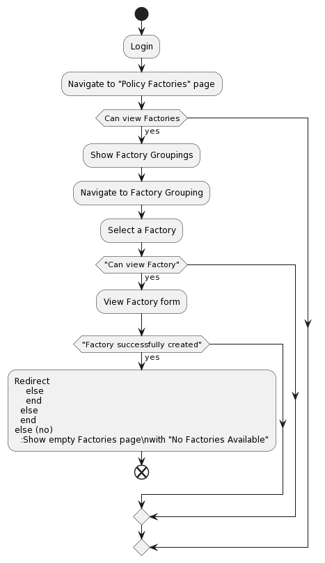

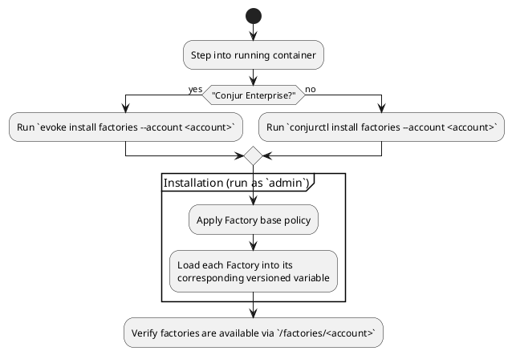

## Factory Upgrade

Upgrades will follow the following workflow:

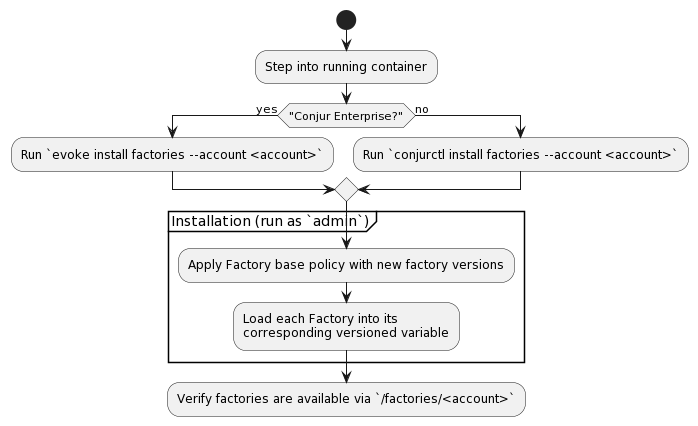

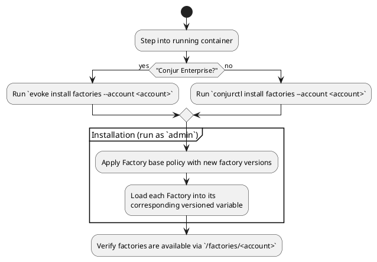

## View all Policy Factories

A role is limited to viewing the Factories they have permission (`execute`) to see.
If a role can see a factory, they will be able to see errors in mis-configured Factories.

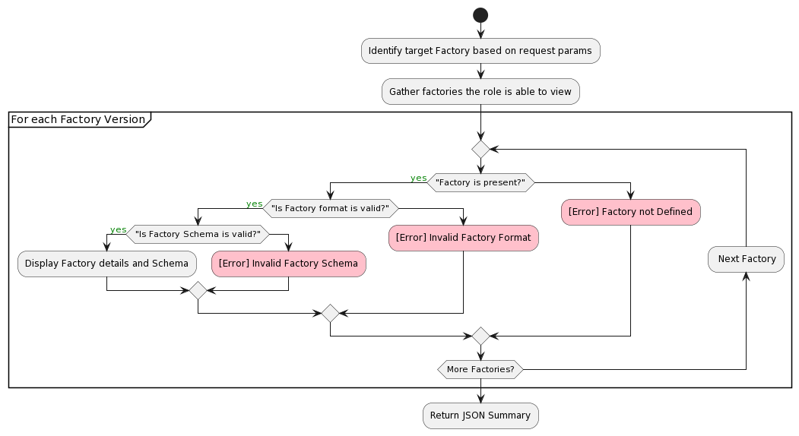

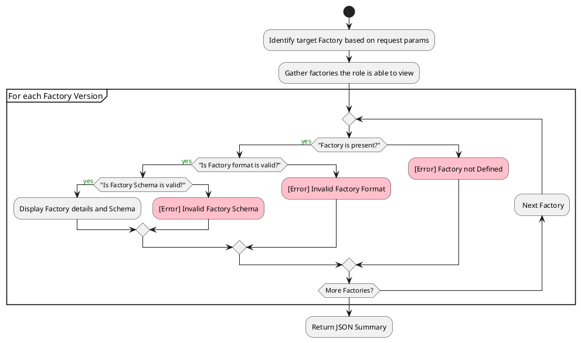

## Policy Factory Info Requests

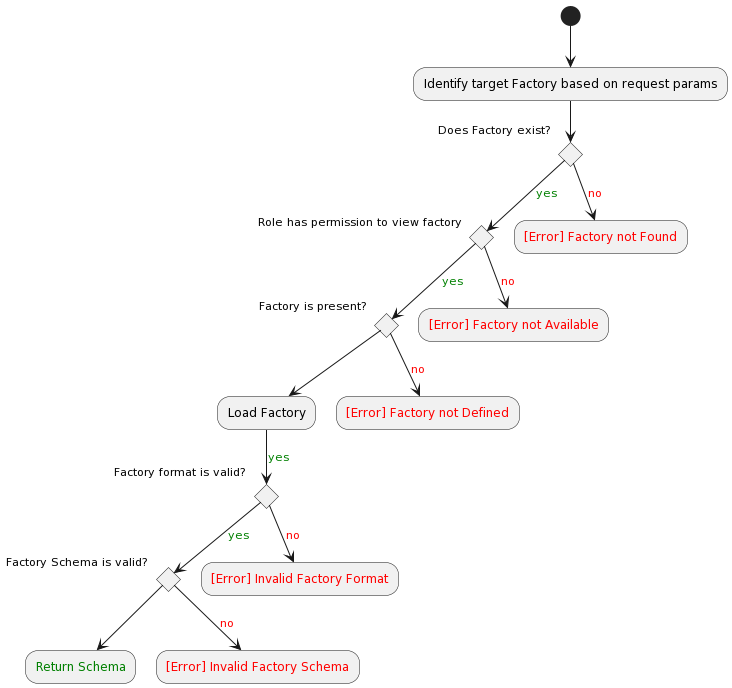

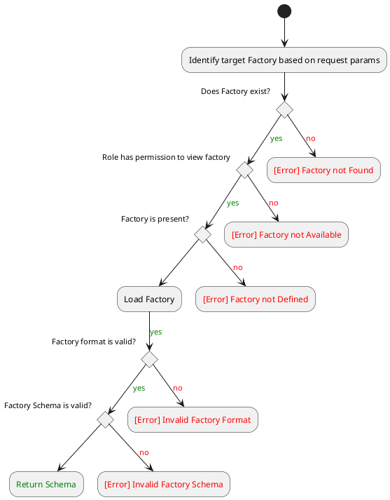

## Policy Factory Creation Requests

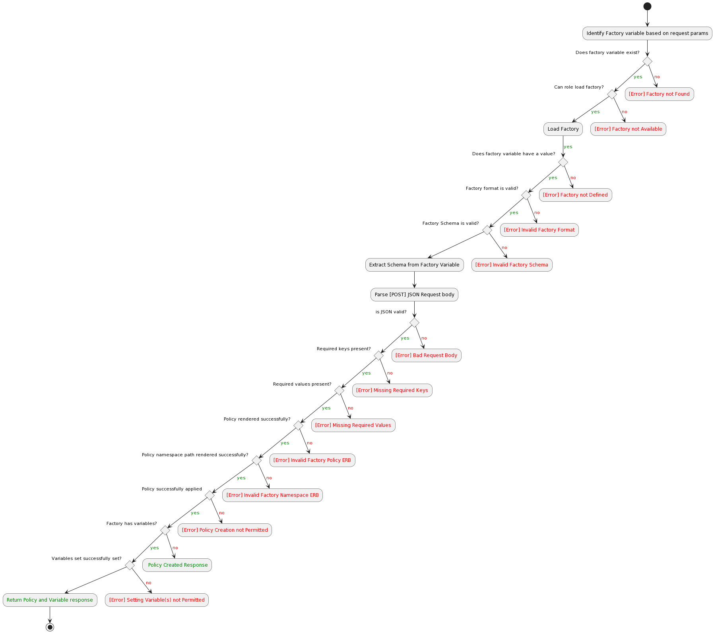

```plantuml
@startuml factory-create-request
(*)  --> "Identify Factory variable based on request params"
if "Does factory variable exist?" then
  --> [<color:green>yes] if "Can role load factory?" then
    --> [<color:green>yes] "Load Factory"
    --> [<color:green>yes] if "Does factory variable have a value?" then
      --> [<color:green>yes] if "Factory format is valid?" then
        --> [<color:green>yes] if "Factory Schema is valid?" then
          --> "Extract Schema from Factory Variable"
          --> "Parse [POST] JSON Request body"
          --> if "is JSON valid?"
            --> [<color:green>yes] if "Required keys present?"
              --> [<color:green>yes] if "Required values present?"
                --> [<color:green>yes] if "Policy rendered successfully?"
                  --> [<color:green>yes] if "Policy namespace path rendered successfully?"
                    --> [<color:green>yes] if "Policy successfully applied"
                      --> [<color:green>yes] if "Factory has variables?"
                        --> [<color:green>yes] if "Variables set successfully set?"
                          --> "<color:green>Return Policy and Variable response"
                          ' note left
                          '   Response Code: 200
                          '   Response: {"response": {
                          '     "code": 200,
                          '     "created_resources": [
                          '       "<account>:<type>:<identifier>",
                          '       {"<account>:host:<identifier>": {"api_key": "<api-key>"}},
                          '       "<account>:variable:<identifier>"
                          '     ]
                          '   }}
                          ' end note
                          --> (*)
                        else
                          --> [<color:red>no] "<color:red>[Error] Setting Variable(s) not Permitted"
                          ' note right
                          '   Response Code: 401
                          '   Response {"error": {
                          '     "code": 401,
                          '     "error": "Role is not permitted to set the following secrets in this factory: 'secret-1', 'secret-2'",
                          '     "fields": [
                          '       "secret-1",
                          '       "secret-2"
                          '     ]
                          '   }}
                          '   Log Level: Error
                          '   Log Message: Role '<role-identifier>' is not permitted to create the following factory variables the '<target-namespace>': 'secret-1', 'secret-2'
                          ' end note
                        endif
                      else
                        --> [<color:red>no] "<color:green> Policy Created Response"
                        ' note left
                        '   Response Code: 200
                        '   Response: {"response": {
                        '     "code": 200,
                        '     "created_resources": [
                        '       "<account>:<type>:<identifier>",
                        '       {"<account>:host:<identifier>": {"api_key": "<api-key>"}}
                        '     ]
                        '   }}
                        ' end note
                      endif
                    else
                      --> [<color:red>no] "<color:red>[Error] Policy Creation not Permitted"
                      ' note left
                      '   Response Code: 401
                      '   Response {"error": {
                      '     "code": 401,
                      '     "error": "Role is not permitted to create a factory in this policy"
                      '   }}
                      '   Log Level: Error
                      '   Log Message: Role '<role-identifier>' is not permitted to create a factory in the '<target-namespace>'
                      ' end note
                    endif
                  else
                    --> [<color:red>no] "<color:red>[Error] Invalid Factory Namespace ERB"
                    ' note left
                    '   Response Code: 400
                    '   Response: {"error": {
                    '     "code": 400,
                    '     "error": "Policy Factory Namespace Template contains invalid ERB"
                    '   }}
                    '   Log Level: Error
                    '   Log Message Policy Factory 'conjur/factories/core/<name>' Namespace Template contains invalid ERB
                    ' end note
                  endif
                else
                  --> [<color:red>no] "<color:red>[Error] Invalid Factory Policy ERB"
                  ' note left
                  '   Response Code: 400
                  '   Response: {"error": {
                  '     "code": 400,
                  '     "error": "Policy Factory Policy Template contains invalid ERB"
                  '   }}
                  '   Log Level: Error
                  '   Log Message Policy Factory 'conjur/factories/core/<name>' Policy Template contains invalid ERB
                  ' end note
                endif
              else
                --> [<color:red>no] "<color:red>[Error] Missing Required Values"
                ' note left
                '   Response Code: 400
                '   Response: {"error": {
                '     "code": 400,
                '     "message": "The following fields are missing values: 'field-1', 'field-2'",
                '     "fields": [
                '       {"field-1": { "error": "cannot be empty" }},
                '       {"field-2": { "error": "cannot be empty" }}
                '     ]}}
                '   Log Level: Error
                '   Log Message: The following fields are missing values in the request JSON body: 'field-1', 'field-2'
                ' end note
              endif
            else
              --> [<color:red>no] "<color:red>[Error] Missing Required Keys"
              ' note left
              '   Response Code: 400
              '   Response: {"error": {
              '     "code": 400,
              '     "message": "The following fields are missing: 'field-1', 'field-2'",
              '     "fields": [
              '       {"field-1": { "error": "must be present" }},
              '       {"field-2": { "error": "must be present" }}
              '     ]
              '   }}
              '   Log Level: Error
              '   Log Message: The following fields are missing from the request JSON body: 'field-1', 'field-2'
              ' end note
            endif
          else
            --> [<color:red>no] "<color:red>[Error] Bad Request Body"
            ' note left
            '   Response Code: 400
            '   Response: {"error": {
            '     "code": 400,
            '     "message": "Request JSON contains invalid syntax"
            '   }}
            '   Log Level: Error
            '   Log Message: Request JSON contains invalid syntax
            ' end note
          endif
        else
          --> [<color:red>no] "<color:red>[Error] Invalid Factory Schema"
        endif
      else
        --> [<color:red>no] "<color:red>[Error] Invalid Factory Format"
      endif
    else
      --> [<color:red>no] "<color:red>[Error] Factory not Defined"
      ' note left
      '   Response Code: 400
      '   Response: {"error": {
      '     "code": 400,
      '     "resource": "conjur/factories/core/<name>",
      '     "message": "Requested Policy Factory is empty"
      '   }}
      '   Log Level: Error
      '   Log Message: Policy Factory Variable "conjur/factories/core/<name>" is empty
      ' end note
    endif
  else
    --> [<color:red>no] "<color:red>[Error] Factory not Available"
    ' note left
    '   Response Code: 403
    '   Response: {"error": {
    '     "code": 403,
    '     "resource": "core/<name>",
    '     "message": "Factory is not available"
    '   }}
    '   Log Level: Error
    '   Log Message: Policy Factory "core/<name>" is not available
    ' end note
  endif
else
  --> [<color:red>no] "<color:red>[Error] Factory not Found"
  ' note left
  '   Response Code: 404
  '   Response: {"error": {
  '       "code": 404,
  '       "resource": "conjur/factories/core/<name>",
  '       "message": "Requested Policy Factory does not exist"
  '     }}
  '   Log Level: Error
  '   Log Message: Policy Factory Variable "conjur/factories/core/<name>" does not exist
  ' end note
endif
@enduml
```

## Policy Factory Creation Requests (beta)

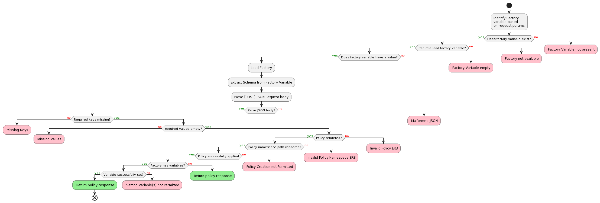

```plantuml
@startuml
start
:Identify Factory\nvariable based\non request params;
if (Does factory variable exist?) then (<color:green>yes)
  if (Can role load factory variable?) then (<color:green>yes)
    if (Does factory variable have a value?) then (<color:green>yes)
      :Load Factory;
      :Extract Schema from Factory Variable;
      :Parse [POST] JSON Request body;
      ' :Extract Schema from Factory;
      if (Parse JSON body?) then (<color:green>yes)
        if (Required keys missing?) then (<color:red>no)
          #pink: Missing Keys;
          ' note right
          '   Response Code: 400
          '   Response: {"error": {
          '     "code": 400,
          '     "message": "The following fields are missing: 'field-1', 'field-2'",
          '     "fields": [
          '       {"field-1": { "error": "must be present" }},
          '       {"field-2": { "error": "must be present" }}
          '     ]
          '   }}
          '   Log Level: Error
          '   Log Message: The following fields are missing from the request JSON body: 'field-1', 'field-2'
          ' end note
          kill
        else (<color:green>yes)
          if (required values empty?) then (<color:red>no)
            #pink: Missing Values;
            ' note right
            '   Response Code: 400
            '   Response: {"error": {
            '     "code": 400,
            '     "message": "The following fields are missing values: 'field-1', 'field-2'",
            '     "fields": [
            '       {"field-1": { "error": "cannot be empty" }},
            '       {"field-2": { "error": "cannot be empty" }}
            '     ]}}
            '   Log Level: Error
            '   Log Message: The following fields are missing values in the request JSON body: 'field-1', 'field-2'
            ' end note
            kill
          else (<color:green>yes)
            if (Policy rendered?) then (<color:green>yes)
              if (Policy namespace path rendered?) then (<color:green>yes)
                if (Policy successfully applied) then (<color:green>yes)
                  if (Factory has variables?) then (<color:green>yes)
                    if (Variable successfully set?) then (<color:green>yes)
                      #lightgreen: Return policy response;
                      ' note right
                      '   Response Code: 200
                      '   Response: {"response": {
                      '     "code": 200,
                      '     "created_resources": [
                      '       "<account>:<type>:<identifier>",
                      '       {"<account>:host:<identifier>": {"api_key": "<api-key>"}},
                      '       "<account>:variable:<identifier>"
                      '     ]
                      '   }}
                      ' end note
                      end
                    else (<color:red>no)
                      #pink: Setting Variable(s) not Permitted;
                      ' note right
                      '   Response Code: 401
                      '   Response {"error": {
                      '     "code": 401,
                      '     "error": "Role is not permitted to set the following secrets in this factory: 'secret-1', 'secret-2'",
                      '     "fields": [
                      '       "secret-1",
                      '       "secret-2"
                      '     ]
                      '   }}
                      '   Log Level: Error
                      '   Log Message: Role '<role-identifier>' is not permitted to create the following factory variables the '<target-namespace>': 'secret-1', 'secret-2'
                      ' end note
                      kill
                    endif
                  else (<color:red>no)
                    #lightgreen: Return policy response;
                    ' note right
                    '   Response Code: 200
                    '   Response: {"response": {
                    '     "code": 200,
                    '     "created_resources": [
                    '       "<account>:<type>:<identifier>",
                    '       {"<account>:host:<identifier>": {"api_key": "<api-key>"}}
                    '     ]
                    '   }}
                    ' end note
                    kill
                  endif
                else (<color:red>no)
                  #pink: Policy Creation not Permitted;
                  ' note right
                  '   Response Code: 401
                  '   Response {"error": {
                  '     "code": 401,
                  '     "error": "Role is not permitted to create a factory in this policy"
                  '   }}
                  '   Log Level: Error
                  '   Log Message: Role '<role-identifier>' is not permitted to create a factory in the '<target-namespace>'
                  ' end note
                  kill
                endif
              else (<color:red>no)
                #pink: Invalid Policy Namespace ERB;
                ' note right
                '   Response Code: 400
                '   Response: {"error": {
                '     "code": 400,
                '     "error": "Policy Factory Namespace Template contains invalid ERB"
                '   }}
                '   Log Level: Error
                '   Log Message Policy Factory 'conjur/factories/core/<name>' Namespace Template contains invalid ERB
                ' end note
                kill
              endif
            else (<color:red>no)
              #pink: Invalid Policy ERB;
              ' note right
              '   Response Code: 400
              '   Response: {"error": {
              '     "code": 400,
              '     "error": "Policy Factory Policy Template contains invalid ERB"
              '   }}
              '   Log Level: Error
              '   Log Message Policy Factory 'conjur/factories/core/<name>' Policy Template contains invalid ERB
              ' end note
              kill
            endif
          endif
        endif
      else (<color:red>no)
        #pink: Malformed JSON;
        ' note right
        '   Response Code: 400
        '   Response: {"error": {
        '     "code": 400,
        '     "message": "Request JSON contains invalid syntax"
        '   }}
        '   Log Level: Error
        '   Log Message: Request JSON contains invalid syntax
        ' end note
        kill
      endif
    else (<color:red>no)
      #pink: Factory Variable empty;
      ' note right
      '   Response Code: 400
      '   Response: {"error": {
      '     "code": 400,
      '     "resource": "conjur/factories/core/<name>",
      '     "message": "Requested Policy Factory is empty"
      '   }}
      '   Log Level: Error
      '   Log Message: Policy Factory Variable "conjur/factories/core/<name>" is empty
      ' end note
      kill
    endif
  else (<color:red>no)
    #pink: Factory not available;
    ' note right
    '   Response Code: 403
    '   Response: {"error": {
    '     "code": 403,
    '     "resource": "core/<name>",
    '     "message": "Factory is not available"
    '   }}
    '   Log Level: Error
    '   Log Message: Policy Factory "core/<name>" is not available
    ' end note
    kill
  endif
else (<color:red>no)
  #pink: Factory Variable not present;
  ' note right
  '   Response Code: 404
  '   Response: {"error": {
  '       "code": 404,
  '       "resource": "conjur/factories/core/<name>",
  '       "message": "Requested Policy Factory does not exist"
  '     }}
  '   Log Level: Error
  '   Log Message: Policy Factory Variable "conjur/factories/core/<name>" does not exist
  ' end note
  kill
endif
@enduml
```

### UI Workflow


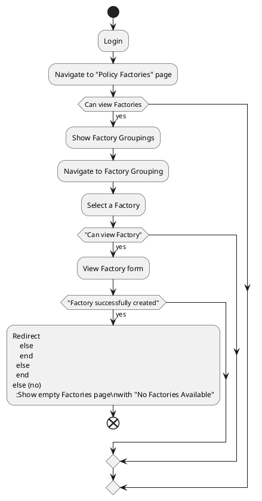

## Code Architecture

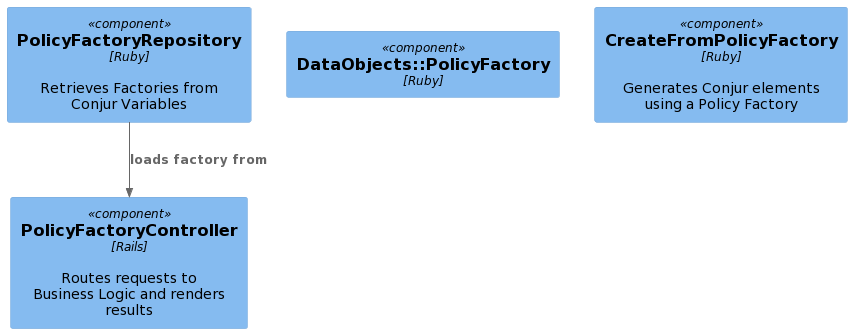

```plantuml
@startuml Basic Sample
!include https://raw.githubusercontent.com/plantuml-stdlib/C4-PlantUML/master/C4_Component.puml

Component(controller, "PolicyFactoryController", "Rails", "Routes requests to Business Logic and renders results")

Component(repository, "PolicyFactoryRepository", "Ruby", "Retrieves Factories from Conjur Variables")

Component(data_object, "DataObjects::PolicyFactory", "Ruby")

Component(create, "CreateFromPolicyFactory", "Ruby", "Generates Conjur elements using a Policy Factory")

Rel(repository, controller, "loads factory from")

' Component(repository 'PolicyFactoryRepository')

' component PolicyFactoryController
' component PolicyFactoryRepository
@enduml
```
