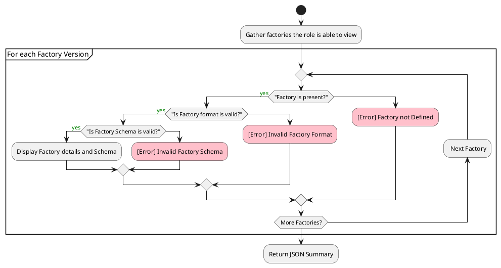
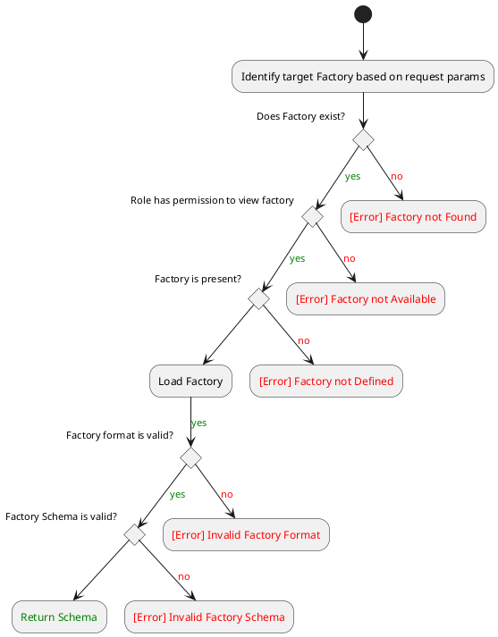
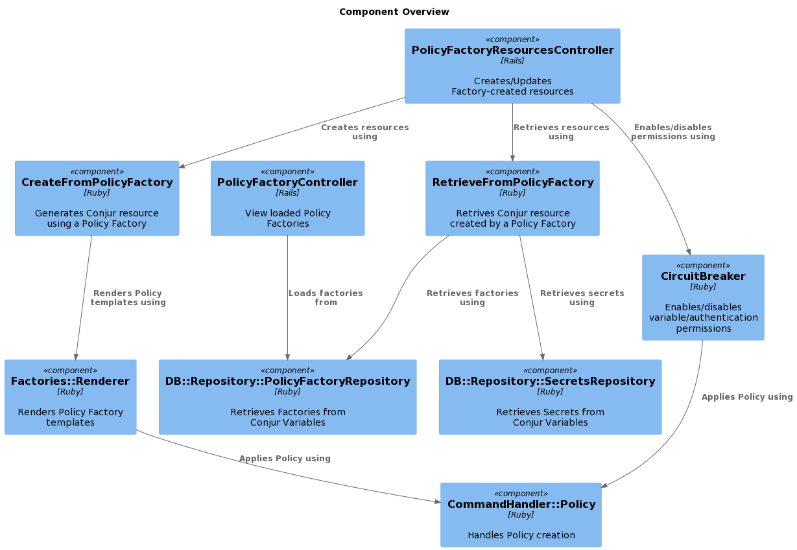

```plantuml
@startuml
start
:Identify Factory\nvariable based\non request params;
if (Does factory variable exist?) then (<color:green>yes)
  if (Can role load factory variable?) then (<color:green>yes)
    if (Does factory variable have a value?) then (<color:green>yes)
      :Load Factory;
      :Extract Schema from Factory Variable;
      :Parse [POST] JSON Request body;
      ' :Extract Schema from Factory;
      if (Parse JSON body?) then (<color:green>yes)
        if (Required keys missing?) then (<color:red>no)
          #pink: Missing Keys;
          ' note right
          '   Response Code: 400
          '   Response: {"error": {
          '     "code": 400,
          '     "message": "The following fields are missing: 'field-1', 'field-2'",
          '     "fields": [
          '       {"field-1": { "error": "must be present" }},
          '       {"field-2": { "error": "must be present" }}
          '     ]
          '   }}
          '   Log Level: Error
          '   Log Message: The following fields are missing from the request JSON body: 'field-1', 'field-2'
          ' end note
          kill
        else (<color:green>yes)
          if (required values empty?) then (<color:red>no)
            #pink: Missing Values;
            ' note right
            '   Response Code: 400
            '   Response: {"error": {
            '     "code": 400,
            '     "message": "The following fields are missing values: 'field-1', 'field-2'",
            '     "fields": [
            '       {"field-1": { "error": "cannot be empty" }},
            '       {"field-2": { "error": "cannot be empty" }}
            '     ]}}
            '   Log Level: Error
            '   Log Message: The following fields are missing values in the request JSON body: 'field-1', 'field-2'
            ' end note
            kill
          else (<color:green>yes)
            if (Policy rendered?) then (<color:green>yes)
              if (Policy namespace path rendered?) then (<color:green>yes)
                if (Policy successfully applied) then (<color:green>yes)
                  if (Factory has variables?) then (<color:green>yes)
                    if (Variable successfully set?) then (<color:green>yes)
                      #lightgreen: Return policy response;
                      ' note right
                      '   Response Code: 200
                      '   Response: {"response": {
                      '     "code": 200,
                      '     "created_resources": [
                      '       "<account>:<type>:<identifier>",
                      '       {"<account>:host:<identifier>": {"api_key": "<api-key>"}},
                      '       "<account>:variable:<identifier>"
                      '     ]
                      '   }}
                      ' end note
                      end
                    else (<color:red>no)
                      #pink: Setting Variable(s) not Permitted;
                      ' note right
                      '   Response Code: 401
                      '   Response {"error": {
                      '     "code": 401,
                      '     "error": "Role is not permitted to set the following secrets in this factory: 'secret-1', 'secret-2'",
                      '     "fields": [
                      '       "secret-1",
                      '       "secret-2"
                      '     ]
                      '   }}
                      '   Log Level: Error
                      '   Log Message: Role '<role-identifier>' is not permitted to create the following factory variables the '<target-namespace>': 'secret-1', 'secret-2'
                      ' end note
                      kill
                    endif
                  else (<color:red>no)
                    #lightgreen: Return policy response;
                    ' note right
                    '   Response Code: 200
                    '   Response: {"response": {
                    '     "code": 200,
                    '     "created_resources": [
                    '       "<account>:<type>:<identifier>",
                    '       {"<account>:host:<identifier>": {"api_key": "<api-key>"}}
                    '     ]
                    '   }}
                    ' end note
                    kill
                  endif
                else (<color:red>no)
                  #pink: Policy Creation not Permitted;
                  ' note right
                  '   Response Code: 401
                  '   Response {"error": {
                  '     "code": 401,
                  '     "error": "Role is not permitted to create a factory in this policy"
                  '   }}
                  '   Log Level: Error
                  '   Log Message: Role '<role-identifier>' is not permitted to create a factory in the '<target-namespace>'
                  ' end note
                  kill
                endif
              else (<color:red>no)
                #pink: Invalid Policy Namespace ERB;
                ' note right
                '   Response Code: 400
                '   Response: {"error": {
                '     "code": 400,
                '     "error": "Policy Factory Namespace Template contains invalid ERB"
                '   }}
                '   Log Level: Error
                '   Log Message Policy Factory 'conjur/factories/core/<name>' Namespace Template contains invalid ERB
                ' end note
                kill
              endif
            else (<color:red>no)
              #pink: Invalid Policy ERB;
              ' note right
              '   Response Code: 400
              '   Response: {"error": {
              '     "code": 400,
              '     "error": "Policy Factory Policy Template contains invalid ERB"
              '   }}
              '   Log Level: Error
              '   Log Message Policy Factory 'conjur/factories/core/<name>' Policy Template contains invalid ERB
              ' end note
              kill
            endif
          endif
        endif
      else (<color:red>no)
        #pink: Malformed JSON;
        ' note right
        '   Response Code: 400
        '   Response: {"error": {
        '     "code": 400,
        '     "message": "Request JSON contains invalid syntax"
        '   }}
        '   Log Level: Error
        '   Log Message: Request JSON contains invalid syntax
        ' end note
        kill
      endif
    else (<color:red>no)
      #pink: Factory Variable empty;
      ' note right
      '   Response Code: 400
      '   Response: {"error": {
      '     "code": 400,
      '     "resource": "conjur/factories/core/<name>",
      '     "message": "Requested Policy Factory is empty"
      '   }}
      '   Log Level: Error
      '   Log Message: Policy Factory Variable "conjur/factories/core/<name>" is empty
      ' end note
      kill
    endif
  else (<color:red>no)
    #pink: Factory not available;
    ' note right
    '   Response Code: 403
    '   Response: {"error": {
    '     "code": 403,
    '     "resource": "core/<name>",
    '     "message": "Factory is not available"
    '   }}
    '   Log Level: Error
    '   Log Message: Policy Factory "core/<name>" is not available
    ' end note
    kill
  endif
else (<color:red>no)
  #pink: Factory Variable not present;
  ' note right
  '   Response Code: 404
  '   Response: {"error": {
  '       "code": 404,
  '       "resource": "conjur/factories/core/<name>",
  '       "message": "Requested Policy Factory does not exist"
  '     }}
  '   Log Level: Error
  '   Log Message: Policy Factory Variable "conjur/factories/core/<name>" does not exist
  ' end note
  kill
endif
@enduml
```

# Policy Factory

Policy Factories are a mechanism for creating custom bits of Conjur Policy and corresponding Conjur secrets in support of some broader outcome, like an authenticator, database, connection, PKI infrastructure, or nearly anything you can dream up.

## Setup

The easiest way to load Policy Factories into Conjur is via:

- [Cyberark Policy Factory CLI](https://github.com/jvanderhoof/policy_factory)

The CLI provides a set of Factories as well as a DSL for writing your own Factories.

## API

All Policy Factory API endpoints require authentication and follow the existing Conjur API patterns. Policy Factories are stored in Conjur variables. Conjur Policy should be used to
limit access to particular Factories to those roles which are allowed to use them.

### List Factories

Display all available Factories a role has access to, grouped by factory classification:

```
GET /factories/<account>
```

#### Sample Response

```json
{
    "authenticators": [
        {
            "name": "authn_iam",
            "namespace": "authenticators",
            "full-name": "authenticators/authn_iam",
            "current-version": "v1",
            "description": "Create a new Authn-IAM authenticator"
        },
        {
            "name": "authn_jwt_jwks",
            "namespace": "authenticators",
            "full-name": "authenticators/authn_jwt_jwks",
            "current-version": "v1",
            "description": "Create a new Authn-JWT Authenticator using a JWKS endpoint"
        },
        {
            "name": "authn_jwt_public_key",
            "namespace": "authenticators",
            "full-name": "authenticators/authn_jwt_public_key",
            "current-version": "v1",
            "description": "Create a new Authn-JWT Authenticator that validates using a public key"
        },
        {
            "name": "authn_oidc",
            "namespace": "authenticators",
            "full-name": "authenticators/authn_oidc",
            "current-version": "v1",
            "description": "Create a new Authn-OIDC Authenticator"
        }
    ],
    "connections": [
        {
            "name": "database",
            "namespace": "connections",
            "full-name": "connections/database",
            "current-version": "v1",
            "description": "All information for connecting to a database"
        }
    ],
    "core": [
        {
            "name": "grant",
            "namespace": "core",
            "full-name": "core/grant",
            "current-version": "v1",
            "description": "Assigns a Role to another Role"
        },
        {
            "name": "group",
            "namespace": "core",
            "full-name": "core/group",
            "current-version": "v1",
            "description": "Creates a Conjur Group"
        },
        {
            "name": "managed_policy",
            "namespace": "core",
            "full-name": "core/managed_policy",
            "current-version": "v1",
            "description": "Policy with an owner group"
        },
        {
            "name": "policy",
            "namespace": "core",
            "full-name": "core/policy",
            "current-version": "v1",
            "description": "Creates a Conjur Policy"
        },
        {
            "name": "user",
            "namespace": "core",
            "full-name": "core/user",
            "current-version": "v1",
            "description": "Creates a Conjur User"
        }
    ]
}
```

#### Response Codes

| Code | Description |
|-|-|
| 200 | Factories returned as a JSON list |
| 401 | The request lacks valid authentication credentials |
| 403 | The authenticated role lacks the necessary privilege |

### View

View the details of a particular Factory

```
GET /factories/<account>/<classification/<optional-version>/<factory_id>
```

#### Sample Response

```json
{
    "title": "Authn-IAM Template",
    "version": "v1",
    "description": "Create a new Authn-IAM authenticator",
    "properties": {
        "id": {
            "description": "Resource Identifier",
            "type": "string"
        },
        "annotations": {
            "description": "Additional annotations",
            "type": "object"
        }
    },
    "required": [
        "id"
    ]
}
```

#### Response Codes

| Code | Description |
|-|-|
| 200 | Factory details returned as JSON |
| 401 | The request lacks valid authentication credentials |
| 403 | The authenticated role lacks the necessary privilege |
| 404 | The factory does not exist, or it has not been set |


### Create with a Policy Factory

Create resources using a Factory

```
POST /factory-resources/<account>/<classification>/<optional version>/<factory_id>
```

#### Sample Request

```
# POST /factories/demo/connections/database

{
    "id": "myapp-database",
    "branch": "root",
    "variables": {
        "url": "https://foo.bar.baz.com",
        "port": "5432",
        "username": "myapp",
        "password": "supersecretP@ssW0rd"
    }
}
```

#### Sample Response

```json
{
    "created_roles": {},
    "version": 1
}
```

#### Response Codes

| Code | Description |
|-|-|
| 201 | Policy and variables were set successfully |
| 400 | Request body is invalid (missing fields, malformed, etc.) |
| 401 | Policy creation or variable setting not permitted |
| 403 | The authenticated role lacks the necessary privilege to use the factory |
| 404 | The factory does not exist, or it has not been set |


### View Factory-created Resources

View the resources created by a Policy Factory.

*Note: Only the results of a complex Policy Factory are shown using this endpoint. When
creating Conjur primitives, use the roles/resources API.*

```
GET /factory-resources/<account>/<policy_identifier>
```

#### Sample Request

Assuming a Database connection was created using the following:

```json
{
    "id": "myapp-database",
    "branch": "my-databases/production",
    "annotations": {
      "foo": "bar",
      "baz": "bang"
    },
    "variables": {
        "type": "mysql",
        "url": "https://foo.bar.baz.com",
        "port": "3306",
        "username": "myapp",
        "password": "supersecretP@ssW0rd"
    }
}
```

```
# GET /factory-resources/demo/my-databases%2Fproduction
```

#### Sample Response

```json
{
    "id": "my-databases/production/myapp-database",
    "variables": {
        "type": {
            "value": "mysql",
            "description": "Database Type"
        },
        "url": {
            "value": "https://foo.bar.baz.com",
            "description": "Database URL"
        },
        "port": {
            "value": "3306",
            "description": "Database Port"
        },
        "username": {
            "value": "myapp",
            "description": "Database Username"
        },
        "password": {
            "value": "supersecretP@ssW0rd",
            "description": "Database Password"
        },
        "ssl-certificate": {
            "value": null,
            "description": "Client SSL Certificate"
        },
        "ssl-key": {
            "value": null,
            "description": "Client SSL Key"
        },
        "ssl-ca-certificate": {
            "value": null,
            "description": "CA Root Certificate"
        }
    },
    "annotations": {
        "foo": "bar",
        "baz": "bang"
    },
    "details": {
        "classification": "connections",
        "version": "v1",
        "identifier": "database"
    }
}
```

#### Response Codes

| Code | Description |
|-|-|
| 200 | Factory resource details returned as JSON |
| 401 | The request lacks valid authentication credentials |
| 404 | The policy does not exist or if the policy was not created by a Factory |

### View all Factory-created Resources

Given a role, return all the Factory-created resources the role has access to.

*Note: Only the results of a complex Policy Factory are shown using this endpoint. When
creating Conjur primitives, use the roles/resources API.*

```
GET /factory-resources/<account>
```

#### Sample Request

```
GET /factory-resources/demo
```

#### Sample Response

```json
[
    {
        "id": "my-test-policy-1/production-1",
        "variables": {
            "type": {
                "value": "mysql",
                "description": "Database Type"
            },
            "url": {
                "value": "https://foo.bar.baz.com",
                "description": "Database URL"
            },
            "port": {
                "value": "5432",
                "description": "Database Port"
            },
            "username": {
                "value": "foo-bar",
                "description": "Database Username"
            },
            "password": {
                "value": "bar-baz",
                "description": "Database Password"
            },
            "ssl-certificate": {
                "value": null,
                "description": "Client SSL Certificate"
            },
            "ssl-key": {
                "value": null,
                "description": "Client SSL Key"
            },
            "ssl-ca-certificate": {
                "value": null,
                "description": "CA Root Certificate"
            }
        },
        "annotations": {},
        "details": {
            "classification": "connections",
            "version": "v1",
            "identifier": "database"
        }
    },
    {
        "id": "production-2",
        "variables": {
            "type": {
                "value": "mysql",
                "description": "Database Type"
            },
            "url": {
                "value": "https://foo.bar.baz.com",
                "description": "Database URL"
            },
            "port": {
                "value": "5432",
                "description": "Database Port"
            },
            "username": {
                "value": "foo-bar",
                "description": "Database Username"
            },
            "password": {
                "value": "bar-baz",
                "description": "Database Password"
            },
            "ssl-certificate": {
                "value": null,
                "description": "Client SSL Certificate"
            },
            "ssl-key": {
                "value": null,
                "description": "Client SSL Key"
            },
            "ssl-ca-certificate": {
                "value": null,
                "description": "CA Root Certificate"
            }
        },
        "annotations": {
            "foo": "bar",
            "baz": "bang"
        },
        "details": {
            "classification": "connections",
            "version": "v1",
            "identifier": "database"
        }
    }
]
```

#### Response Codes

| Code | Description |
|-|-|
| 200 | Factory resource details returned as JSON array |
| 401 | The request lacks valid authentication credentials |


### [Experimental] Circuit Breakers

Policy Factories includes a "circuit-breaker" group, which allows access to variables
or use of an authenticator to be severed. This allows a security administrator to mitigate
a data leak or security event without writing any Conjur Policy.

Factories created via the CLI (starting with version `1.0.0`) automatically include the
required policy.

*Note: enabling/disabling circuit-breakers requires `update` permission on the Factory-created
policy.*

### [Experimental] Cut Access

Removes read access to Factory variables or authenticate permission on an authenticator.

```
POST /factory-resources/<account>/<policy_identifier>/disable
```

#### Sample Request

```
POST /factory-resources/demo/my-test-policy-1%2Fproduction-1/disable
```

#### Sample Response

```json
{
    "created_roles": {},
    "version": 2
}
```

#### Response Codes

| Code | Description |
|-|-|
| 200 | Successfully disabled access |
| 401 | The request lacks valid authentication credentials |
| 403 | The request lacks permission to disable access |
| 501 | The target policy lacks a circuit-breaker group |


### [Experimental] Reenable Access

Restore read access to Factory variables or authenticate permission on an authenticator.

```
POST /factory-resources/<account>/<policy_identifier>/enable
```

#### Sample Request

```
POST /factory-resources/demo/my-test-policy-1%2Fproduction-1/enable
```

#### Sample Response

```json
{
    "created_roles": {},
    "version": 2
}
```

#### Response Codes

| Code | Description |
|-|-|
| 200 | Successfully enables access |
| 401 | The request lacks valid authentication credentials |
| 403 | The request lacks permission to enables access |
| 501 | The target policy lacks a circuit-breaker group |

## Workflows

### View all Policy Factories

A role is limited to viewing the Factories they have permission (`execute`) to see.
If a role can see a factory, they will be able to see errors in mis-configured Factories.




### Policy Factory Info Requests




### Policy Factory Creation Requests




## Code Architecture


