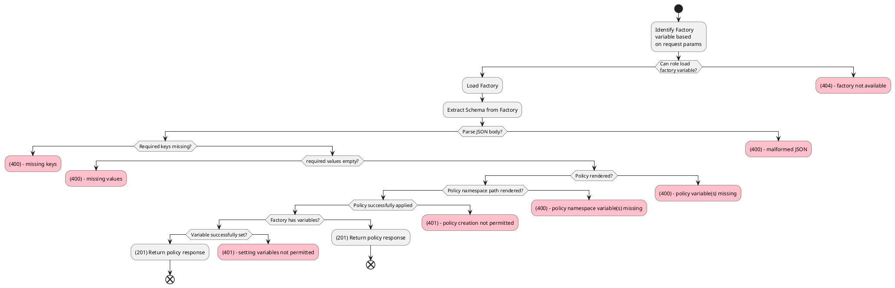

# Policy Factory

## Policy Factory Creation Requests

```plantuml
@startuml
start
:Identify Factory\nvariable based\non request params;
if (Can role load\nfactory variable?) then
  :Load Factory;
  :Extract Schema from Factory;
  if (Parse JSON body?) then
    if (Required keys missing?) then
      #pink:(400) - missing keys;
      kill
    else
      if (required values empty?) then
        #pink:(400) - missing values;
        kill
      else
        if (Policy rendered?) then
          if (Policy namespace path rendered?) then
            if (Policy successfully applied) then
              if (Factory has variables?) then
                if (Variable successfully set?) then
                  :(201) Return policy response;
                  end
                else
                  #pink:(401) - setting variables not permitted;
                  kill
                endif
              else
                :(201) Return policy response;
                end
              endif
            else
              #pink:(401) - policy creation not permitted;
              kill
            endif
          else
            #pink:(400) - policy namespace variable(s) missing;
            kill
          endif
        else
          #pink:(400) - policy variable(s) missing;
          kill
        endif
      endif
    endif
  else
    #pink:(400) - malformed JSON;
    kill
  endif
else
  #pink:(404) - factory not available;
  kill
endif
@enduml
```
