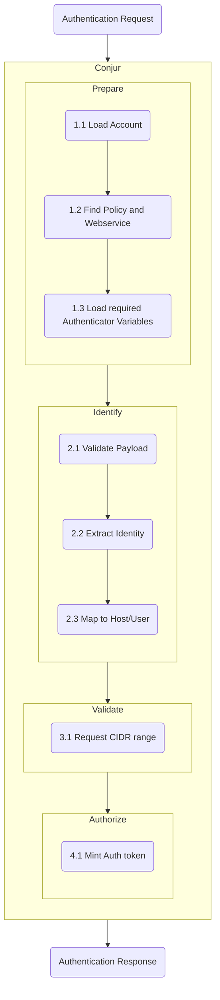

# Authenticator Refactor

## Problem

Our current Authenticator architecture forces a number of actions into the individual authenticators. This causes code duplication and increases the complexity of each individual authenticator.

## Authentication Overview

### Current Workflow

Currently, our authenticators all follow a similar pattern for authorizing an external resource (human or machine):

1. Parse request to identify which authenticator should be used.
2. Verify account exists and Authenticator is valid?
  a. Does it exist?
  b. Is it enabled?
  c. Is it configured?
3. Load authenticator Variables
4. Pass password/jwt token/access key to authenticator
5. Verify and extract identity (ensuring it is valid)
6. Using authenticator identity, lookup identity in Conjur
7. Verify Conjur identity can use this authenticator
8. Return Conjur Auth token

In the above list, steps 2-8 are all performed by authenticators.

### Proposed workflow

If we look at the above steps the work falls into a couple of different categories:

- Prepare the authenticator (verify the authenticator has what it needs)
- Verify the external identity is valid
- Map the external identity to an internal identity with the permission to use the authenticator
- Return an auth token for the internal identity



Phase 1 (`Prepare`), Phase 3 (`Validate`), and Phase 4 (`Authorize`) are actions common to all authenticators. The unique nature of an authenticator lies in Phase 2 (`Identify`).

The following components should help abstract the above phases:

- `AuthenticatorLoader` - loads all required values for a particular authenticator.
-

### AuthenticatorLoader Class

The `AuthenticatorLoader` is responsible for gathering the Conjur related information required by authenticators.  This includes:

- Checking the required Conjur Policy is present
- Loading an authenticator's values
- Gathering the Conjur Roles which are allowed to use this authenticator

```ruby
module Authenticators
  class AuthenticatorLoader
    def initialize(role: ::Role, resource: ::Resource)
      @role = role
      @resource = resource
    end

    # Authenticators::AuthenticatorLoader.find returns a Struct representation
    # of an Authenticator:
    #     Struct.new(:config, :authenticatable_roles)
    def find(account:, type:, service_id: nil)
      # The following steps are performed:
      #   1. Verify account exists
      #   2. Is Authenticator valid?
      #     a. Does it exist?
      #     b. Is it enabled?
      #     c. Is it configured?
      #   3. Gather all Variables from the desired authenticator
    end
  end
end
```

### OIDC Authenticator

Sample interface with a `call` method which takes request params and returns an identified external identity.

```ruby
module Authentication
  module AuthnOidc
    class Authenticate
      REQUIRED_CONFIGURATION = %i[
        issuer_uri
        client_id
        client_secret
        redirect_uri
        claim_mapping
      ].freeze

      REQUIRED_PARAMS = %i[code state].freeze

      def initialize(config:)
        # Validation will be moved upstream
        validate_present(
          args: config,
          required_fields: REQUIRED_CONFIGURATION
        )
        @config = config
        # ...
      end

      def call(params:)
        # Validation will be moved upstream
        validate_present(
          args: params,
          required_fields: REQUIRED_PARAMS
        )
        # Identify the OIDC user resulting from the callback
      end
      # ...
    end
  end
end
```

### OIDC Mapper

Given the allowed Conjur Roles, the mapper translates selects the Role to bind the external identity to:

```ruby
module Authentication
  module AuthnOidc
    class Mapper
      def initialize(allowable_roles:)
        @allowable_roles = allowable_roles
      end

      def call(identity:)
        identified_role = @allowable_roles.select do |role|
          role.id.split(':').last == identity
        end
        raise "#{identify} was not found as a valid authenticatable role" if identified_role.nil?

        identified_role
      end
    end
  end
end
```

### Authenticator Workflow

Finally, we glue the above bits together:

```ruby
module Validations
  class Cidr
    def valid?(role:, ip:)
      raise Errors::Authentication::InvalidOrigin unless role.valid_origin?(ip)
    end
  end
end

class Authenticator
  def initialize(token_factory: ::TokenFactory)
    @token_factory = token_factory
  end

  def call(account:, request:, identity_resolver:, mapper:)
    role = mapper.call(
      identity: identity_resolver.call(
        params: request
      )
    )
    Validations::Cidr.new.valid?(role: role, ip: request[:ip])

    @token_factory.signed_token(
      account: account,
      username: role
    )
  end
end
```

### Full Workflow

With these parts, we can construct a full authenticator flow with the following:

```ruby
authenticator_configuration = Authenticators::AuthenticatorLoader.new.find(
  account: params[:account],
  service_id: params[:service_id],
  type: 'authn-oidc'
)

Authenticator.new.call(
  identity_resolver: Authentication::AuthnOidc2::IdentityResolver.new(
    config: authenticator_configuration.config
  ),
  mapper: Authentication::AuthnOidc2::Mapper.new(
    roles: authenticator_configuration.authenticatable_roles
  ),
  params: params,
  account: params[:account]
)
```

The result of the `Authenticator` call is an Conjur Authorization Token, which is returned to the newly authorized user.

## Advantages

- Most authenticators (`authn-azure`, `authn-gcp`, `authn-jwt`, `authn-oidc`) only perform JWT validation and attribute extraction. With the above pattern we can write a single JWT validation class while providing custom JWT mapping.
- With custom mapping, we can easily build a custom mappings for different JWT endpoints (ex. GitLabs, ADFS, Okta, etc.). This removes the need for customers to perform this mapping (and simplifies the end user experience).
- Any new pre and post authentication functionality does not need to be added to each different authenticator.
- Identity mapping can be performed without testing end-to-end.
- The above workflow should fit into the existing authenticator interface, allowing us to implement the pattern with the new OIDC authenticator and then work through a complete refactor of the other authenticators in the future.

## Disadvantages

- Introducing a new architectural pattern will lead to code complexity in the short. It'll also require additional refactoring work to remove the current authenticator complexity.

# Proof-of-Concept

This PR includes a proof-of-concept for a true OpenID Connect workflow.  It can be run as follows:

1. Start a Conjur development environment:

    ```sh
    cd dev
    ./start
    ```

1. Generate a Okta Redirect URL:

   ```sh
   bundle exec rake oidc:redirect_url
   ```

1. Copy the link to your browser and follow it. If prompted, login with:
    - username/email: `test.user@mycompany.com`
    - password: `MyP@ss123`

1. After authenticating, your browser will redirect to a broken link. Grab the value in GET `code` parameter:

    ```http
    http://localhost:3000/authn-oidc/okta/cucumber/callback?code=uFdu65nYEveQfUsm8-2PFsXmJAh6zYdxHq5znAWYzeI&state=8e82d35323913ebc3f9f593e1bcfc579
    ```

1. Validate the code by passing it into the `oidc:run` Rake task:

    ```sh
    bundle exec rake oidc:run[uFdu65nYEveQfUsm8-2PFsXmJAh6zYdxHq5znAWYzeI]
    ```

    You should see the following:

    ```sh
    name: test.user@mycompany.com
    ```

The OIDC Rake file is located at: `/lib/tasks/authn_oidc.rake`.

The OIDC authentication is handled by the `::Authentication::AuthnOidc2::Callback` class, located: `/app/domain/authentication/authn_oidc_2/authenticator.rb`.
