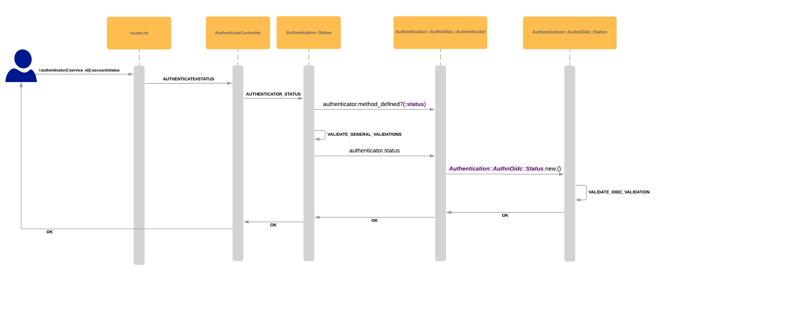

# Introduction

This is a design doc for the user story [Authenticator Status API - General](https://github.com/cyberark/conjur/issues/1064) that is part of the epic [Authenticators Status API returns status of a specific authenticator](https://github.com/cyberark/conjur/issues/1062)

# Feature Overview

***As a*** Conjur operator\
***I'd like to*** know that an authenticator is configured correctly\
***So that*** I can complete the configuration properly if it's incomplete (or remove
it if it's not needed).

This feature lets the person who configures an authenticator to get an immediate feedback
on the configuration, before any user needs to run an authentication request.

# Implementation Details



We will create a new route in `routes.rb` for `/authenticators/:authenticator/:service_id/:account/status`.
This route will lead to `AuthenticateController` which will consist of a new `status` method.
In this method we will call a new CommandClass `Authentication::Status`. This class's
`call` method will perform the general checks that apply to all authenticators
and those specific to each authenticator:

- The requesting user has access to the authenticator status route webservice
    - more info in the Security section of the [epic](https://github.com/cyberark/conjur/issues/1062)
- The authenticator is implemented
- The account exists
    - although a wrong account in an `/authenticate` request will indicate a client error and
    not a server error, we still need to verify it exists in order to verify that the webservice exists
    under that account
- The webservice exists
- The authenticator is enabled in the ENV
- [Specific authenticator requirements](#implementing_specific_authenticator_status_check)
 
***Note:*** The default authenticator (`authn`) is always healthy

We will also need to audit access success & failures to this endpoint.
 
## Implementing specific authenticator status check
 
Some authenticators need extra validation. As mentioned in the Epic, if 
the status check is not implemented for the authenticator we will return a 501 Not 
Implemented response. 

In the following section, we will use `authn-oidc` as an example.
 
For each authenticator that will implement the status check, we will add:
 1. A `Status` CommandClass in the structure `Authentication::AuthnOidc::Status` (with the validations in its `call` method). 
 1. A `status` method to its existing authenticator class (i.e. `Authentication::AuthnOidc::Authenticator`)
 which will call the new CommandClass, as follows: 
 
 ```
 def status
   Authentication::AuthnOidc::Status.new.(
     <input for status check>
   )
 end
 ``` 
 
 The `status` method above will be called from the general status check, when validating
 the authenticator's specific requirements. We will first verify that the `status` method exists
 in the `Authenticator` class, which will indicate that the status check is implemented on the given
 authenticator. Therefore, the `call` method of the general status check 
 will look like the following:
                                                                            
```
 def call
  validate_authenticator_exists
  validate_authenticator_implements_status_check
  .
  .
  # perform general validations (allowlisted in env, etc.)
  .
  .
  validate_authenticator_requirements
 end
 
 private
 
 def validate_authenticator_exists
   raise Err::AuthenticatorNotSupported unless authenticator
 end
     
 def validate_authenticator_implements_status_check
  unless authenticator.method_defined?(:status)
    raise 501
 end
 
 def validate_authenticator_requirements
  authenticator.status
 end
 
 def authenticator
  # The `@authenticators` map includes all authenticator classes that are implemented in 
  # Conjur (`Authentication::AuthnOidc::Authenticator`, `Authentication::AuthnLdap::Authenticator`, etc.). 
  
  @authenticator = @authenticators[@authenticator_input.authenticator_name]
 end
```
 
 ***Note***: We check that the authenticator status check exists before we check the permissions to
 the status webservice as this info isn't sensitive and we can expose it.
 
 # Test Plan
 
 ## Response bodies
 
 The following are the response bodies that will be returned to the user
 
 ### Success
 
 ```
{
   "status": "ok"
}
```

 ### Failure
 
 ```
{
  "status": "error",
  "error": "<configuration_error>"
}
```

For example,  if the status check failed on `WebserviceNotFound` then the message 
will be `Webservice '{webservice-name}' wasn't found` (which is its built-in message)
 
## Integration Tests

### OSS

 |                               **Given**                               | **When**                                                                                       | **Then**                                   | **Status** |
 |:---------------------------------------------------------------------:|------------------------------------------------------------------------------------------------|--------------------------------------------|------------|
 | A healthy authenticator                                               | I send a request with a valid access token                                                     | I get a 200 OK response with a successful body                | - [ ]        |
 | A healthy authenticator                                               | I send a request with an invalid access token (user is not permitted on the status webservice) | I get a 403 Forbidden response                                | - [ ]        |
 | An authenticator without an implemented status check                  | I send a request with a valid access token                                                     | I get a 501 Not Implemented response                          | - [ ]        |
 | A non-existing authenticator                                          | I send a request with a valid access token                                                     | I get a 404 Not Found response                                | - [ ]        |
 | A missing status webservice in the policy                             | I send a request with a valid access token                                                     | I get a 500 Internal Server Error response with an error body with the relevant error message                          | - [ ]        |
 | A non-existing account name in the request                            | I send a request with a valid access token                                                     | I get a 500 Internal Server Error response with an error body with the relevant error message | - [ ]        |
 | Authenticator webservice doesn't exist (wasn't loaded in the policy)  | I send a request with a valid access token                                                     | I get a 500 Internal Server Error response with an error body with the relevant error message | - [ ]        |
 | The authenticator isn't allowlisted in the ENV                        | I send a request with a valid access token                                                     | I get a 500 Internal Server Error response with an error body with the relevant error message | - [ ]        |
 
### Enterprise

|                               **Given**                               | **When**                                                                                       | **Then**                                   | **Status** |
|:---------------------------------------------------------------------:|------------------------------------------------------------------------------------------------|--------------------------------------------|------------|
| A healthy authenticator                                               | I send a request with a valid access token                                                     | I get a 200 OK response with a successful body                | - [ ]        |

## Unit Tests

1. if `authenticator.status` (specific authenticator validation) raises an error then it propagates to the user
1. if `authenticator.status` (specific authenticator validation) succeeds then the user gets a successful message
 
# Effort Estimation

5 Days
 