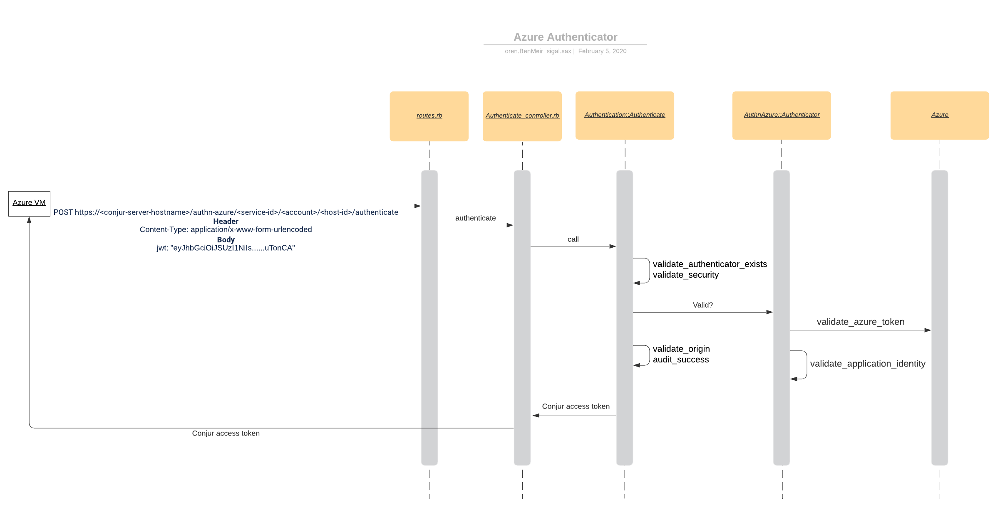

# Solution Design - Azure Authenticator

## Table of Contents

- [Glossary](#glossary)
- [Useful Links](#useful-links)
- [Issue description](#issue-description)
- [Solution](#solution)
    - [Azure Resource Restrictions](#azure-application-identity)
    - [Design](#design)
        - [Authentication Flow](#authentication-flow)
        - [Azure authenticator class](#azure-authenticator-class)
    - [Backwards compatibility](#backwards-compatibility)
    - [Performance](#performance)
    - [Affected Components](#affected-components)
- [Security](#security)
- [Test plan](#test-plan)
- [Logs](#logs)
- [Docs](#docs)
- [Version update](#version-update)
- [DoD](#dod)
- [Open Questions](#open-questions)

## Glossary

| Term                                   | Description                                                                                                                                                                                                                                                   |
|----------------------------------------|---------------------------------------------------------------------------------------------------------------------------------------------------------------------------------------------------------------------------------------------------------------|
| Active Directory (AD)                  | an access management service that allows users to sign-in and access resources based on privileges granted to them                                                                                                                                            |
| Active Directory (AD) tenant           | a dedicated instance of AD for the organization (AAM for example)                                                                                                                                                                                             |
| Azure Resource Manager                 | the service that is used to provision resources. When creating a new VM, it receives a request upon instance (VM) creation and gives the instance a system-assigned managed identity.                                                                         |
| Service principle                      | object representation of VM instance in AD. This object holds information defining its permissions on resources                                                                                                                                               |
| Client ID                              | unique identifier generated by Azure AD tied to application and service principal during initial provisioning. This client ID is used to identify the object that is requesting an access token                                                               |
| Object ID                              | unique identifier for application object in Azure AD                                                                                                                                                                                                           |
| System-assigned identity               | an identity for an instance in AD that is trusted. The identity is tied to the resource and abides to its lifecycle. In other words, if the resource is delete so to will the identity                                                                        |
| User-assigned identity                 | an identity for an instance in AD that is trusted. This identity can be assigned to 1+ Azure services instances and is independent of instance lifecycle                                                                                                      |
| Azure Instance Metadata Service (IMDS) | a REST endpoint accessible to all VMs created via the Azure Resource Manager. Resources in Azure request access tokens from the Azure Instance Metadata service endpoint. We will first focused on supporting VMs and explore other services at a later time  |
| JWT                                    | JSON-based access token that asserts claims (logged in, etc)                                                                                                                                                                                                  |
| xms_mirid                              | a claim that defines the resource that holds the encoding of the instance's subscription, resource group, and name needed for authorization                                                                                                                   |

## Useful links

- [Feature doc](https://app.zenhub.com/workspaces/appliance-development-5c9cf04bfa1c204b63eddcc6/issues/cyberark/conjur/1266)

## Issue description

We want to enable Azure resources to authenticate according to Azure 
properties and get back a Conjur access token in order to retrieve secrets from our providers. At current, customers can authenticate their Azure 
VMs with Conjur by creating a Conjur host identity for their Azure resources. The Azure resource would then receive an API key as part of the 
creation of a Conjur identity which they must use to connect to targets. This is not optimal nor convenient because we are not allowing the 
resources to authenticate based on their Azure identity and demand that the resource hold an extra secret, the Conjur-given API key.

## Solution

We will add a new authenticator to Conjur, which users can authenticate with from Azure VMs. As mentioned in the [feature doc](https://app.zenhub.com/workspaces/appliance-development-5c9cf04bfa1c204b63eddcc6/issues/cyberark/conjur/1266), before any authentication 
request is sent to Conjur, the admin will load the authenticator policy: 

```yaml
# policy id needs to match the convention `conjur/authn-azure/<service ID>`
- !policy
  id: conjur/authn-azure/prod
  body:
  - !webservice

  - !variable
    id: provider-uri  
      
  - !group apps
  
  - !permit
    role: !group apps
    privilege: [ read, authenticate ]
    resource: !webservice
```

and add the `provider-uri` variable to the webservice (e.g `https://sts.windows.net/TENANT_ID`). 

As part of our effort to improve the user experience for our authenticators, we discussed two options for defining the `provider-uri`:
 
1. `provider-uri` as a variable
    ```yaml
    - !policy
      id: conjur/authn-azure/prod
      body:
      - !webservice
    
      - !variable
        id: provider-uri      
    ```
    
1. `provider-uri` as an entry in the webservice annotations
    ```yaml
    - !policy
      id: conjur/authn-azure/prod
      body:
        - !webservice
          annotations: 
            provider-uri: https://sts.windows.net/TENANT_ID
          
    ```     

Because the `provider-uri` doesn't hold sensitive information, it doesn't necessary need to be saved as a secret in Conjur. Adding the `provider-uri` as a variable in the policy demands later that the
admin user populate its value through the CLI. Further, adding it as annotation entry makes it easier to set it as a key-value pair and is therefore more readable. 
On the other hand, with `provider-uri` in the host annotations, any change to this value will demand a complete replacement of the root policy which raises concerns for maintenance. 
For concerns of maintenance and for uniformity preservation across our different authenticators, we have decided against moving the `provider-uri` to the webservice annotation.
 
### Azure Resource Restrictions

To authenticate with Conjur, Azure-specific fields will need to be provided in the host annotations of the Conjur host identity for the Azure resource- subscription-id, resource-group, and user/system-assigned-identity. Specifically, If the Azure resource is assigned a system-assigned-identity, 
we will also need to validate the `oid` field of the Azure access token. These fields will be used to confirm the identity of the Azure resource that is
sending the authentication request. This will be done by comparing the Azure access token information with the host annotations that are defined in the policy below.

A Conjur host will be defined as follows with their annotations holding Azure-specific identification properties.

```yaml
- !policy 
  id: azure-apps 
  body: 
  - !host 
    id: test-app 
    annotations: 
      authn-azure/subscription-id: test-subscription 
      authn-azure/resource-group: test-group 

OPTIONAL
      authn-azure/user-assigned-identity: test-app-pipeline 
OR 
      authn-azure/system-assigned-identity: 853b9a84-5bfa-4b22-a3f3-0b9a43d9ad8a

- !grant
  role: !group conjur/authn-azure/prod/apps
  member: !host azure-apps/test-app
```

*Note:* `!host` and `!user` Conjur identities should function interchangeably   

#### Supported granularity

1. Subscription ID + Resource Group

1. Subscription ID + Resource Group + System Assigned Identity

1. Subscription ID + Resource Group + User Assigned Identity

We do not support a combination of System Assigned Identity & User Assigned Identity

#### Multiple-assigned identity for host - NOT FOR NOW

We may allow hosts to be defined with both "authn-azure/user-assigned-identity" and "authn-azure/system-assigned-identity". This way such a host can 
authenticate a token with a user-assigned id as well as a token with a system-assigned id. As a first step we will not develop - nor test - such a use-case.

### Design

#### Authentication Flow

This flow assumes that the VM already exists in Azure, and that an authn-azure authenticator and a Conjur host were loaded.




1. Azure VM sends the following request to Conjur:
   
    ```yaml
    POST https://<conjur-server-hostname>/authn-azure/<service-id>/<account>/<host-id>/authenticate
    
    Header 
     Content-Type: application/x-www-form-urlencoded
    
    Body 
     jwt: "eyJhbGciOiJSUzI1NiIs......uTonCA"
    ```

1. An already existing route will be used (post '/:authenticator(/:service_id)/:account/:id/authenticate' => 'authenticate#authenticate') that will forward the request to the AuthenticationController. 

1. The request will then be forwarded to the Authentication::Authenticate CommandClass. This CommandClass holds a collection of general authenticator validations that will take place.

1. The two first general validations include validate_authenticator_exists and validate_security. 
    
    1. validate_authenticator_exists ensures that the authenticator sent as part of the request URI is one that we support (authn-k8s, authn-azure, etc.).

    1. validate_security validates that the Azure authenticator has been defined correctly in policy and the host is permitted to authenticate to the webservice.

1. The next validation, validate_credentials calls the authenticator's `valid?` function. Then, Azure-specific authenticator validations will be triggered. 

    1. validate_azure_token (see below for a more detailed explanation of the function).
    
    1. validate_application_identity - the annotations of the authenticating host and the properties extracted from the "xms_mirid" field of the Azure token provided by the Azure VM are compared (see below for a more detailed explanation of the function).

1. Once the Azure authenticator-specific validations have passed, the general authenticator validations can continue.
   
    1. validate_origin checks the origin of the request to determine if the origin of the request is restricted.

1. If all validations pass, an audit entry is written to audit logs and a Conjur access token will be returned to the Azure requesting resource. This Conjur access token will be used for all further communications between the Azure resource and Conjur.

If at any point a validation fails, an audit entry is written to audit logs and an error response is returned to the client.

### Azure authenticator class
 
As mentioned in the flow above, we will create a new CommandClass for Azure-specific validations.

 ```ruby
require 'command_class'

module Authentication
  module AuthnAzure

    Err = Errors::Authentication::AuthnAzure

    Authenticator = CommandClass.new(
      dependencies: {
       ...
      },
      inputs: [:authenticator_input]
    ) do
      
	  # Azure authenticator checks
      def call
        validate_azure_token
        validate_application_identity
      end

      private

      ...

    end
 ```


#### validate_azure_token

The Azure token validation checks the signature and claims of the Azure token to 
ensure that the token was issued by the Azure Active Directory defined in the authenticator policy. 
To do this we need to:
1. Discover the Oauth 2.0 provider - in this case the Azure AD is the Oauth 2.0 
provider. Its URl will be retrieved from the "provider-uri" variable value defined in the authenticator policy
1. Retrieve JWKs from the discovery endpoint - These keys are used for the token validation
1. Decode and verify the token using the JWKs.

Steps 1 & 2 may seem familiar as they are the exact steps that we perform in the 
OIDC Authenticator. This is because OIDC is Oauth 2.0 based. We will take advantage 
on this and use the 3rd party used in the OIDC Authenticator to perform steps 
1 & 2 in our authenticator.

Unfortunately, the 3rd party used in the OIDC Authenticator does not implement 
an access token decoding, and only an ID Token decoding. Thus, to perform step 3, we will need another 3rd 
party - the ["jwt" gem](https://github.com/jwt/ruby-jwt). This gem has an MIT License which is aligned with our policy.

As you can see in the following blueprint for the `validate_azure_token` 
implementation, it will use `AuthnOidc`'s `FetchProviderCertificate` class to 
retrieve the JWKs and will use them to verify & decode the token, using `JWT`'s `decode` function:
```
require 'jwt'

module Authentication
  module AuthnAzure
    DecodeAndVerifyToken = CommandClass.new(
      dependencies: {
        # We have a ConcurrencyLimitedCache which wraps a RateLimitedCache which wraps a FetchProviderCertificate class
        fetch_provider_certificate: ::Util::ConcurrencyLimitedCache.new(
          ::Util::RateLimitedCache.new(
            ::Authentication::AuthnOidc::FetchProviderCertificate.new,
            refreshes_per_interval: 10,
            rate_limit_interval:    300, # 300 seconds (every 5 mins)
            logger: Rails.logger
          ),
          max_concurrent_requests: 3,
          logger: Rails.logger
        ),
      },
      inputs:       %i(provider_uri token_jwt)
    ) do

      def call
        certs = @fetch_provider_certificate.(
          provider_uri: @provider_uri
        )     

        # indicate that we should verify the issuer and audience claims
        options = { iss: provider_uri, verify_iss: true, verify_aud: true }

        @decoded_token = JWT.decode(
          @token_jwt,
          @certs, # JWKs retrieved from the provider
          true, # tells the decoder to verify the token
          options
        )
      end
    end
  end
end
```

Note that `JWT.decode` not only decodes the token but also validates it. It gets as
input the JWKs retrieved from the provider and validates the signature of the token.
It also validates the `iss` and `aud` claims to verify that the token was issued by the correct
Azure provider (which is the Oauth 2.0 provider).
 
#### validate_application_identity

The `validate_application_identity` function will validate that the Azure VM can 
authenticate with Conjur based on information extracted from the provided Azure token.

Proposed validation flow is as followings:


1. We will extract the `xms_mirid` field from the Azure access token

1. If the `xms_mirid` field exists, we will parse it and extract the 
`resource_group` and `subscription_id` and compare them with their equivalents 
in the Conjur host. If the field does not exist, we will raise a proper error.

    *NOTE:* It is required that the Host annotation have at least `authn-azure/subscription-id` and `authn-azure/resource-group` but
    for greater security granularity, a third host annotation can exist - `authn-azure/system-assigned-identity` or `authn-azure/user-assigned-identity`. 

1. If a third annotation, `authn-azure/system-assigned-identity` or `authn-azure/user-assigned-identity` is present, the process of 
validating this annotation entry differs depending on the identity assigned to the Azure resource. 
Because of this, we need to handle each case differently. The two types of identities that can be assigned to an Azure resource include the following:

    1. system-assigned identity

    1. user-assigned identity

1. As you can see in the "Examples" section below, the suffix of the `xms_mirid` field includes
the assigned identity. If the suffix includes `Microsoft.ManagedIdentity/userAssignedIdentities/<user_assigned_identity>`
then it is a user assigned identity. In this case we will compare its value (i.e `<user_assigned_identity>`) 
with the `authn-azure/user-assigned-identity` annotation defined in the Conjur host.

1. Otherwise, we will check if `providers/Microsoft.Compute/virtualMachines/` is present in the `xms_mirid` claim. 
If so, we will compare the `oid` field from the Azure access token with the 
`authn-azure/user-assigned-identity` annotation in the Conjur host.
    Note: At this point we support only VMs. In the future we can check for other Azure resources in the `xms_mirid` suffix.
  

##### Examples

Let's take a look at examples for tokens with a system-assigned identity and token with a user-assigned identity.

###### system-assigned identity

```yaml
{
  "aud": "https://management.azure.com/",
  "iss": "https://sts.windows.net/df242c82.../",
  "iat": 157...,
  "nbf": 157...,
  "exp": 157...,
  "aio": "42Vg...",
  "appid": "7230cc60...",
  "appidacr": "2",
  "idp": "https://sts.windows.net/df242c82...",
  "oid": "14751f4a...",
  "sub": "14751f4a...",
  "tid": "df242c82...",
  "uti": "g1mKQ0DE...",
  "ver": "1.0",
  "xms_mirid": "/subscriptions/<subscription_id>/resourcegroups/<resource_group>/providers/Microsoft.Compute/virtualMachines/<resource_name>"
}
```

The following is a mapping of Host annotations with the values we will be extracting in the Azure access token for `system-assigned-identities` 

| Host annotation                                                      | Azure access token             | 
|----------------------------------------------------------------------|--------------------------------|
| `authn-azure/subscription-id`                                        | subscription_id (inside `xms_mirid`)  |
| `authn-azure/resource-group`                                         | resource_group (inside `xms_mirid`)   |
| `authn-azure/system-assigned-identity`                               | `oid` field (Azure token)      |

###### user-assigned identity

```yaml
{
  "aud": "https://management.azure.com/",
  "iss": "https://sts.windows.net/df242c82.../",
  "iat": 157...,
  "nbf": 157...,
  "exp": 157...,
  "aio": "42Vg...",
  "appid": "7230cc60...",
  "appidacr": "2",
  "idp": "https://sts.windows.net/df242c82...",
  "oid": "14751f4a...",
  "sub": "14751f4a...",
  "tid": "df242c82...",
  "uti": "g1mKQ0DE...",
  "ver": "1.0",
  "xms_mirid": "/subscriptions/<subscription_id>/resourceGroups/<resource_group>/providers/Microsoft.ManagedIdentity/userAssignedIdentities/<resource_name>"
}
```

The following is a mapping of Host annotations with the values we will be extracting in the Azure access token for `user-assigned-identities`

| Host annotation                                                      | Azure access token                    | 
|----------------------------------------------------------------------|---------------------------------------|
| `authn-azure/subscription-id`                                        | subscription_id (inside `xms_mirid`)  |
| `authn-azure/resource-group`                                         | resource_group (inside `xms_mirid`)   |
| `authn-azure/user-assigned-identity`                                 | resource_name (inside `xms_mirid`)    | 

Regardless of the assigned-identity for the Azure resource, once the proper fields are extracted from the Azure token, we will compare them to the annotations of the Conjur host for this Azure resource. If they match, the next validation test will run. If all 
validations run without raising an error, the Azure VM resource will receive a Conjur access token in return. All further requests that this Azure VM sends will need to have this Conjur access token in the header.

### Backwards compatibility

None because this is a new feature.

### Performance

Azure authenticator performance should conform with our other authenticators with an average call time of 1 second.

### Affected Components

- Conjur Open Source
- Conjur Enterprise

## Security

### Security boundary

#### Azure security boundary
The security boundary (i.e. who can get an Azure access token) of the Azure Managed Identity Service is the resource to which it is attached to.
For more details about this boundary, please visit [Azure managed identity security boundary](https://docs.microsoft.com/en-us/azure/active-directory/managed-identities-azure-resources/known-issues#what-is-the-security-boundary-of-managed-identities-for-azure-resources).

#### Conjur security boundary
The security boundary of the Conjur Azure authenticator is the Azure access token received in the authentication request.
This access token is fetched using Azure Instance Metadata Service (IMDS) which in turn, uses Azure Active Directory (AAD) to generate the token.
For the full details of how to achieve an access token and how its being generated, please visit [Azure managed identity overview](https://docs.microsoft.com/en-us/azure/active-directory/managed-identities-azure-resources/overview).


### Authentication
Conjur Azure authenticator authenticates the originator by its provided access token.
The full authentication process is described in the [Authentication flow](#authentication-flow) section.

### Authorization
After authenticating the originator, Conjur Azure authenticator returns a Conjur access token (which is different from the Azure access token).
This Conjur access token is generated for the Conjur host that was authenticated.
The authorization will be done according to the following requests and is basically out-of-scope for the Azure authenticator.
For more details about how Conjur authorization works, please visit [Conjur authorization](https://docs.conjur.org/Latest/en/Content/Operations/Services/authorization.html).


 
### Azure Access token
Conjur Azure authenticator receives an Azure access token which is a credential for the Azure resource. As such, Conjur handles this token with the appropriate sensitivity.

#### Azure Access token in transit
Any request to Conjur is done over HTTPS to protect against any kind of Man-In-The-Middle attack. 

#### Azure access token at rest 
Conjur uses that token only for the authentication flow and does not store it or log it into any persistent store.

#### Azure access token Time-To-Live (TTL)
Attack surface can be reduced by limiting Azure access token time-to-live (TTL).
The default TTL of an Azure access token is one hour, but it can reduced to a shorter period. To reduce the TTL of Azure access token, please visit [Configurable token lifetimes in Azure Active Directory](https://docs.microsoft.com/en-us/azure/active-directory/develop/active-directory-configurable-token-lifetimes). 
###

 
## Test Plan

### Integration tests 


|    | Given                                                                                                                       | When                                                                | Then                                                                                                                                           | Manual / UT / Integration | Tested                 |Core Test                             |
|----|-----------------------------------------------------------------------------------------------------------------------------|---------------------------------------------------------------------|------------------------------------------------------------------------------------------------------------------------------------------------|---------------------------|------------------------|---------------------------------------
| 1  | *Vanilla flow* - a host identity exists for Azure VM and added to privileged group for authentication on webservice         | VM sends authentication request with a valid Azure token            | <ul><li>Conjur access token is returned in body and action is logged</li><li>Conjur secret can be retrieved with Conjur access token</li></ul> | Integration               | <ul><li> [ ] </li></ul>| Yes                                  |
| 2  | A host identity for Azure VM has not been added to privileged group                                                         | VM sends request with valid Azure token                             | <ul><li>Return 401 Unauthorized</li><li> Error message `RoleNotAuthorizedOnResource` is written to the log</li></ul>                         | Integration               | <ul><li> [ ] </li></ul>| No                                   |
| 3  | No Conjur Host identity exists for Azure VM                                                                                 | VM sends authentication request with a valid Azure token            | <ul><li>Return 401 Unauthorized</li><li>Error message `RoleNotFound` is written to the log</li></ul>                                           | Integration               | <ul><li> [ ] </li></ul>| No                                   |
| 4  | authn-azure isn't allowlisted in ENV or enabled in DB                                                                       | VM sends authentication request to Conjur with valid Azure token    | <ul><li>Return 401 Unauthorized</li><li>Error message `AuthenticatorNotEnabled` is written to the log</li></ul>                                | Integration               | <ul><li> [ ] </li></ul>| No                                   |
| 5  | Policy is loaded w/o `provider-uri` variable                                                                                | VM sends authentication request to Conjur with valid Azure token    | <ul><li>Return 401 Unauthorized</li><li>Error message `RequiredResourceMissing` is written to the log</li></ul>                                | Integration               | <ul><li> [ ] </li></ul>| Yes                                  |
| 6  | Policy is loaded with `provider-uri` variable but a value is never added                                                    | VM sends authentication request to Conjur with valid Azure token    | <ul><li>Return 401 Unauthorized</li><li>Error message `RequiredSecretMissing` is written to the log</li></ul>                                  | Integration               | <ul><li> [ ] </li></ul>| Yes                                  |                                                                                                                                                                                                                                                                                                                                                                                                                                                 
| 7  | Policy is loaded w/o defining authenticator webservice                                                                      | VM sends authentication request to Conjur with valid Azure token    | <ul><li>Return 401 Unauthorized</li><li>Error message `WebserviceNotFound` is written to the log</li></ul>                                     | Integration               | <ul><li> [ ] </li></ul>| No                                   |
| 8  | An invalid/non-existent `provider-uri` (Conjur couldn't connect to provider)                                                | VM sends authentication request to Conjur with valid Azure token    | <ul><li>Return 504 GatewayTimeout</li><li>Error message `ProviderDiscoveryTimeout` is written to the log</li></ul>                             | Integration               | <ul><li> [ ] </li></ul>| Yes                                  |
| 9  | Conjur can make contact with provider but couldn't confirm token signature                                                  | VM sends authentication request to Conjur with invalid Azure token  | <ul><li>Return 502 Bad Gateway</li><li>Error message `ProviderTokenInvalid` is written to the log</li></ul>                                    | Integration               | <ul><li> [ ] </li></ul>| Yes                                  |
| 10 | One or more annotations combination is incorrect or missing from the host policy (6 separate tests, see below explanation)  | VM sends authentication request to Conjur with valid Azure token    | <ul><li>Return 401 Unauthorized</li><li>Error message `RoleMissingAnnotations` is written to the log</li></ul>                                 | Integration               | <ul><li> [ ] </li></ul>| partially(details in the table below)|
| 11 | Expected field from request is missing (missing "jwt" in request)                                                           | VM sends authentication request to Conjur without jwt               | <ul><li>Return 400 Bad request</li><li>Error message `MissingRequestParam` is written to the log</li></ul>                                     | Integration               | <ul><li> [ ] </li></ul>| Yes                                  |
| 12 | `xms_mirid` field of the Azure token is missing                                                                             | VM sends authentication request to Conjur with invalid Azure token  | <ul><li>Return 401 Unauthorized</li><li>Error message `TokenClaimNotFoundOrEmpty` is written to the log</li></ul>                              | Integration               | <ul><li> [ ] </li></ul>| Yes                                  |
| 13 | One or more fields in the Azure token don't match the Conjur host annotations                                               | VM sends authentication request to Conjur with valid Azure token    | <ul><li>Return 401 Unauthorized</li><li>Error message `InvalidApplicationIdentity` is written to the log</li></ul>                             | Integration               | <ul><li> [ ] </li></ul>| Yes                                  |
| 14 | Load on unreachable provider-uri                                                                                            | VM authenticates x times in y threads w/ invalid Azure token        | <ul><li>Return 503 Service Unavailable</li><li>Error message `ConcurrencyLimitReachedBeforeCacheInitialization` is written to the log</li></ul>| Integration               | <ul><li> [ ] </li></ul>| No                                   |

*Note*: For test #10, we will have separate integration tests according to the different, possible combinations for the host annotations

|      | Given                                                                                                                | When                                                                                                        | Then                                                                                                                       | Manual / UT / Integration | Tested                      |Core Test|
|------|----------------------------------------------------------------------------------------------------------------------|-------------------------------------------------------------------------------------------------------------|----------------------------------------------------------------------------------------------------------------------------|---------------------------|-----------------------------|----------
| 13-1 | A host with Subscription ID + Resource Group + User Assigned Identity in its annotations                             | That host attempts to authenticates with authn-azure with an Azure token that has a User Assigned Identity  | <ul><li>Return 200 status</li><li>RetrievedAnnotationValue is logged for all the annotations</li></ul>                     | Integration               | <ul><li> [ ] </li></ul>     |Yes      | 
| 13-2 | A host with Subscription ID + Resource Group + System Assigned Identity in its annotations                           | That host attempts to authenticates with authn-azure with an Azure token that has a System Assigned Identity| <ul><li>Return 200 status</li><li>RetrievedAnnotationValue is logged for all the annotations</li></ul>                     | Integration               | <ul><li> [ ] </li></ul>     |No       |
| 13-3 | A host with Subscription ID + Resource Group in its annotations                                                      | That host attempts to authenticates with authn-azure                                                        | <ul><li>Return 200 status</li><li>RetrievedAnnotationValue is logged for all the annotations</li></ul>                     | Integration               | <ul><li> [ ] </li></ul>     |No       |
| 13-4 | A host with no Azure-specific identification in its annotations                                                      | That host attempts to authenticates with authn-azure                                                        | <ul><li>Return 401 Unauthorized</li><li>Error message `RoleMissingAnnotations` is written to the log</li></ul>             | Integration               | <ul><li> [ ] </li></ul>     |Yes      |
| 13-5 | A host with Subscription ID OR Resource Group in its annotations                                                     | That host attempts to authenticates with authn-azure                                                        | <ul><li>Return 401 Unauthorized</li><li>Error message `RoleMissingAnnotations` is written to the log</li></ul>             | Integration               | <ul><li> [ ] </li></ul>     |No       |
| 13-6 | A host with Subscription ID + Resource Group + User Assigned Identity + System Assigned Identity in its annotations  | That host attempts to authenticates with authn-azure                                                        | <ul><li>Return 401 Unauthorized</li><li>Error message `IllegalConstraintCombinations` is written to the log</li></ul>      | Integration               | <ul><li> [ ] </li></ul>     |No       | 
    
### Performance 

|    | Type             | Given                                      | When                                                                                                 | Then                                                                             | Tested                     |Core tests|
|----|------------------|--------------------------------------------|------------------------------------------------------------------------------------------------------|----------------------------------------------------------------------------------|----------------------------|-----------
| 1  | Performance      | Azure VM defined in Conjur                 | Each Azure VM sends authentication requests (+-20 sequential requests)                               | Check load on Azure and check load on Conjur (each request should take 1 second) | <ul><li> [ ] </li></ul>    |No        |
| 2  | Performance      | Azure VM defined in Conjur                 | Each Azure VM has invalid Azure tokens and sends authentication requests (+-20 sequential requests)  | Check load on Azure and check load on Conjur (each request should take 1 second) | <ul><li> [ ] </li></ul>    |No        |

### Regression

- Two authenticators that are enabled in same ENV

- Same host should work with both authn-oidc and authn-azure

## Logs

### Error Log level

|    | Scenario                                                                | Log message                                                                            | Implemented            |
|--- |-----------------------------------------------------------------------  |----------------------------------------------------------------------------------------|------------------------|
| 1  | Authenticator is not enabled (in DB/ENV)                                | Authenticator '{0-authenticator-name}' is not enabled                                                 | <ul><li> [ ] </li></ul> |
| 2  | Webservice is not defined in a Conjur policy                            | Webservice '{0-webservice-name}' wasn't found                                          | <ul><li> [ ] </li></ul> |
| 3  | Host is not permitted to authenticate with the webservice               | '{0-role-name}' does not have 'authenticate' privilege on {1-service-name}             | <ul><li> [ ] </li></ul> |
| 4  | Host is not defined in Conjur                                           | '{0-role-name}' wasn't found                                                           | <ul><li> [ ] </li></ul> |
| 5  | Couldn't make connection with Azure Identity Provider in time           | Azure Identity Provider failed with timeout error (Provider URI: '{0}'). Reason: '{1}' | <ul><li> [ ] </li></ul> |
| 6  | Failed to confirm Azure token signature                                 | Failed to confirm signature of '{0-token}' issued by (Provider URI: '{1}'              | <ul><li> [ ] </li></ul> |
| 7  | A required annotation is missing in the Conjur host                     | Annotation is missing for authentication for Role '{0-role}'                           | <ul><li> [ ] </li></ul> |
| 8  | Authentication request body is missing a field (e.g `azure_token`)      | Field '{0-field-name}' is missing or empty in request body                             | <ul><li> [ ] </li></ul> |
| 9  | xms_field is not found in the Azure token                               | Field '{0-field-name}' not found or empty in token                                     | <ul><li> [ ] </li></ul> |
| 10 | Resource Restrictions defined in Conjur host doesn't match Azure token   | Resource Restrictions field '{0-field-name}' does not match Azure token                 | <ul><li> [ ] </li></ul> |
| 11 | Conjur host is defined with both a user-assigned & a system-assigned id | Resource Restrictions includes an illegal constraint combination - '{0-constraints}'    | <ul><li> [ ] </li></ul> |

### Debug Log level

|    | Scenario                                              | Log message                                                                            | Implemented             |
|--- |-------------------------------------------------------|----------------------------------------------------------------------------------------|-------------------------|
| 1  | Before validating host annotations                    | Validating annotations with prefix {0-prefix}                                          | <ul><li> [ ] </li></ul> |
| 2  | Before discovering Azure Identity Provider            | Working with Provider {0-provider-uri}                                                 | <ul><li> [ ] </li></ul> |
| 3  | After discovering Azure Identity Provider             | Provider discovery succeeded                                                           | <ul><li> [ ] </li></ul> |
| 4  | After decoding Azure token                            | Token decode succeeded                                                                 | <ul><li> [ ] </li></ul> |
| 5  | Before extracting claims from the Azure token         | Extracting claims from token for resource {0-resource-name}                            | <ul><li> [ ] </li></ul> |
| 6  | After validating the resource restrictions of the host | Resource identity for {0-resource-name} has been validated successfully                | <ul><li> [ ] </li></ul> |     

## Docs

## Version update

- Conjur Open Source
- Conjur Enterprise

## DoD

- [ ] Solution design is pushed to GH and project-artifacts slack channel for early feedback
- [ ] Solution design is approved
- [ ] Test plan is approved
- [ ] Security review was done
  - [ ] Security review was done to the 3rd party ["jwt" gem](https://github.com/jwt/ruby-jwt)
- [ ] Implement Azure authn functionality
- [ ] Azure VM can authenticate to Conjur using the Conjur authn-azure authenticator and get Conjur access token
- [ ] Tests are implemented according to test plan and all tests pass
    - [ ] Integration tests exist
    - [ ] Unit tests exist
- [ ] Security action items were taken care of
- [ ] Performance tests were done and align with SLA
- [ ] Logs were reviewed by TW and PO
- [ ] Documentation has been written and reviewed by PO and TW for both Conjur Enterprise and Conjur
- [ ] A demo was created for the new authenticator
- [ ] Engineer(s) that were not involved in the project use documentation to authenticate with Conjur using Azure
- [ ] Versions are bumped in all relevant projects
   - [ ] Conjur Open Source
   - [ ] Conjur Enterprise
 
## Open questions

- Do we want to develop a mechanism to support a request body with more than one field (currently, we have only "token", but we may want to add more fields later).

## Future efforts

- Challenge moving the `provider-uri` to the webservice annotations in terms of maintenance and evaluate the effort needed to cascade this update to our other authenticators (OIDC, K8s, etc)

    - How often does this value change?

    - How will it impact the OIDC authenticator experience?

- Cache tests similar to authn-oidc
