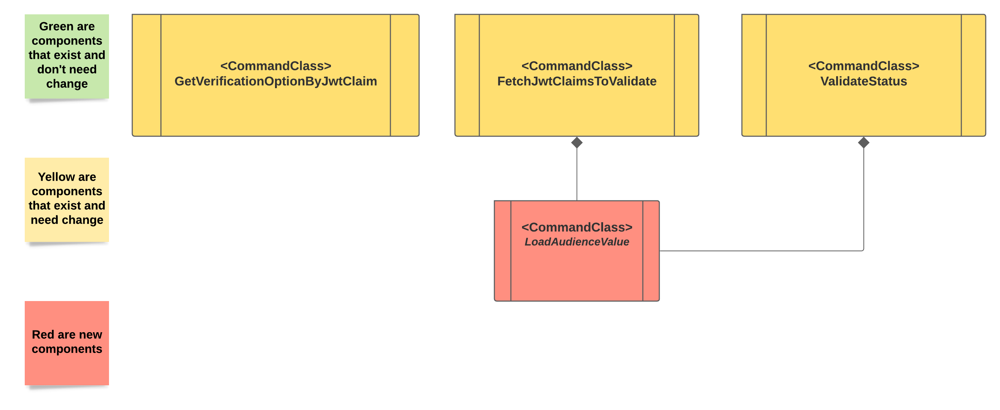

# JWT validation - support list values in token 
[//]: # "Change the title above from 'Template' to your design's title"

[//]: # "General notes:"
[//]: # "1. Design should be graphical-based and table-based - avoid long text explanations"
[//]: # "2. Design documents should not be updated after implementation"
[//]: # "3. Design decisions should be made before writing this document, and as such this document should not include options / choices"


## Table of Contents
[//]: # "You can use this tool to generate a TOC - https://ecotrust-canada.github.io/markdown-toc/"
* [Useful Links](#useful-links)
* [Issue Description](#issue-description)
* [Solution](#solution)
     + [User Interface](#user-interface)
* [Design](#design)
     + [Option 1 (annotation)](#option-1--annotation-)
     + [Option 2 (variable) - Chosen](#option-2--variable----chosen)
     + [Class / Component Diagrams](#class---component-diagrams)
          - [Class / Details](#class---details)
* [Performance](#performance)
* [Backwards Compatibility](#backwards-compatibility)
     + [Option 1 (annotation)](#option-1--annotation--1)
     + [Option 2 (variable) - chosen](#option-2--variable----chosen)
* [Affected Components](#affected-components)
* [Test Plan](#test-plan)
     + [Test Environments](#test-environments)
     + [Test Assumptions](#test-assumptions)
     + [Test Cases (Including Performance)](#test-cases--including-performance-)
          - [Functional Tests](#functional-tests)
          - [Status API Tests](#status-api-tests)
* [Logs](#logs)
* [Documentation](#documentation)
* [Definition of Done](#definition-of-done)
* [Solution Review](#solution-review)

## Useful Links
[//]: # "Add links that may be useful for the reader"

|**Link** |
|----------|
| [RFC7519](https://datatracker.ietf.org/doc/html/rfc7519)         |
| [authn-jwt design](authn_jwt_solution_design.md) |
| [ruby-jwt audience claim](https://github.com/jwt/ruby-jwt#audience-claim) |

## Issue Description
[//]: # "Elaborate on the issue you are writing a solution for"
According the [RFC7519](https://datatracker.ietf.org/doc/html/rfc7519) [aud](https://datatracker.ietf.org/doc/html/rfc7519#section-4.1.3) claim:
> The "aud" (audience) claim identifies the recipients that the JWT is
intended for.  Each principal intended to process the JWT MUST
identify itself with a value in the audience claim.  If the principal
processing the claim does not identify itself with a value in the
"aud" claim when this claim is present, then the JWT MUST be
rejected.  In the general case, the "aud" value is an array of case-
sensitive strings, each containing a StringOrURI value.  In the
special case when the JWT has one audience, the "aud" value MAY be a
single case-sensitive string containing a StringOrURI value.  The
interpretation of audience values is generally application specific.
Use of this claim is OPTIONAL.

At the moment `authn-jwt` supports only a "special case" means `aud`
can be a single string value defined using host's annotation.

Our goal is to support general case when "aud" is an array.

## Solution
[//]: # "Elaborate on the solution you are suggesting in this page. Address the functional requirements and the non functional requirements that this solution is addressing. If there are a few options considered for the solution, mention them and explain why the actual solution was chosen over them. Add an execution plan when relevant. It doesn't have to be a full breakdown of the feature, but just a recommendation to how the solution should be approached."
There are two possible solutions for the issue:
  1. Keep `aud` as a host annotation and to check that annotation value is in the claim value array

     Proc:
       - Non breaking change for sure
       - Introduces general `includes` check for annotations and array claims  
       - Extra Small EE (1)

     Cons:
       - Bad UX - as far as `aud` defines possible recipients of the token it very likely that 
         it will be the same value for all hosts of the same authenticator service id
       - Bad security - as far as `aud` defines possible recipients of the token it's recommended to
         control its value at authenticator level rather at the host one
       - We already know that its wrong direction. Following this way will require future behaviour change 
         means it will happen never.

     Remarks:
       - `aud` can be enforced and can be mapped
     

  2. Define `aud` as an authenticator variable `audience`

     Proc:
       - Better UX - `aud` value will be defined once for each authenticator service
       - Better security - `aud` value is controlled in centralized way
       - A step to right direction. Later or sooner `aud` will became a part of authenticator configuration
    
     Cons:
       - Small EE (3)
       - May be a breaking change (may be not) see Backward compatibility section

     Remark:
       - `aud` can not be enforced and mapped as `iss`
       - `aud` behaves as mandatory once the variable exists

    Limitations:
       - `audience` variable supports single value
     
**Chosen option:** Option 2 - `audience` variable at authenticator level

### User Interface
[//]: # "Describe user interface (including command structure, inputs/outputs, etc where relevant)"

1. Conjur admin or other person is able to define jwt authenticator will load authenticator policy like:
  ```yaml
- !policy
  id: conjur/authn-jwt/serviceId
  body:
    - !webservice
    
    - !variable
      id: token-app-property

    - !variable
      id: audience
```

2. `token-app-property` and `audience` variables are populated.
Let's assume, for example, that `audience` value is `conjur`.
   
Once `audiece` variable exists each JWT should contain `conjur` value as the `aud` claim value or in `aud` claim array
and `aud` claim is mandatory in the token.

## Design
[//]: # "Add any diagrams, charts and explanations about the design aspect of the solution. Elaborate also about the expected user experience for the feature"
### Option 1 (annotation)

All changes are under `app/domain/authentication/authn_jwt/restriction_validators` path.

Add new class `ValidateIncludesRestriction` that will validate that restriction value (came from annotation)
includes into an array fetched from JWT.

Modify `ValidateRestrictionsOneToOne` class to refer a type of fetched restriction:
- If the type is an array - call `ValidateIncludesRestriction` validate function.
- Otherwise call default `=` (equals) statement.

The solution is general for all array typed claims in the token.

### Option 2 (variable) - Chosen 

Changes under `app/domain/authentication/authn_jwt/validate_and_decode` path.

- Add new class `FetchAudienceValue` that will fetch and check the value if exists.

- Change `FetchJwtClaimsToValidate` class to treat `aud` as mandatory claim if the variable exists.

- Change `GetVerificationOptionByJwtClaim` class to support verification options for `aud` that
will be validated by 3rd party (exactly like issuer).

Changes under `app/domain/authentication/authn_jwt` path.

- Change `ValidateStatus` class to depend and call `FetchAudienceValue`.

### Class / Component Diagrams
[//]: # "Describe classes that are going to be added /changes and their immediate environment. Non-changed classes may be colored differently"



#### Class / Details
[//]: # "Describe details of each class - to emphasise its main functionality / methods and interactions"

- `FetchAudienceValue` fetches and validates value of `audience` variable.

  If variable does not exists returns nothing.
  
  If variable is defined but not populated throws an error.

  If variable is defined and populated but has an invalid value throws an exception.

  Validation criteria are:
  - non empty string

- `FetchJwtClaimsToValidate` calls `FetchAudienceValue`
  If value is not empty:
  - Add `aud` to mandatory claims list
  - Add claim and it's value to claims to validate list
     
- `GetVerificationOptionByJwtClaim` for `aud` claim return the next verification options `{ aud: claim_value, verify_aud: true }`

- `ValidateStatus` calls `FetchAudienceValue` during status verification

## Performance
[//]: # "Describe potential performance issues that might be raised by the system as well as their mitigations"
[//]: # "How does this solution affect the performance of the product?"

In general it's interesting question what's effect of each variable on authenticator's performance

## Backwards Compatibility
[//]: # "How will the design of this solution impact backwards compatibility? Address how you are going to handle backwards compatibility, if necessary"

### Option 1 (annotation)

The solution is backward compatible. Array is not supported either way today.

### Option 2 (variable) - chosen

The solution is backward compatible. Array is not supported either way today.
We don't need to take any additional action: like today we're not preventing from user 
to create `exp`, `iss` and etc. annotations.

`aud` claim can not be enforced and can not be mapped.

### authn-gcp

In gcp `aud` is working as `token-app-property`.

The design does not break this functionality if we will want to use `authn-jwt` instead of `authn-gcp`

## Affected Components
[//]: # "List all components that will be affected by your solution"
[//]: # "[Conjur Open Source/Enterprise, clients, integrations, etc.]"
[//]: # "and elaborate on the impacts. This list should include all"
[//]: # "downstream components that will need to be updated to consume"
[//]: # "new releases as these changes are implemented"

Conjur Open Source/Enterprise

## Test Plan

### Test Environments
[//]: # "Including build number, platforms etc. Considering the OS and version of PAS (PVWA, CPM), Conjur, Synchronizer etc."

Conjur Open Source

### Test Assumptions

`audience` variable is defined in the authenitcator policy

### Test Cases (Including Performance)

#### Functional Tests

[//]: # "Fill in the table below to depict the tests that should run to validate your solution"
[//]: # "You can use this tool to generate a table - https://www.tablesgenerator.com/markdown_tables#"

| **Audience value** | **JWT** | **Result** |
|-----------|-----------|-----------|
| Aud is empty | Does not matter | 401 |
| Aud has a valid value | No `aud` | 401 |
| Aud has a valid value | `aud` has different single value | 401 |
| Aud has a valid value | `aud` has the same single value | 200 |
| Aud has a valid value | `aud` is an array without the value | 401 |
| Aud has a valid value | `aud` is an array with the value | 200 |

#### Status API Tests

[//]: # "Fill in the table below to depict the tests that should run to validate your solution"
[//]: # "You can use this tool to generate a table - https://www.tablesgenerator.com/markdown_tables#"

| **Audience value** | **Result** |
|-----------|-----------|
| Aud is empty | Error |
| Aud has a valid value | 200 |

## Logs
[//]: # "If the logs are listed in the feature doc, add a link to that section. If not, list them here."
[//]: # "You can use this tool to generate a table - https://www.tablesgenerator.com/markdown_tables#"

| **Scenario** | **Log message** |
|--------------|-----------------|
| FetchJwtClaimsToValidate | "Fetching `audience` value" |
| FetchJwtClaimsToValidate | "Fetched `audience` value {value}" |

## Documentation
[//]: # "Add notes on what should be documented in this solution. Elaborate on where this should be documented, including GitHub READMEs and/or official documentation."

TBD

## Definition of Done

- Solution designed is approved
- Test plan is reviewed
- Acceptance criteria have been met
- Tests are implemented according to test plan
- The behaviour is documented in Conjur Open Source and Enterprise
- All relevant components are released

## Solution Review
[//]: # "Relevant personas can indicate their design approval by approving the pull request"

| **Persona**        | **Name** |
|--------------------|----------|
| Team leader        |          |
| Product owner      |          |
| System architect   |          |
| Security architect |          |
| QA architect       |          |
