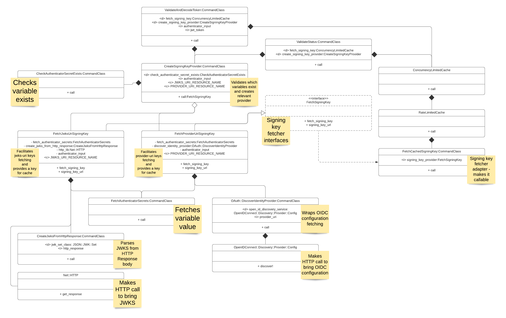
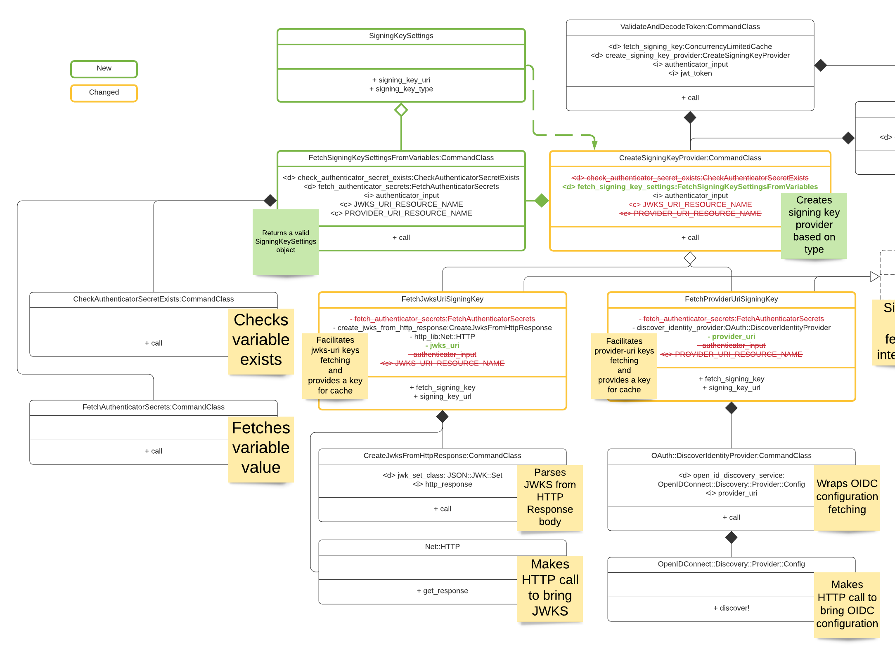
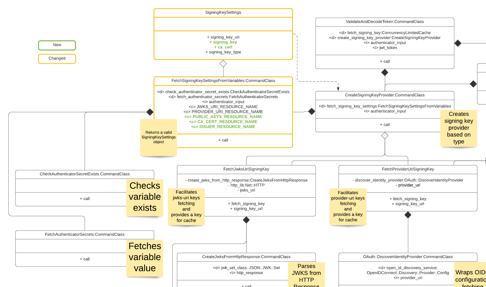
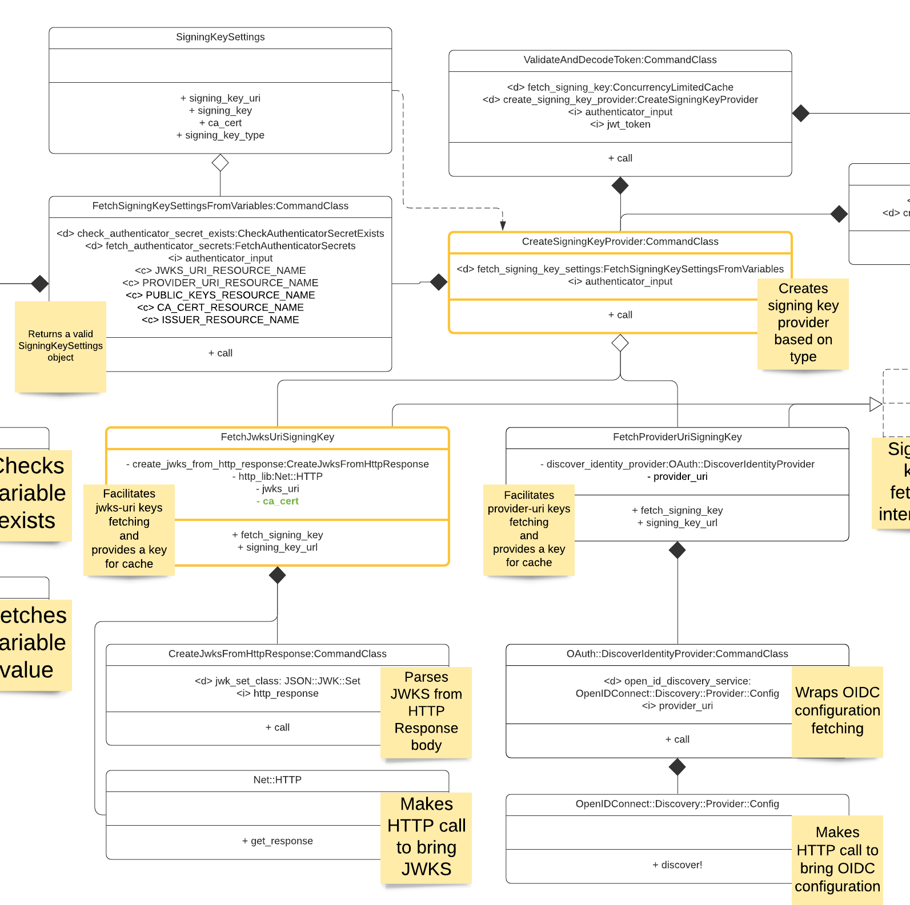
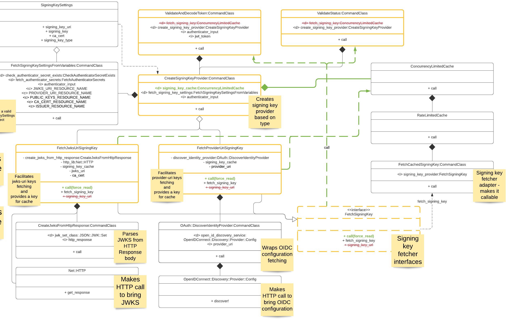
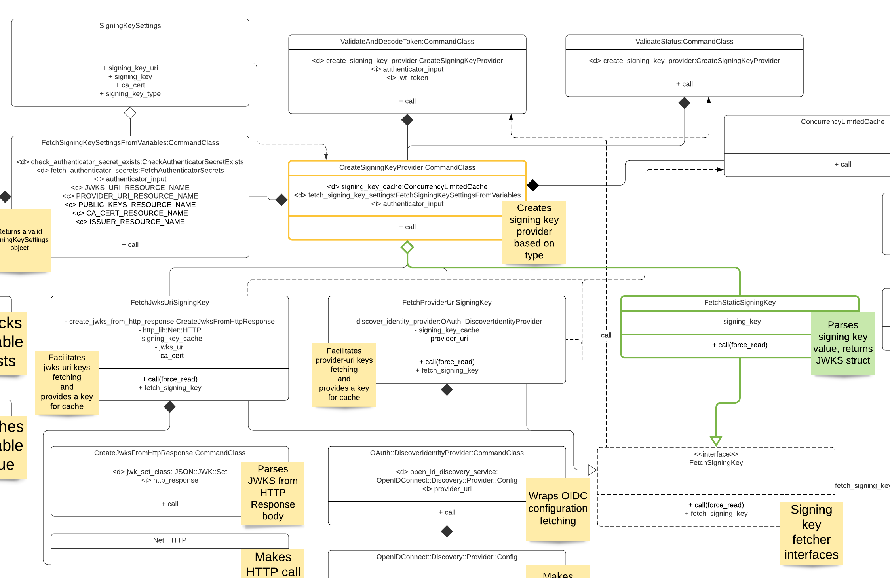
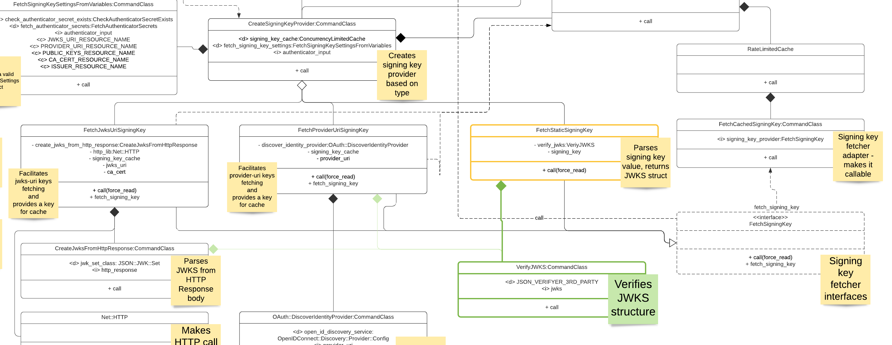

# Solution Design - Enhance signing key delivery mechanisms

## Table of Contents

* [Background](#background)
* [Issue Description](#issue-description)
* [Solution](#solution)
  * [User Interface](#user-interface)
    * [`public-keys` variable](#-public-keys--variable)
    * [`ca-cert` variable](#-ca-cert--variable)
* [Design](#design)
  * [Stage 1](#s1)
  * [Stage 2](#s2)
  * [Stage 3](#s3)
  * [Stage 4](#s4)
  * [Stage 5](#s5)
  * [Stage 6](#s6)
* [Performance](#performance)
* [Backwards Compatibility](#backwards-compatibility)
* [Work in Parallel](#work-in-parallel)
  * [Effort estimation](#effort-estimation)
* [Test Plan](#test-plan)
* [Definition of Done](#definition-of-done)

## Background

JWT Authenticator has two ways of fetching public keys in order to verify JWT tokens:

* `jwks-uri` - is a URI that refers to a resource for a set of JSON-encoded
  public keys, one of which corresponds to the key used to digitally sign the JWS
* `provider-uri` - is a URI that refers to a server supports OpenID Connect standard

Current state requires connectivity between Conjur and a host of jwks/provider-url.
If Conjur is unable to connect the host authentication will fail.

In addition fetching public key is possible if and only if a target https uri presents
certificate is signed by well-known certificate authority.

## Issue Description

There're use-cases where jwks/provider-uri is unreachable by Conjur or presents certificate
signed by 3rd party certificate authority/self-signed.

At the moment both use-cases are unsupported and required code changes in JWT authenticator.

## Solution

Add two new variables to the authenticator policy:

* `public-keys` - a variable contains static JWKS value for the case where Conjur
  is unable to reach server hosts jwks/provider-uri.
  <details>
  The variable is optional.

  The variable should be defined without other "key delivering" variables. If `public-keys`
  variable is defined alongside with `jwks-uri` and/or `provider-uri` and/or `ca-cert`
  variable authentication will fail.

  When `public-keys` variable is defined `issuer` variable became mandatory
  (in case of jwks/provider-uri variables Conjur is trying to figure out issuer
  from variables values).

  `public-keys` variable format is JSON with two fields:
  * `type` - the type of public keys. At the moment only one type `jwks` will be
    supported. More types can be supported in future.
  * `value` - the value of JWKS as is it's returned from unreachable jwks/provider-uri
    endpoint.
  <details><summary>JSON example</summary>
  For example (based on https://www.googleapis.com/oauth2/v3/certs):

  ```json

  {
    "type": "jwks",
    "value":
    {
      "keys":
      [
        {
          "alg": "RS256",
          "e": "AQAB",
          "kty": "RSA",
          "n": "umvf7fUxwzm76j41jjd-8HCguLXpkzcw-VzH-ur1OkmWWPtQ8W3_yPuhK5K35I0akptWtqHTzKyrCYPXrICY54D0HGp4ycLDSe2H_KTZGcTPfLwNhTWyc-Ax_7ZO89NyPNxn6yIoLhqEa8Q6gMUIRxkwLz0PWtGGn8qFCB_9jUFPjTiRbJ87C8LNYo3wwHiBJQfOF3QOf46gVoLHv8qM-2a27qQcl9f3oZVlm8Gwtvj6E6AnfZmehkzZZwOJyf1FvJxVaYIE5MLcsY-YwAatFgL_urwCFbp4wr9HtI_-CmU_AnF0aAOHCdRRJCXmAFgKtcQvdi82UgJIPjg_ZbMtUw",
          "use": "sig",
          "kid": "9341abc4092b6fc038e403c91022dd3e44539b56"
        },
        {
          "alg": "RS256",
          "use": "sig",
          "kty": "RSA",
          "kid": "c1892eb49d7ef9adf8b2e14c05ca0d032714a237",
          "e": "AQAB",
          "n": "xWDJBwwxLU8KU0w2bqiiXPPrOA7ffmF7g78O_D6LOv80bzeRyyX3zjzIcOI0tLZfFEfFO8CvpzTzB1h5bNinDA4MX9PFMyNBjc7Q4h7QStYZoORY6Kac314IQkwfVM3u4hbIpVvVgmapYESGpPfKh_SPr8tRvarDoEnXG6a501Ni8PfZg44aCbe0kJygl4YZjvLABEkH19HxPiXojxJEWee1lToyDJfM8tZqNTal5u3F8Mk37RhkMWMM1gypvl22t6MDUEOmqp5StwWWgo7KDJ17nDXsM6TQ10rxofkQm5I2swvfosr4Qr3GoUCrE1zXnPwNZJ_P-sQziOFRd36eZw"
        }
      ]
    }
  }

  ```

  </details></details>

* `ca-cert` - a variable contains certificates bundle with CA/self-signed certificates
  conjur will trust instead well-known CAs when it approaches jwks/provider uri.
  <details>
  The variable is optional.

  The variable can be defined only with `jwks-uri` variable.

  The variable cannot be define with `provider-uri` or `public-keys` variables.
  If `ca-cert` variable is defined with `provider-uri` or`public-keys` variables
  authentication will fail. (See relevant [design section](#s3) about `provider-uri`
  limitations).

  The `ca-cert` variable format is a certificate bundle contains one or more certificates
  in pem ([rfc7468](https://datatracker.ietf.org/doc/html/rfc7468)) format.
  <details><summary>Bundle example</summary>

  ```
  -----BEGIN CERTIFICATE-----
  MIINsDCCDJigAwIBAgIQJ1XLe8gbSBsKAAAAASJLjDANBgkqhkiG9w0BAQsFADBG
  MQswCQYDVQQGEwJVUzEiMCAGA1UEChMZR29vZ2xlIFRydXN0IFNlcnZpY2VzIExM
  QzETMBEGA1UEAxMKR1RTIENBIDFDMzAeFw0yMTExMDgwMjI1MDVaFw0yMjAxMzEw
  MjI1MDRaMBcxFTATBgNVBAMMDCouZ29vZ2xlLmNvbTBZMBMGByqGSM49AgEGCCqG
  SM49AwEHA0IABJ3Kvcco7pO5Rl9vYqVmh2olpt6Ra6XdZ/tBm1PyyOke1ThsIfPh
  SjTDguPVXDO5RhdrtTROQu9sdpJIeXxtDKujgguSMIILjjAOBgNVHQ8BAf8EBAMC
  B4AwEwYDVR0lBAwwCgYIKwYBBQUHAwEwDAYDVR0TAQH/BAIwADAdBgNVHQ4EFgQU
  S19rc1SBbMyhlN1HhHuOklGlxgUwHwYDVR0jBBgwFoAUinR/r4XN7pXNPZzQ4kYU
  83E1HScwagYIKwYBBQUHAQEEXjBcMCcGCCsGAQUFBzABhhtodHRwOi8vb2NzcC5w
  a2kuZ29vZy9ndHMxYzMwMQYIKwYBBQUHMAKGJWh0dHA6Ly9wa2kuZ29vZy9yZXBv
  L2NlcnRzL2d0czFjMy5kZXIwgglCBgNVHREEggk5MIIJNYIMKi5nb29nbGUuY29t
  ghYqLmFwcGVuZ2luZS5nb29nbGUuY29tggkqLmJkbi5kZXaCEiouY2xvdWQuZ29v
  Z2xlLmNvbYIYKi5jcm93ZHNvdXJjZS5nb29nbGUuY29tghgqLmRhdGFjb21wdXRl
  Lmdvb2dsZS5jb22CCyouZ29vZ2xlLmNhggsqLmdvb2dsZS5jbIIOKi5nb29nbGUu
  Y28uaW6CDiouZ29vZ2xlLmNvLmpwgg4qLmdvb2dsZS5jby51a4IPKi5nb29nbGUu
  Y29tLmFygg8qLmdvb2dsZS5jb20uYXWCDyouZ29vZ2xlLmNvbS5icoIPKi5nb29n
  bGUuY29tLmNvgg8qLmdvb2dsZS5jb20ubXiCDyouZ29vZ2xlLmNvbS50coIPKi5n
  b29nbGUuY29tLnZuggsqLmdvb2dsZS5kZYILKi5nb29nbGUuZXOCCyouZ29vZ2xl
  LmZyggsqLmdvb2dsZS5odYILKi5nb29nbGUuaXSCCyouZ29vZ2xlLm5sggsqLmdv
  b2dsZS5wbIILKi5nb29nbGUucHSCEiouZ29vZ2xlYWRhcGlzLmNvbYIPKi5nb29n
  bGVhcGlzLmNughEqLmdvb2dsZXZpZGVvLmNvbYIMKi5nc3RhdGljLmNughAqLmdz
  dGF0aWMtY24uY29tgg9nb29nbGVjbmFwcHMuY26CESouZ29vZ2xlY25hcHBzLmNu
  ghFnb29nbGVhcHBzLWNuLmNvbYITKi5nb29nbGVhcHBzLWNuLmNvbYIMZ2tlY25h
  cHBzLmNugg4qLmdrZWNuYXBwcy5jboISZ29vZ2xlZG93bmxvYWRzLmNughQqLmdv
  b2dsZWRvd25sb2Fkcy5jboIQcmVjYXB0Y2hhLm5ldC5jboISKi5yZWNhcHRjaGEu
  bmV0LmNuggt3aWRldmluZS5jboINKi53aWRldmluZS5jboIRYW1wcHJvamVjdC5v
  cmcuY26CEyouYW1wcHJvamVjdC5vcmcuY26CEWFtcHByb2plY3QubmV0LmNughMq
  LmFtcHByb2plY3QubmV0LmNughdnb29nbGUtYW5hbHl0aWNzLWNuLmNvbYIZKi5n
  b29nbGUtYW5hbHl0aWNzLWNuLmNvbYIXZ29vZ2xlYWRzZXJ2aWNlcy1jbi5jb22C
  GSouZ29vZ2xlYWRzZXJ2aWNlcy1jbi5jb22CEWdvb2dsZXZhZHMtY24uY29tghMq
  Lmdvb2dsZXZhZHMtY24uY29tghFnb29nbGVhcGlzLWNuLmNvbYITKi5nb29nbGVh
  cGlzLWNuLmNvbYIVZ29vZ2xlb3B0aW1pemUtY24uY29tghcqLmdvb2dsZW9wdGlt
  aXplLWNuLmNvbYISZG91YmxlY2xpY2stY24ubmV0ghQqLmRvdWJsZWNsaWNrLWNu
  Lm5ldIIYKi5mbHMuZG91YmxlY2xpY2stY24ubmV0ghYqLmcuZG91YmxlY2xpY2st
  Y24ubmV0gg5kb3VibGVjbGljay5jboIQKi5kb3VibGVjbGljay5jboIUKi5mbHMu
  ZG91YmxlY2xpY2suY26CEiouZy5kb3VibGVjbGljay5jboIRZGFydHNlYXJjaC1j
  bi5uZXSCEyouZGFydHNlYXJjaC1jbi5uZXSCHWdvb2dsZXRyYXZlbGFkc2Vydmlj
  ZXMtY24uY29tgh8qLmdvb2dsZXRyYXZlbGFkc2VydmljZXMtY24uY29tghhnb29n
  bGV0YWdzZXJ2aWNlcy1jbi5jb22CGiouZ29vZ2xldGFnc2VydmljZXMtY24uY29t
  ghdnb29nbGV0YWdtYW5hZ2VyLWNuLmNvbYIZKi5nb29nbGV0YWdtYW5hZ2VyLWNu
  LmNvbYIYZ29vZ2xlc3luZGljYXRpb24tY24uY29tghoqLmdvb2dsZXN5bmRpY2F0
  aW9uLWNuLmNvbYIkKi5zYWZlZnJhbWUuZ29vZ2xlc3luZGljYXRpb24tY24uY29t
  ghZhcHAtbWVhc3VyZW1lbnQtY24uY29tghgqLmFwcC1tZWFzdXJlbWVudC1jbi5j
  b22CC2d2dDEtY24uY29tgg0qLmd2dDEtY24uY29tggtndnQyLWNuLmNvbYINKi5n
  dnQyLWNuLmNvbYILMm1kbi1jbi5uZXSCDSouMm1kbi1jbi5uZXSCFGdvb2dsZWZs
  aWdodHMtY24ubmV0ghYqLmdvb2dsZWZsaWdodHMtY24ubmV0ggxhZG1vYi1jbi5j
  b22CDiouYWRtb2ItY24uY29tgg0qLmdzdGF0aWMuY29tghQqLm1ldHJpYy5nc3Rh
  dGljLmNvbYIKKi5ndnQxLmNvbYIRKi5nY3BjZG4uZ3Z0MS5jb22CCiouZ3Z0Mi5j
  b22CDiouZ2NwLmd2dDIuY29tghAqLnVybC5nb29nbGUuY29tghYqLnlvdXR1YmUt
  bm9jb29raWUuY29tggsqLnl0aW1nLmNvbYILYW5kcm9pZC5jb22CDSouYW5kcm9p
  ZC5jb22CEyouZmxhc2guYW5kcm9pZC5jb22CBGcuY26CBiouZy5jboIEZy5jb4IG
  Ki5nLmNvggZnb28uZ2yCCnd3dy5nb28uZ2yCFGdvb2dsZS1hbmFseXRpY3MuY29t
  ghYqLmdvb2dsZS1hbmFseXRpY3MuY29tggpnb29nbGUuY29tghJnb29nbGVjb21t
  ZXJjZS5jb22CFCouZ29vZ2xlY29tbWVyY2UuY29tgghnZ3BodC5jboIKKi5nZ3Bo
  dC5jboIKdXJjaGluLmNvbYIMKi51cmNoaW4uY29tggh5b3V0dS5iZYILeW91dHVi
  ZS5jb22CDSoueW91dHViZS5jb22CFHlvdXR1YmVlZHVjYXRpb24uY29tghYqLnlv
  dXR1YmVlZHVjYXRpb24uY29tgg95b3V0dWJla2lkcy5jb22CESoueW91dHViZWtp
  ZHMuY29tggV5dC5iZYIHKi55dC5iZYIaYW5kcm9pZC5jbGllbnRzLmdvb2dsZS5j
  b22CG2RldmVsb3Blci5hbmRyb2lkLmdvb2dsZS5jboIcZGV2ZWxvcGVycy5hbmRy
  b2lkLmdvb2dsZS5jboIYc291cmNlLmFuZHJvaWQuZ29vZ2xlLmNuMCEGA1UdIAQa
  MBgwCAYGZ4EMAQIBMAwGCisGAQQB1nkCBQMwPAYDVR0fBDUwMzAxoC+gLYYraHR0
  cDovL2NybHMucGtpLmdvb2cvZ3RzMWMzL21vVkRmSVNpYTJrLmNybDCCAQQGCisG
  AQQB1nkCBAIEgfUEgfIA8AB3AFGjsPX9AXmcVm24N3iPDKR6zBsny/eeiEKaDf7U
  iwXlAAABfP2UFQ0AAAQDAEgwRgIhAOzsE2oprPzULRAZ4U+hp9ETp3k8Bwiivtlu
  n94+qKsYAiEA98TE7mS/FBOVavXYZevfwbH32S5QsuPL4cFErqqh8fgAdQApeb7w
  njk5IfBWc59jpXflvld9nGAK+PlNXSZcJV3HhAAAAXz9lBShAAAEAwBGMEQCIBJ3
  xHfbdXo7WATOUJRFVaARljKSu8ET05WEhtBmMv/bAiB8BKDDROAGaJuQJBULJFu6
  D4nPf+OUm1R5nAv7+eh5wjANBgkqhkiG9w0BAQsFAAOCAQEAePr3y6Fub47mYGrM
  WuRhI6YKIoaL2UzNmqS+/vhmpJT5Fwd0JD8lZz3IrFuMiC1uLD+OZPBlax1XXM8E
  /IM9vaMM3VV6Qe6HiK3WHmK+1q9SPZPrIyOipaErG48bPj5HkNtiK0HIWqq4jpeo
  Xj/HR5zU5AyEnQsjVl1Wtay4DD7tc400My8XpUrBi68MlB1HCX81Rw/C/yA5SzEx
  aOgNpCgr8EiVT7A6lJ8JNPNd+9alwA5PEATPNoUdZlJLv56YLFVM3IfgzXNktl3z
  bDlG1NLB6QzNvvLlurrLlBENaRpUh0rfQNN/MrlIDkPNCTI0QhaOyZOEm8L3BO3V
  Fbj2aw==
  -----END CERTIFICATE-----
  -----BEGIN CERTIFICATE-----
  MIIFljCCA36gAwIBAgINAgO8U1lrNMcY9QFQZjANBgkqhkiG9w0BAQsFADBHMQsw
  CQYDVQQGEwJVUzEiMCAGA1UEChMZR29vZ2xlIFRydXN0IFNlcnZpY2VzIExMQzEU
  MBIGA1UEAxMLR1RTIFJvb3QgUjEwHhcNMjAwODEzMDAwMDQyWhcNMjcwOTMwMDAw
  MDQyWjBGMQswCQYDVQQGEwJVUzEiMCAGA1UEChMZR29vZ2xlIFRydXN0IFNlcnZp
  Y2VzIExMQzETMBEGA1UEAxMKR1RTIENBIDFDMzCCASIwDQYJKoZIhvcNAQEBBQAD
  ggEPADCCAQoCggEBAPWI3+dijB43+DdCkH9sh9D7ZYIl/ejLa6T/belaI+KZ9hzp
  kgOZE3wJCor6QtZeViSqejOEH9Hpabu5dOxXTGZok3c3VVP+ORBNtzS7XyV3NzsX
  lOo85Z3VvMO0Q+sup0fvsEQRY9i0QYXdQTBIkxu/t/bgRQIh4JZCF8/ZK2VWNAcm
  BA2o/X3KLu/qSHw3TT8An4Pf73WELnlXXPxXbhqW//yMmqaZviXZf5YsBvcRKgKA
  gOtjGDxQSYflispfGStZloEAoPtR28p3CwvJlk/vcEnHXG0g/Zm0tOLKLnf9LdwL
  tmsTDIwZKxeWmLnwi/agJ7u2441Rj72ux5uxiZ0CAwEAAaOCAYAwggF8MA4GA1Ud
  DwEB/wQEAwIBhjAdBgNVHSUEFjAUBggrBgEFBQcDAQYIKwYBBQUHAwIwEgYDVR0T
  AQH/BAgwBgEB/wIBADAdBgNVHQ4EFgQUinR/r4XN7pXNPZzQ4kYU83E1HScwHwYD
  VR0jBBgwFoAU5K8rJnEaK0gnhS9SZizv8IkTcT4waAYIKwYBBQUHAQEEXDBaMCYG
  CCsGAQUFBzABhhpodHRwOi8vb2NzcC5wa2kuZ29vZy9ndHNyMTAwBggrBgEFBQcw
  AoYkaHR0cDovL3BraS5nb29nL3JlcG8vY2VydHMvZ3RzcjEuZGVyMDQGA1UdHwQt
  MCswKaAnoCWGI2h0dHA6Ly9jcmwucGtpLmdvb2cvZ3RzcjEvZ3RzcjEuY3JsMFcG
  A1UdIARQME4wOAYKKwYBBAHWeQIFAzAqMCgGCCsGAQUFBwIBFhxodHRwczovL3Br
  aS5nb29nL3JlcG9zaXRvcnkvMAgGBmeBDAECATAIBgZngQwBAgIwDQYJKoZIhvcN
  AQELBQADggIBAIl9rCBcDDy+mqhXlRu0rvqrpXJxtDaV/d9AEQNMwkYUuxQkq/BQ
  cSLbrcRuf8/xam/IgxvYzolfh2yHuKkMo5uhYpSTld9brmYZCwKWnvy15xBpPnrL
  RklfRuFBsdeYTWU0AIAaP0+fbH9JAIFTQaSSIYKCGvGjRFsqUBITTcFTNvNCCK9U
  +o53UxtkOCcXCb1YyRt8OS1b887U7ZfbFAO/CVMkH8IMBHmYJvJh8VNS/UKMG2Yr
  PxWhu//2m+OBmgEGcYk1KCTd4b3rGS3hSMs9WYNRtHTGnXzGsYZbr8w0xNPM1IER
  lQCh9BIiAfq0g3GvjLeMcySsN1PCAJA/Ef5c7TaUEDu9Ka7ixzpiO2xj2YC/WXGs
  Yye5TBeg2vZzFb8q3o/zpWwygTMD0IZRcZk0upONXbVRWPeyk+gB9lm+cZv9TSjO
  z23HFtz30dZGm6fKa+l3D/2gthsjgx0QGtkJAITgRNOidSOzNIb2ILCkXhAd4FJG
  AJ2xDx8hcFH1mt0G/FX0Kw4zd8NLQsLxdxP8c4CU6x+7Nz/OAipmsHMdMqUybDKw
  juDEI/9bfU1lcKwrmz3O2+BtjjKAvpafkmO8l7tdufThcV4q5O8DIrGKZTqPwJNl
  1IXNDw9bg1kWRxYtnCQ6yICmJhSFm/Y3m6xv+cXDBlHz4n/FsRC6UfTd
  -----END CERTIFICATE-----
  -----BEGIN CERTIFICATE-----
  MIIFYjCCBEqgAwIBAgIQd70NbNs2+RrqIQ/E8FjTDTANBgkqhkiG9w0BAQsFADBX
  MQswCQYDVQQGEwJCRTEZMBcGA1UEChMQR2xvYmFsU2lnbiBudi1zYTEQMA4GA1UE
  CxMHUm9vdCBDQTEbMBkGA1UEAxMSR2xvYmFsU2lnbiBSb290IENBMB4XDTIwMDYx
  OTAwMDA0MloXDTI4MDEyODAwMDA0MlowRzELMAkGA1UEBhMCVVMxIjAgBgNVBAoT
  GUdvb2dsZSBUcnVzdCBTZXJ2aWNlcyBMTEMxFDASBgNVBAMTC0dUUyBSb290IFIx
  MIICIjANBgkqhkiG9w0BAQEFAAOCAg8AMIICCgKCAgEAthECix7joXebO9y/lD63
  ladAPKH9gvl9MgaCcfb2jH/76Nu8ai6Xl6OMS/kr9rH5zoQdsfnFl97vufKj6bwS
  iV6nqlKr+CMny6SxnGPb15l+8Ape62im9MZaRw1NEDPjTrETo8gYbEvs/AmQ351k
  KSUjB6G00j0uYODP0gmHu81I8E3CwnqIiru6z1kZ1q+PsAewnjHxgsHA3y6mbWwZ
  DrXYfiYaRQM9sHmklCitD38m5agI/pboPGiUU+6DOogrFZYJsuB6jC511pzrp1Zk
  j5ZPaK49l8KEj8C8QMALXL32h7M1bKwYUH+E4EzNktMg6TO8UpmvMrUpsyUqtEj5
  cuHKZPfmghCN6J3Cioj6OGaK/GP5Afl4/Xtcd/p2h/rs37EOeZVXtL0m79YB0esW
  CruOC7XFxYpVq9Os6pFLKcwZpDIlTirxZUTQAs6qzkm06p98g7BAe+dDq6dso499
  iYH6TKX/1Y7DzkvgtdizjkXPdsDtQCv9Uw+wp9U7DbGKogPeMa3Md+pvez7W35Ei
  Eua++tgy/BBjFFFy3l3WFpO9KWgz7zpm7AeKJt8T11dleCfeXkkUAKIAf5qoIbap
  sZWwpbkNFhHax2xIPEDgfg1azVY80ZcFuctL7TlLnMQ/0lUTbiSw1nH69MG6zO0b
  9f6BQdgAmD06yK56mDcYBZUCAwEAAaOCATgwggE0MA4GA1UdDwEB/wQEAwIBhjAP
  BgNVHRMBAf8EBTADAQH/MB0GA1UdDgQWBBTkrysmcRorSCeFL1JmLO/wiRNxPjAf
  BgNVHSMEGDAWgBRge2YaRQ2XyolQL30EzTSo//z9SzBgBggrBgEFBQcBAQRUMFIw
  JQYIKwYBBQUHMAGGGWh0dHA6Ly9vY3NwLnBraS5nb29nL2dzcjEwKQYIKwYBBQUH
  MAKGHWh0dHA6Ly9wa2kuZ29vZy9nc3IxL2dzcjEuY3J0MDIGA1UdHwQrMCkwJ6Al
  oCOGIWh0dHA6Ly9jcmwucGtpLmdvb2cvZ3NyMS9nc3IxLmNybDA7BgNVHSAENDAy
  MAgGBmeBDAECATAIBgZngQwBAgIwDQYLKwYBBAHWeQIFAwIwDQYLKwYBBAHWeQIF
  AwMwDQYJKoZIhvcNAQELBQADggEBADSkHrEoo9C0dhemMXoh6dFSPsjbdBZBiLg9
  NR3t5P+T4Vxfq7vqfM/b5A3Ri1fyJm9bvhdGaJQ3b2t6yMAYN/olUazsaL+yyEn9
  WprKASOshIArAoyZl+tJaox118fessmXn1hIVw41oeQa1v1vg4Fv74zPl6/AhSrw
  9U5pCZEt4Wi4wStz6dTZ/CLANx8LZh1J7QJVj2fhMtfTJr9w4z30Z209fOU0iOMy
  +qduBmpvvYuR7hZL6Dupszfnw0Skfths18dG9ZKb59UhvmaSGZRVbNQpsg3BZlvi
  d0lIKO2d1xozclOzgjXPYovJJIultzkMu34qQb9Sz/yilrbCgj8=
  -----END CERTIFICATE-----
  ```

  </details></details>

Possible alternative `ca-cert` variable per authenticator solution is a mechanism
allows dynamically manage certificates Conjur trusts. REST or command line based
solution allows to add/remove additional trusted certificates to a leader that will
replicate is across all conjur nodes (standbys and followers). At the moment this
alternative is looking too heavy in terms of EE so we will continue with the variable.

### User Interface

#### `public-keys` variable

JWT Authenticator policy contains new `public-keys` variable example:

```yaml
- !policy
  id: conjur/authn-jwt/myUnreachableVendor
  body:
    - !webservice
    - !variable public-keys
    - !variable issuer
    ...
```

Populating relevant variables using [Python CLI](https://github.com/cyberark/conjur-api-python3)
(based on google's [openid configuration](https://accounts.google.com/.well-known/openid-configuration)):

```bash
conjur variable set -i conjur/authn-jwt/myUnreachableVendor/public-keys \
  "{ \"type\":\"jwks\", \"value\": $(curl https://www.googleapis.com/oauth2/v3/certs) }"
conjur variable set -i conjur/authn-jwt/myUnreachableVendor/issuer \
  "https://accounts.google.com"
```

#### `ca-cert` variable

JWT Authenticator policy contains new `ca-cert` variable example:

```yaml
- !policy
  id: conjur/authn-jwt/myUntrustedVendor
  body:
    - !webservice
    - !variable jwks-uri
    - !variable ca-cert
    ...
```

Populating relevant variables using [Python CLI](https://github.com/cyberark/conjur-api-python3)
and [OpenSSL command line tool](https://www.openssl.org/docs/manmaster/man1/openssl.html)
for fetching certificate bundle:

```bash
conjur variable set -i conjur/authn-jwt/myUntrustedVendor/jwks-uri \
  "https://provider.host.name/jwks-uri"
conjur variable set -i conjur/authn-jwt/myUntrustedVendor/ca-cert \
  "$(openssl s_client \
             -showcerts \
             -connect provider.host.name:443 \
             -servername provider.host.name \
             < /dev/null 2>/dev/null \
     | awk '/-----BEGIN/,/-----END/')"
```

## Design

Today authenticator's code is tightly coupled to the way the authenticator is
configured - conjur variables.

The next design is taking a step forward in direction of decoupling variables from
the main authenticator's business logic.

The design is considering around and changing code area presented on the next class
diagram:



Next sections are describing code changes step by step towards functional - supporting
public-keys configuration, and non-functional - decoupling variables from main BL
requirements.

1. <a name="s1"></a>Create abstraction layer for relevant Conjur variables from
   authenticator's BL
   <details><div>

   New class `SigningKeySettings` the class is [POJO](https://en.wikipedia.org/wiki/Plain_old_Java_object)
   like class for JWKS fetching related settings of the authenticator.

   The class will expose next properties:

   * `signing_key_uri`: `String` - returns `jwks-uri` or `provider-uri` variable
     value
   * `signing_key_type`: one of [`JWKS`, `OIDC`] - returns provider type base on
     existing variables

   New class `FetchSigningKeySettingsFromVariables` the command class:

   * fetches settings from variables
   * validates settings
   * populates and returns `SigningKeySettings` instance

   The responsibility for variables permutation validation is moving from `CreateSigningKeyProvider`
   class to the new `FetchSigningKeySettingsFromVariables` class.

   The class also figures out and sets `signing_key_type` which will be used by `CreateSigningKeyProvider`
   to create needed signing key provider.

   Integrate both classes into existing flow:
   

   * `FetchSigningKeySettingsFromVariables` is `CreateSigningKeyProvider` dependency
   * Change `FetchJwksUriSigningKey` and `FetchProviderUriSigningKey` input parameters

   </div></details>

1. <a name="s2"></a>Add new properties to `SigningKeySettings` class
   <details><div>

   Add new properties to the `SigningKeySettings` class:

   * `signing_key`: String - returns `public-keys` variable value
   * `ca_cert`: `OpenSSL::X509::Store`<br>
     Store creation example

     ```ruby
     ca_cert = OpenSSL::X509::Store.new
     ::Conjur::CertUtils.add_chained_cert(ca_cert, <VARIABLE_VALUE>)
     ```

   Add new `signing_key_type` - `STATIC`. The provider type static when `public-keys`
   variable is set and non empty.
   

   Modify `FetchSigningKeySettingsFromVariables` class accordingly.
   Implement subsequent input validation:

   * Only one of `jwks-uri`, `provider-uri`, `public-keys` variables can be define
   * `ca-cert` variable can be defined only with `jwks-uri` variable
   * If `public-keys` variable is defined `issuer` variable should be defined too
   * Each defined variable should be non empty

   ### Expected validation errors

   | **Error message** | **Description** |
   |-------------------|-----------------|
   | Signing key configuration is invalid: only one of `jwks-uri`, `provider-uri`, `public-keys` variables can be define simultaneously | When more than one variable is defined                                         |
   | Signing key configuration is invalid: `ca-cert` variable can be defined only with `jwks-uri` variables                             | When `ca-cert` variable defined with `provider-uri` or `public-keys` variables |
   | Signing key configuration is invalid: missing `issuer` variable                                                                    | When `public-keys` variable is defined but `issuer` is not                     |
   | Signing key configuration is invalid: {variable-name} variable is defined but empty                                                | When variables permutation is valid but one of it is empty                     |

   </div></details>

1. <a name="s3"></a>Use additional CA certificates during keys fetching in `jwks-uri`
   use cases
   <details><div>

   Pass `ca_cert`:`OpenSSL::X509::Store` parameter to `FetchJwksUriSigningKey` class.

   `ca_cert` parameter is optional, default value is `nil`.

   

   Modify the way `FetchJwksUriSigningKey` invokes `Net::HTTP` `GET` request
   to `jwks_url` in a way allows to trust certificates from `ca_cert`:`OpenSSL::X509::Store`.**

   See [Net::HTTP](https://ruby-doc.org/stdlib-2.5.8/libdoc/net/http/rdoc/Net/HTTP.html)
   reference.

   Suggested implementation:

   ```ruby
   uri = URI(jwks_uri)
   http = Net::HTTP.start(
     uri.host,
     uri.port,
     :use_ssl => true,
     :cert_store => ca_cert)
   request = Net::HTTP::Get.new(uri)
   response = http.request(request)
   ```

   The only possible way of injecting certificate store into OpenIDConnect flow
   that we found is like this

   ```ruby
   OpenIDConnect.http_config do |config|
     config.ssl_config.cert_store = ca_cert
   end
   openid_config = OpenIDConnect::Discovery::Provider::Config.discover!(provider_uri)
   ```

   `http_config` block is state-full and cannot be changed once defined.

   This behaviour does not suite current conjur's approach: to threat ca-certs
   of each authenticator instance separately. Following this it been decided to
   not support `ca-cert` variable with `provider-uri` one.
   </div></details>

1. <a name="s4"></a>Refactor cache layer related to `FetchProviderUriSigningKey`
   and `FetchJwksUriSigningKey` classes
   <details><div>

   Today cache (`ConcurrencyLimitedCache`):

   * combines two responsibilities caching and throttling mechanism around fetching
     signing keys.
   * has two instances one under `ValidateAndDecodeToken` and one under `ValidateStatus`.
     Each instance has its own state independent from each other.
   * caches responses from `Fetch*SigningKey` classes. The cache does not distinct
     types of signing key fetchers.

   Caching behaviour is completely unnecessary in case when signing key is in DB.
   Changing signing key in variable should take an immediate effect on the authenticator.

   In order to prevent from DB based signing key to be cached the decision to
   cache or not to cache should be taken inside concrete signing key provider.
   In order to achieve it the following changes need to be implemented (see
   [cyberark/conjur#2447](https://github.com/cyberark/conjur/pull/2447) for POC
   implementation):

   * Make cache instance to the `CreateSigningKeyProvider` class dependencies.
     Remove cache instance from `ValidateAndDecodeToken` and `ValidateStatus`
     classes dependencies. Additional side effect of this change is that there
     will be only one instance of cache that will prevent additional approaches to
     signing key provider from authenticate or status flows once it's cached.
   * Make cache a ctor parameter of `Fetch*SigningKey` classes. `CreateSigningKeyProvider`
     will pass cache dependency into the classes when create them.
   * Adjust calling sequence:
     * `ValidateAndDecodeToken` and `ValidateStatus` are calling `call` method of
       `Fetch*SigningKey` classes with optional `force_read` flag instead of `call`
       method of the `ConcurrencyLimitedCache` class. _`call` is a new method in
       ephemeral `FetchSigningKey` interface._
     * `Fetch*SigningKey` classes are calling `call` method of the `ConcurrencyLimitedCache`
       class with appropriate parameters. _`signing_key_url` is not logger a part
       of ephemeral `FetchSigningKey` interface `cache_key` is defined internally
       in concrete `Fetch*SigningKey` class._

   
   </div></details>

1. <a name="s5"></a>Create new `FetchStaticSigningKey` class parses the `public-keys`
   variable value and returns a valid JWKS structure
   <details><div>

   `FetchStaticSigningKey` class:

   * partially implements ephemeral `FetchSigningKey` interface:
   * `call` method receives `force_read` parameter, but ignores it
   * `fetch_signing_key` method does not require implementation
   * receives `signing_key` value in ctor
   * parses and validates `signing_key` value in `call`
     For reference see expected validation errors below and `CreateJwksFromHttpResponse.parse_jwks_response`

   `CreateSigningKeyProvider` class:

   * creates and returns `FetchStaticSigningKey` class when `signing_key_type`
     is `STATIC`
   * passes `signing_key` from `SigningKeySettings`

   

   ### Expected validation errors

   | **Error message** | **Description** |
   |-------------------|-----------------|
   | Signing key configuration is invalid: JSON parsing error from JSON gem                     | When the variable value is not a valid JSON |
   | Signing key configuration is invalid: `public-keys` `type` field value is missing or empty | When type field absent or has empty value   |
   | Signing key configuration is invalid: `public-keys` `type` field value {} is wrong         | When type field value is no `jwks`          |
   | Signing key configuration is invalid: `public-keys` `value` field is missing or empty      | When value field absent or has empty value  |
   </div></details>

1. <a name="s6"></a>Strict JWKS structure input validation
   <details><div>

   Getting JWKS input from end user rather directly from JWKS/OIDC provider requires
   stricter input validation.

   Create new `VerifyJWKS` CommandClass class is responsible for JWKS structure validation.
   Method `call` will get a JWKS structure and will throw an exception if it's invalid.
   The `call` method will return a valid JWKS structure.

   For validation purpose itself we can take one of the next 3rd parties:

   - [json_schema](https://github.com/brandur/json_schema)
   - [json-schema](https://github.com/voxpupuli/json-schema)
   - [json_schemer](https://github.com/davishmcclurg/json_schemer)
   - any other appropriate 3rd party

   See [JSON Schema](https://json-schema.org) for more information.

   Choosing the best 3rd party is a part of implementation effort.

   Validation rules should be aligned with JWKS [RFC 7517](https://www.ietf.org/rfc/rfc7517.txt)

   
   </div></details>

## Performance

Two additional variables checking, fetching and parsing is added to the flow.
The risk of performance impact it very low.

## Backwards Compatibility

The change is fully backward compatible.

## Work in Parallel

Despite stages in [Design](#design) are described sequentially and all changes are
around the same classes it's possible to parallelize development work to two threads.

Stages:

* S1 - Variables abstraction
* S2 - New variables fetching and validation
* S3 - `ca-cert` integration
* S4 - Refactor signing key cache level
* S5 - Static keys fetcher class
* S6 - JWKS validation

Proposed flow:

```
S1 --> S4 --> S5 --> S6
   --> S2 --> S3
```

### Effort estimation

| **Stage** | **EE** |
| --------- | ------ |
| S1        | 3 SP   |
| S2        | 2 SP   |
| S3        | 3 SP (without integration tests) |
| S4        | 2 SP (considering spike code [cyberark/conjur#2447](https://github.com/cyberark/conjur/pull/2447)) |
| S5        | 2 SP (without integration tests) |
| S6        | 3 SP (without integration tests) |
| Integration tests | 10 SP - t-shirt estimation |
| Documentation, logs and messages review | 5 SP |
| **Total** | **30 SP** |

## Test Plan

Test plan will be discussed separately.

Stages S1 and S4 does not require new tests but require UTs adjustment and existing
integration tests should pass.

## Definition of Done

* Solution designed is approved
* Test plan is reviewed
* Acceptance criteria have been met
* Tests are implemented according to test plan
* The behaviour is documented in Conjur Open Source and Enterprise
* All relevant components are released
