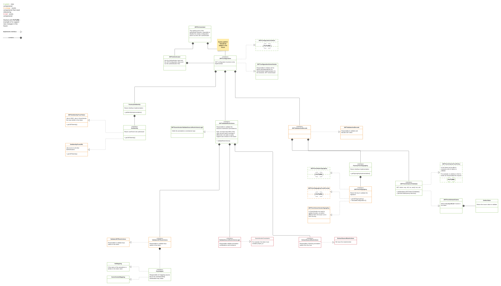
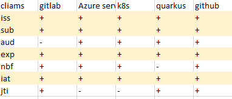
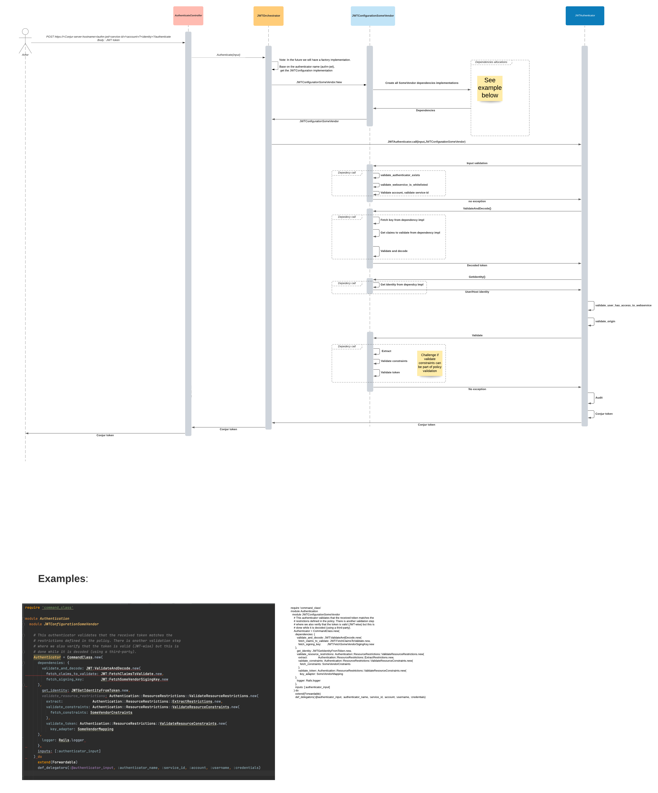
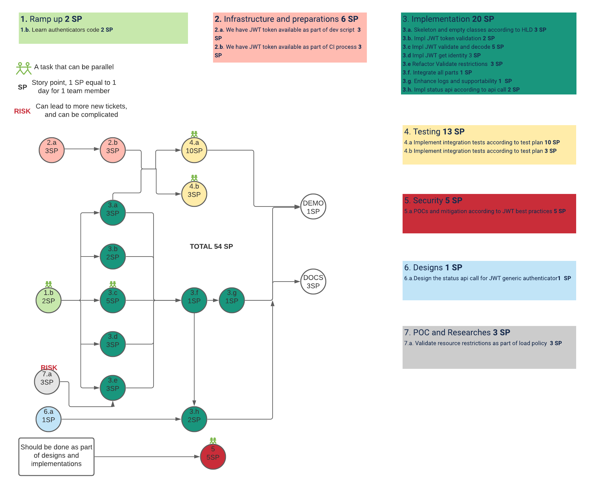

# Solution Design - JWT generic Authenticator

## Table of Contents

* [Glossary](#glossary)
* [Useful links](#useful-links)
* [Issue description](#issue-description)
* [Out of scope for 1st phase](#out-of-scope-for-1st-phase)
* [Solution](#solution)
    + [Design](#design)
        - [Class diagram](#class-diagram)
        - [Sequence diagram](#sequence-diagram)
        - [Business logic](#business-logic)
            * [Fetch identity](#fetch-identity)
            * [Validate and decode](#validate-and-decode)
                + [Fetch signing key](#fetch-signing-key)
    + [Developments phases](#developments-phases)
        - [1st phase](#1st-phase)
        - [2nd phase](#2nd-phase)
        - [3rd phase](#3rd-phase)
    + [How to contribute](#how-to-contribute)
    + [Meet the requirements](#meet-the-requirements)
    + [Backwards compatibility](#backwards-compatibility)
    + [Performance](#performance)
    + [Affected Components](#affected-components)
* [Open questions](#open-questions)
* [Security](#security)
* [Test Plan](#test-plan)
* [Delivery Plan](#delivery-plan)
    + [Total 1st milestone EE 51](#total-1st-milestone-ee-51)
        - [Ramp-up EE 2](#ramp-up-ee-2)
        - [Designs EE 1](#designs-ee-1)
        - [POC and Researches 3](#poc-and-researches-3)
        - [Implementations EE 18](#implementations-ee-18)
        - [Infrastructure EE 6](#infrastructure-ee-6)
        - [Testing EE 13](#testing-ee-13)
        - [Security EE 5](#security-ee-5)
        - [Docs EE 3](#docs-ee-3)
        - [Demo EE 1](#demo-ee-1)
    + [Total Post 1st milestone EE 5](#total-post-1st-milestone-ee-5)
    + [Total 1st milestone + Token schema 16](#total-1st-milestone---token-schema-16)

## Glossary

| **Term**   | **Description**                                              |
| ---------- | ------------------------------------------------------------ |
| JWT Claims | claims are pieces of information asserted about a subject    |
| iss        | (issuer): Issuer of the JWT                                  |
| sub        | (subject): Subject of the JWT (the user)                     |
| aud        | (audience): Recipient for which the JWT is intended          |
| exp        | (expiration time): Time after which the JWT expires          |
| nbf        | (not before time): Time before which the JWT must not be accepted for processing |
| iat        | (issued at time): Time at which the JWT was issued; can be used to determine age of the JWT |
| jti        | (JWT ID): Unique identifier; can be used to prevent the JWT from being replayed (allows a token to be used only once) |


## Useful links

- [PRD](https://cyberark365.sharepoint.com/sites/Conjur/Shared%20Documents/DAP/PRDs/%5bPRD%5d%20JWT%20Authenticator.docx?web=1)
- Feature doc (Confluence - Conjur JWT Authenticator)
- [JWT claims](https://auth0.com/docs/tokens/json-web-tokens/json-web-token-claims)

## Issue description

There are a lot of vendors, and protocols which use JWT for authentication process.
We would like to have a generic JWT authenticator to support those use cases.

## Out of scope for 1st phase

The solution which described below will give us the infrastructure to support most (all that we know about) of the common
JWT authentication use cases, but as we always do we will start with a simple 1st phase to support a specific use case.

Here are all the out of scope list of that phase:

*  We will not have a token-schema (or any other configuration in the policy)
   which affects token validation logic in runtime - It will be added on next phase

*  static-keys support - will be implemented after POC and Security architect approval

*  Identity inside JWT token will 1st level key (not nested)


## Solution

A new generic JWT authenticator will be added to Conjur, and will be responsible to handle different Vendors authentication
implementations which based on JWT.

Each authentication implementation will be represented with a different JWT configuration, for example:

1. VendorX - authenticate with JWT which signed by static key
2. VendorY - authenticate with JWT and have the identity (user/host) in some format under the audience claim
3. VendorZ - authenticate with JWT and we must validate some custom claims (projectID, location)

### Design

The following class diagram, represent the responsibilities and the boundaries of the JWT generic authenticator.

#### Class diagram



According to the above diagram we will have the flexibility to support any vendor JWT
implementation no matter what are the answers of the following questions:

1. From where to fetch the public key token?

   1.1 Provider URI ? like we do in Azure, OIDC and GCP

   1.2 Special JWKS url ? Like Gitlab implementation

   1.3 Static key?

2. Which JWT claim to validate ? exp, nbf, iss, aud, jti, iat, sub

    * Note: All of them are optional, but we already saw differences between some vendors implementations
      

3. Where is the identity to authorized ?

   3.1. In the URL request? like GCP and Azure

   3.2. Inside the token? Under which claim? Like OIDC

   Note:
   In 1st phase we will support both 3.1, 3.2

4. How to validate the user restrictions?

   4.1. Where are those restrictions ? in all of our authenticators the restrictions reside under the
   identity (user/host) policy, but according to this design we have the
   flexibility to support other approaches in the future.

   4.2. What are the constraints of the restrictions? mandatory? optional? permitted ? at least one? OR relation? AND relation?

   4.3. Validate restrictions value against the token?

    * Comparison logic? ==? contains?

    * Key mapping logic? for example: auth-gcp/project-id is subject claim in JWT

#### Sequence diagram



#### Business logic

##### Fetch identity

For 1st milestone we will support 2 use cases:

1. User/Host identity which delivered in the Rest request parameter. for example:
   user-test is the identity in the following request.
   This parameter is optional


        POST https://<Conjur-server-hostname>/authn-jwt/<service-id>/<account>/user-test/authenticate

2. User/Host identity which reside inside the token under claim key which configured in `token-app-property`
   in the authenticator policy. for example: if the identity reside in `user_email` claim we will load the
   following policy:

   ```yaml
    - !policy
    id: conjur/authn-jwt/VendorY
    body:
    - !webservice
    
    - !variable
      id: token-app-property
   ```

   The user will ne responsible to set the value:
   token-app-property=`user_email`

The `FactoryGetIdentity` class will be responsible on the following logic:
The user in the variable token-app-property gets priority over URL, which means:

1. token-app-property variable is configured, Identity is also delivered in the URL = User from Token

2. token-app-property variable is configured, No Identity in the URL = User from Token

3. token-app-property variable not exists in policy, Identity delivered in the URL = User from URL

4. token-app-property variable not exists/empty in policy, No Identity in the URL = ERROR

Note:
If token-app-property variable is configured,  
but the variable not set with value, it is always an ERROR without checking the URL


##### Validate and decode

###### Fetch signing key

For 1st milestone we will support only in keys
which accessible by the provider which signed on the token.

The path for fetching the keys will be configured as variable in the authenticator policy.

The options are:

1. provider-uri = OIDC provider hostname  
   Note: Fetch key from provider uri base on OIDC protocol
2. jwks-uri = JWT Provider uri to fetch the public key

The `FactoryFetchSignigKey` class will be responsible on the following logic:

1. Both configured = ERROR

2. None of them configured = ERROR

3. 1 of them configured = use it interface to fetch the key

###### Fetch JWT standard claims to validate

For 1st milestone we will validate the following:

1. nbf iat - will be validated if exists in token, (not extra value is  needed from customer)
2. exp - it is mandatory, if not exists in the token we will throw an error
3. Iss - will be validated if exists in token
   The value to validate will be fetched by the following logic:

* throw ERROR if `issuer` variable configured but empty
* fetch value from `issuer` variable if configured
* else
    * Throw ERROR if both `provider-uri` and `jwks-uri` are configured
    * fetch value from `provider-uri` variable if configured
    * fetch value from `jwks-uri` variable if configured

3. aud,sub - will be validated only if configured as annotation in the host.user policy
4. jti - won't be validated as it required additional information

##### Resource restrictions

Note: It is very similar to our current authenticators logic.
For 1st milestone we will support the following logic:

* If not jwt annotations was configured on the host/user we will throw an ERROR
* The relations between the annotation will be AND
* There is no mapping schema, the annotation name should be found in the token claims 1st level only
* The comparison logic will between the jwt annotation to the token claim will be == , (no regex support at this phase)
* All host/user jwt annotations are mandatory to validate

### Development phases for Simple JWT authenticator

#### 1st phase

We will support 1 specific vendor, which meaning we will create 1 implementation for each interface.

For example for Gitlab CI JOB JWT token we will have the following JWT configuration:

1. JWTFetchSigningKey: we will fetch the key from the a specific JWKS url
2. JWTFetchClaimsToValidate: exp,iss,iat,nbf
3. ExtractSourceRestrictions: from resource policy like all others authenticators
4. VendorConstraints: (TODO: validate with PM) any claim which appears under the identity policy
5. KeyAdapter: None - the name of the annotation should be match to a token claim
6. ValidateJWTRestrictions - string comparison in and relation

The JWTConfigurationVendorX implementation will contains all the above dependencies implementations.

Example to the authenticator policy:

```yaml
    - !policy
    id: conjur/authn-jwt/VendorX
    body:
    - !webservice
    
    - !variable
      id: provider-uri
    
    - !group apps
    
    - !permit
      role: !group apps
      privilege: [ read, authenticate ]
      resource: !webservice
```

Example to the user policy:

```yaml
    - !policy
      id: <policy-id>
      body:
        - !group
    
        - &hosts
            - !host
              id: myapp
              annotations:
              authn-jwt/VendorX/project_id: 22
              authn-jwt/VendorX/job_id: job_1212
              authn-jwt/VendorX/resourcePath: /my/org
    
    
        - !grant
          role: !group
          members: *hosts
    
    - !grant
      role: !group /conjur/authn-jwt/VendorX/apps
      member: !group <policy-id>
```

#### 2nd phase

Support VendorY implementation.

Example for future VendorY requirements:
VendorY requirements are similar to VendorX with the following differences:

1. VendorY uses staticKey

2. VendorY constraints are:

   2.1. The Token must contain at least one of the following claims: country or region or location

   2.2. The token should have mandatory claim of flow-id

Develop VendorY new interfaces implementations:

1. JWTFetchSigningKey: fetch static keys from policy
2. VendorConstraints: as explained above

The JWTConfigurationVendorY implementation will contains all the above dependencies implementations.

Example to the authenticator policy:

```yaml
    - !policy
    id: conjur/authn-jwt/VendorY
    body:
    - !webservice
    
    - !variable
      id: static-key-value

    - !variable
      id: static-key-metadata

    - !variable
      id: provider-uri
    
    - !group apps
    
    - !permit
      role: !group apps
      privilege: [ read, authenticate ]
      resource: !webservice
```

Example to the user policy:

```yaml
    - !policy
      id: <policy-id>
      body:
        - !group
    
        - &hosts
            - !host
              id: myapp
              annotations:
              authn-jwt/VendorY/location: tiberias
              authn-jwt/VendorY/flow_id: 442-attack
    
        - !grant
          role: !group
          members: *hosts
    
    - !grant
      role: !group /conjur/authn-jwt/VendorY/apps
      member: !group <policy-id>
```

#### 3rd phase

Add smart components to control runtime decisions by configuration

To support both VendorX and VendorY public key fetching we will implement the following:

*  JWTFetchSigningKey: according to policy configuration, for example always fetch from provider uri
   unless static-key-value exists

To support both VendorX and VendorY constraints we will implement the following:

*  VendorConstraints: read from policy, this is more tricky and i suggest to challenge this once we meet this
   requirements

### How to contribute

Once we will have multiple interfaces implementations, the way to support a new VendorZ will be:

1. Copy and JwtConfigurationTemplate
2. Change his name to JwtConfigurationVendorZ
3. Choose the interfaces implementations according to your solution
4. Develop a new small peaces if needed
5. Run UT
6. Create a PR request for Conjur team to write E2E tests and to validate this new flow is secure

### Meet the requirements

More details on the requirements can be found on Confluence - Conjur JWT Authenticator

* New simple JWT generic authenticator
    * Meet? Yes
    * How? The UX is simple like all other authenticators we have

* simplest "mapping" option from JWT to host annotation
    * Meet? Yes
    * How? By implementing small interface
    * Motivation? Will give us the flexibility to support any new future requirement and the maturity
      to move it later to more "smarter" component to consume it from policy configuration

* easily way to contribute code
    * Meet? Yes
    * How? By implementing new JWTConfiguration implementation class
    * Motivation? Will give us the flexibility to support any new future requirement and it keeps the authenticator policy
      simple to use

* support static keys in 1st phase
    * Meet? Partially
    * Why? At the time of writing, we have not yet begun the POC of how its works
    * How? The is interface with this 1 responsibility

* token-schema
    * Meet? No
    * Why? I suggest to delay this decision in order to keep a simple use and also have more flexibility
      by moving this logic to code

### Backwards compatibility

None because this is a new feature.

### Performance

JWT authenticator performance should conform with our other authenticators with an average call time of 1 second.

### Affected Components

- Conjur

- Conjur Enterprise

## Open questions

1. Do we want to support static keys in 1st phase?
2. Which vendor constraints do we want to implement in 1st phase? for example, project-id is mandatory

## Security

We will validate we are are following JWT best practices

## Test Plan

TODO

## Delivery Plan

### Total 1st milestone EE 54



#### Ramp-up EE 2

* Learn authenticators code EE 2

#### Designs EE 1

* Design the status api call for JWT generic authenticator EE 1

#### POC and Researches 3

* Validate resource restrictions as part of load policy EE 3

#### Implementations EE 20

* Skeleton and empty classes according to HLD EE 3
* Impl JWT token validation EE 2
    * Class KeyAdapter
    * Class ValidateJWTRestrictions
* Impl JWT validate and decode EE 5
    * Class JWTFetchClaimsToValidate
    * Class GetIssValue
    * Class JWTFetchSigningKey
    * Class ValidateAndDecode
* Impl JWT get identity EE 3
    * Implement factory
    * Implement interface
    * Implement both token & url
* Refactor Validate restrictions EE 3
* Integrate all parts EE 1
* Enhance logs ans supportability EE 1
* Impl status api according to api call EE 2

#### Infrastructure EE 6

* We have JWT token available as part of dev script EE 3
* We have JWT token available as part of CI process EE 3


#### Testing EE 13

* Implement Conjur integration tests according to test plan EE 10
* Implement Conjur integration tests according to test plan EE 3

#### Security EE 5

* POCs and mitigation according to JWT best practices EE 5

#### Docs EE 3

#### Demo EE 1


### Total 1st milestone EE 54 + EE 5

* Refactor all duplicates code EE 5

### Total 1st milestone EE 54 + Token schema EE 14

* LLD Token schema EE 3
* Implementation EE 4
* Testing EE 3
* Security EE 2
* Docs EE 2
