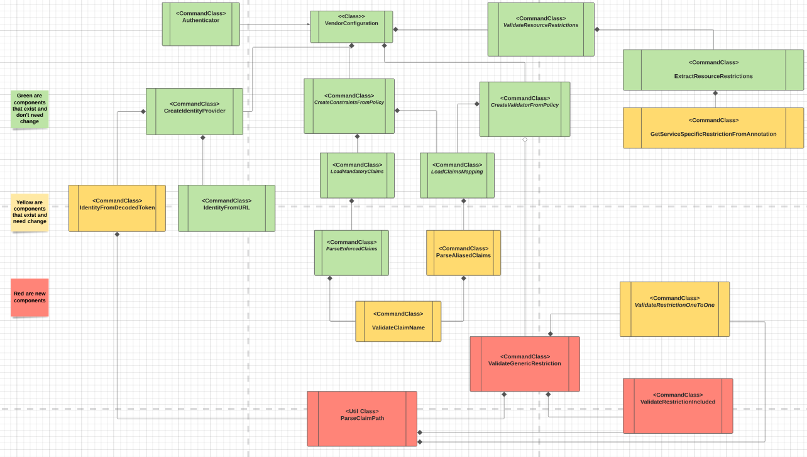

# Solution Design - Authn JWT Complex Claim

[//]: # "1. Design should be graphical-based and table-based - avoid long text explanations"
[//]: # "2. Design documents should not be updated after implementation"
[//]: # "3.  Design decisions should be made before writing this document, and as such this document should not include options / choices"


## Table of Contents
[//]: # "You can use this tool to generate a TOC - https://ecotrust-canada.github.io/markdown-toc/"

- [Solution Design - Authn JWT Complex Claim](#solution-design---authn-jwt-complex-claim)
  * [Table of Contents](#table-of-contents)
  * [Glossary](#glossary)
  * [Useful Links](#useful-links)
  * [Requirements](#requirements)
  * [Solution](#solution)
    + [User Interface](#user-interface)
      - [Host Annotation Example](#host-annotation-example)
      - [Variable Values Example](#variable-values-example)
      - [Disclaimers](#disclaimers)
  * [Design](#design)
    + [Class Diagrams](#class-diagrams)
    + [Change Explanation](#change-explanation)
  * [Backwards Compatibility](#backwards-compatibility)
    + [POC](#poc)
  * [Affected Components](#affected-components)
  * [Delivery Plan](#delivery-plan)
  * [Security](#security)
  * [Test Plan](#test-plan)
  * [Open Questions](#open-questions)
  * [Documentation](#documentation)
  * [Definition of Done](#definition-of-done)
  * [Solution Review](#solution-review)

## Glossary

[//]: # "Describe terms that will be used throughout the design"
[//]: # "You can use this tool to generate a table - https://www.tablesgenerator.com/markdown_tables#"

| **Term**         | **Description**                                              |
| ---------------- | ------------------------------------------------------------ |
| JWT Claims       | Claims are pieces of information asserted about a subject    |
| Host Annotation  | Defines the checks that we should do on authentication request for host. In JWT authentication its a claim check. |
| Enforced Claims | JWT-specific claims that a host must validate their existance and value |
| Aliased Claims | Mapping between claim name and name of host annotation       |
| Listed Annotation | Giving list instead of single value to the host annotation |
| Listed Values | Giving list instead of single value to claim in the token |
| Nested Claims | Claims that are not in the first level of "JSON hirerchy". JSON supports dictioneries and lists inside of keys. |

## Useful Links
[//]: # "Add links that may be useful for the reader"

| **Name**                                     | **Link**                                                     |
| -------------------------------------------- | ------------------------------------------------------------ |
| JWT Claims                                   | https://auth0.com/docs/tokens/json-web-tokens/json-web-token-claims |
| Design Of JWT Authenticator                  | https://github.com/cyberark/conjur/blob/master/design/authenticators/authn_jwt/authn_jwt_solution_design.md |
| Design Of Aliased Claims And Enforced Claims | https://github.com/cyberark/conjur/blob/master/design/authenticators/authn_jwt/token_schema.md |
| Ruby dig Function                            | https://apidock.com/ruby/v2_5_5/Hash/dig                     |

## Requirements
[//]: # "Elaborate on the issue you are writing a solution for"

Extending the JWT generic authenticator by providing a more complex schema to help map JWT fields to host annotation. Still, have the end user be responsible for setting this schema. JWT Authenticator will support:

* Nested claims inside dictioneries and arrays.
* Retrivial of Identity from nested claims
* Arrays of values in token and in host annotation

## Solution
User will be able to define host annotations and configuration variables in the generic JWT authenticator using hirarchy to mention the wanted claims. When there is a list in host annotation each value of the list needs to be included in the token in order to authentication to pass.

### User Interface

For example we this complex token

```json
{
  "sub": "1234567890",
  "iat": 1516239022,
  "platform":"linux"
  "details": [ # NEW: This is example of nested array in JWT token
    { "identity":"myapp"}, # NEW: This is example of nested identity in token
    { "branch":"main"},
    { 
      "subdomains": ["facebook.com","google.com","amazon.com"], # NEW: This is example of listed values
      "lood_balancers":"ec2-address"
    }
  ] 
}
```

#### Host Annotation Example

```yaml
- !host:
  id: myapp
  annotations: 
    details/0/platform: # New: This is example of listed annotations
      - linux
      - windows
    details/1/branch: main
    details/2/subdomains: google.com
    lood_balancers: ec2-address # This is example of aliased claim. See example below
```


#### Variable Values Example

| Name             | Value                 | Description                                      |
| ---------------- | --------------------- | ------------------------------------------------ |
| token-app-property | details/0/identity | The identity in the token is inside details section in the first value in the of array in claim called "identity". |
| aliased-claims | load_balancers:details/2/load_balancers | Example of usage of aliased claims to simplify usage of nested claim. Instead<br />of writing annotation with full path to "load_balancers" claim user use just load_balancers for the annotation. |
| Enforced-claims | details/2/load_balancers | Nested claim can be enforced similar to a regular claim |

#### Disclaimers

* Token-App-Property ignored claim aliasing
* We assume there are no claims that contain "/" in their name.


## Design
[//]: # "Add any diagrams, charts and explanations about the design aspect of the solution. Elaborate also about the expected user experience for the feature"

The following class diagram, represent the points in the generic JWT authenticator that need to change in order to support complex token.

### Class Diagrams



### Change Explanation

* Currently the validation of single host annotation happens inside `ValidateRestrictionsOneToOne` and until this usecase it was enough for the one to one validation. But now when we need to support nested access to the token and listed values and annotations and support also the old form of annotation and values we need a smarter restriction validatior. Therefore we will remove the `ValidateRestrictionsOneToOne ` and will create a new class called `ValidateGenericRestritction`
* `ValidateGenericRestriction` will be able to access any claim in the token and validate any claim with any type of annotation. It will be open for futurue validation logics if they be needed.
* `ExtractNestedValue` a util class for accessing any token in dictionary. Should support string paths in the format mentioned in the UX for annotation. Other JWT based authenticator will use it too and this is why the access to nested claim is outside of `ValidateGenericRestriction`.
* `IdentityFromDecodedToken` will use the `ExtractNestedValue` util to access the claim holding the identity doing the authentication request.

## Backwards Compatibility
[//]: # "How will the design of this solution impact backwards compatibility? Address how you are going to handle backwards compatibility, if necessary"

`ValidateGenericRestritction` will be backward compatible and old way of usage of the JWT authenticator will work on it.


### POC

@sashacher alredy created a draft PR for accessing nested claims using ruby dig function.
https://github.com/cyberark/conjur/pull/2352

## Affected Components

[//]: # "List all components that will be affected by your solution"
[//]: # "[Conjur Open Source/Enterprise, clients, integrations, etc.]"
[//]: # "and elaborate on the impacts. This list should include all"
[//]: # "downstream components that will need to be updated to consume"
[//]: # "new releases as these changes are implemented"

* JWT Authenticator

## Delivery Plan

* When the step is `number.number` it means it can be done concurrently
* Tests also can be done by more then one person

| Step | Mission                                                      | Estimation |
| ---- | ------------------------------------------------------------ | ---------- |
| 1    | Create `ValidateGenericRestritction` that supporting arrays in annotation and token | 3 SP       |
| 2    | Add `ExtractNestedValue` with proper UT                      | 1 SP       |
| 3.1  | Call `ExtractNestedValue` from `ValidateGenericRestritction` | 1 SP       |
| 3.2  | Call `ExtractNestedValue` from `IdentityFromDecodedToken`    | 1 SP       |
| 3.3  | Call `ExtractNestedValue` from other JWT based authenticators | 1 SP       |
| 4    | Tests                                                        | 2 SP       |
|      | Documentation                                                |            |

Total 10 SP

## Security

## Test Plan

https://ca-il-confluence.il.cyber-ark.com/x/fdjKFQ

## Open Questions

[//]: # "Add any question that is still open. It makes it easier for the reader to have the open questions accumulated here instead of them being acattered along the doc"

* What happens if host already exists and than we configure enforced claims that he doesn't check - Documentation
* What about claims that are dictioneires - Out Of Scope.

## Documentation

* Does `token-app-property` support list as value in the token.

## Definition of Done

- Solution designed is approved
- Test plan is reviewed
- Acceptance criteria have been met
- Tests are implemented according to test plan
- The behaviour is documented in Conjur Open Source and Enterprise
- All relevant components are released

## Solution Review
[//]: # "Relevant personas can indicate their design approval by approving the pull request"

| **Persona**        | **Name**     | Approved |
| ------------------ | ------------ | -------- |
| Team leader        | @benoaviram  |          |
| Product owner      | @hilagross   |          |
| System architect   | @tzheleznyak |          |
| Security architect | @sashacher   |          |
| QA architect       | @eladkug     |          |
