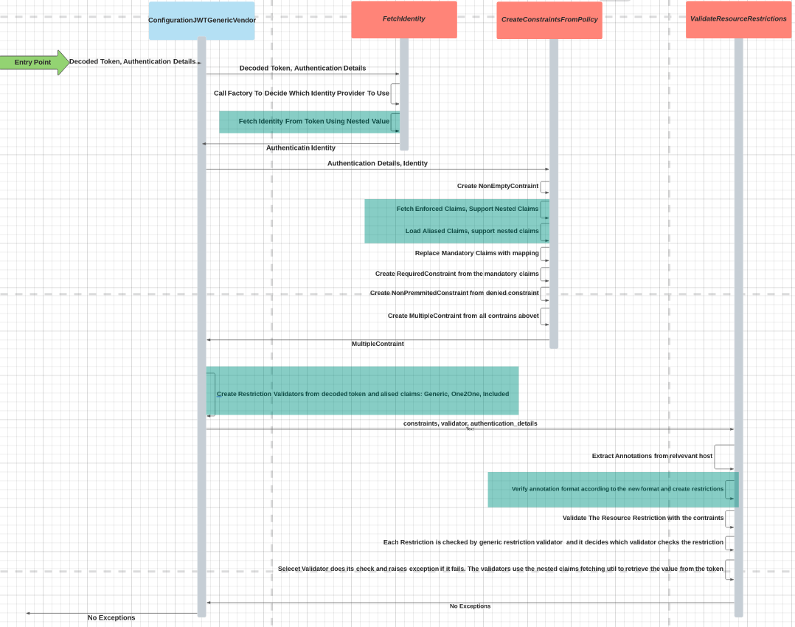

# Solution Design - Authn JWT Complex Token

[//]: # "1. Design should be graphical-based and table-based - avoid long text explanations"
[//]: # "2. Design documents should not be updated after implementation"
[//]: # "3.  Design decisions should be made before writing this document, and as such this document should not include options / choices"


## Table of Contents
[//]: # "You can use this tool to generate a TOC - https://ecotrust-canada.github.io/markdown-toc/"

- [Solution Design - Authn JWT Complex Claim](#solution-design---authn-jwt-complex-claim)
  * [Table of Contents](#table-of-contents)
  * [Glossary](#glossary)
  * [Useful Links](#useful-links)
  * [Requirements](#requirements)
  * [Solution](#solution)
    + [Format Changes](#format-changes)
    + [User Interface](#user-interface)
      - [Token Example](#token-example)
      - [Host Annotation Example](#host-annotation-example)
      - [Variable Values Example](#variable-values-example)
      - [Disclaimers](#disclaimers)
    + [Status API](#status-api)
  * [Design](#design)
    + [Class Diagrams](#class-diagrams)
    + [Change Explanation](#change-explanation)
    + [Flow Chart](#flow-chart)
    + [POC](#poc)
  * [Affected Components](#affected-components)
  * [Delivery Plan](#delivery-plan)
  * [Security](#security)
  * [Test Plan](#test-plan)
  * [Open Questions](#open-questions)
  * [Documentation](#documentation)
  * [Definition of Done](#definition-of-done)
  * [Solution Review](#solution-review)

## Glossary

[//]: # "Describe terms that will be used throughout the design"
[//]: # "You can use this tool to generate a table - https://www.tablesgenerator.com/markdown_tables#"

| **Term**         | **Description**                                              |
| ---------------- | ------------------------------------------------------------ |
| JWT Claims       | Claims are pieces of information asserted about a subject    |
| Host Annotation  | Defines the checks that we should do on authentication request for host. In JWT authentication its a claim check. |
| Enforced Claims | JWT-specific claims that a host must validate their existance and value |
| Aliased Claims | Mapping between claim name and name of host annotation       |
| Listed Annotation | Giving list instead of single value to the host annotation |
| Listed Values | Giving list instead of single value to claim in the token |
| Nested Claims | Claims that are not in the first level of "JSON hirerchy". JSON supports dictioneries and lists inside of keys. |

## Useful Links
[//]: # "Add links that may be useful for the reader"

| **Name**                                     | **Link**                                                     |
| -------------------------------------------- | ------------------------------------------------------------ |
| JWT Claims                                   | https://auth0.com/docs/tokens/json-web-tokens/json-web-token-claims |
| Design Of JWT Authenticator                  | https://github.com/cyberark/conjur/blob/master/design/authenticators/authn_jwt/authn_jwt_solution_design.md |
| Design Of Aliased Claims And Enforced Claims | https://github.com/cyberark/conjur/blob/master/design/authenticators/authn_jwt/token_schema.md |
| Ruby dig Function                            | https://apidock.com/ruby/v2_5_5/Hash/dig                     |

## Requirements
[//]: # "Elaborate on the issue you are writing a solution for"

Functional signof document (Confluence: JWT Authenticator - re-scope)

Extending the JWT generic authenticator by providing a more complex schema to help map JWT fields to host annotation. Still, have the end user be responsible for setting this schema. JWT Authenticator will support:

* Nested claims inside dictioneries and arrays.
* Retrivial of Identity from nested claims
* Arrays of values in token and in host annotation and in token. Include releationship between each element of host annotation to list in token.

## Solution
User will be able to define host annotations and configuration variables in the generic JWT authenticator using hirarchy to mention the wanted claims. When there is a list in host annotation each value of the list needs to be included in the token in order to authentication to pass.

### Format Changes

New format changes that need to be validated and if authentication is not according to them we fail the authentication.

1. Annotations - Now support nested access using / to go inside of dict and [] to access element of array, counting starts from zero
2. Claim Aliases - Can't contain slashes and []. They should simplify the token and not make it more harder to use.

### User Interface

For example we this complex token

#### Token Example

```json
{
  "sub": "1234567890",
  "iat": 1516239022,
  "platform":"linux"
  "details": [ # NEW: This is example of nested array in JWT token
    { "identity": "myapp"}, # NEW: This is example of nested identity in token
    { "branch": "main"},
    { 
      "subdomains": ["facebook.com","google.com","amazon.com"], # NEW: This is example of listed values
      "load_balancers": "ec2-address"
    }
  ] 
}
```

#### Host Annotation Example

```yaml
- !host:
  id: myapp
  annotations: 
    authn-jwt/vendor/detaiils[2]/load_balancers: ec2-address # NEW: This is example of aliased claim. See example below
    authn-jwt/vendor/details[1]/branch: main # NEW: This is example of JSON array in token stracture
    authn-jwt/vendor/details[2]/subdomains: # NEW: This is example for array in host annotation. Each one should be included in token
      - google.com 
      - amazon.com
    authn-jwt/vendor/details[2]/subdomains: facebook.com # NEW: This is another example for include relationship between host annotation and value in token both cases work.
```

#### Variable Values Example

| Name             | Value                 | Description                                      |
| ---------------- | --------------------- | ------------------------------------------------ |
| token-app-property | details[0]/identity | The identity in the token is inside details section in the first value in the of array in claim called "identity". |
| aliased-claims | load_balancers:details[2]/load_balancers | Example of usage of aliased claims to simplify usage of nested claim. Instead<br />of writing annotation with full path to "load_balancers" claim user use just load_balancers for the annotation. |
| Enforced-claims | details[2]/load_balancers | Nested claim can be enforced similar to a regular claim |

#### Disclaimers

* Token-App-Property ignored claim aliasing
* Token-app-propery cant support claim that its value is array.
* We don't support  token with claims that contain "/" and [] in their name.
* Enforced claims ignore aliases and are according to the claims in token.

### Status API

Status API will also validate that :

* New format of enforced claims (same as format for host annotations)
* New format for claim-aliases
* Token-App-Property not ending with access to array element


## Design
[//]: # "Add any diagrams, charts and explanations about the design aspect of the solution. Elaborate also about the expected user experience for the feature"

The following class diagram, represent the points in the generic JWT authenticator that need to change in order to support complex token.

### Class Diagrams


### Change Explanation

* Currently the validation of single host annotation happens inside `ValidateRestrictionsOneToOne` and until this usecase it was enough for the one to one validation. But now when we need to support nested access to the token and listed values and annotations and support also the old form of annotation and values we need a smarter restriction validatior. Therefore we will remove the `ValidateRestrictionsOneToOne ` and will create a new class called `ValidateGenericRestritction`
* `ValidateGenericRestriction` will retrieve value from token and decide to which class forward the validation according the type of the value of the token. It will forward strings to `ValitateRestrictionOneToOne` and lists to `ValitateRestrictionInclude`
* `ValidateRestrictionOneToOne` will support nested claims and do the regular one to one validation like we done until now
* `ValidateRestrictionInclude` will check if the value in the host annotation included in the list in the token. If the host annotation is also a list it will check that every element in host annotation is included in the list in the token. It will support nested claims.
* `ParseClaimPath` a util class for accessing for converting annotation name to array representing the path in the token. Which will be used to access it in the token using built in `dig` function.
* `IdentityFromDecodedToken` will use the `ExtractNestedValue` util to access the claim holding the identity doing the authentication request.Backwards Compatibility
* `ValidateClaimName` should validate claims according to new format
* Validation to annotation according to the nested format should be added.

[//]: # "How will the design of this solution impact backwards compatibility? Address how you are going to handle backwards compatibility, if necessary"

The restriction validation will be backward compatible and old way of usage of the JWT authenticator will work on it.

### Flow Chart

The flow don't change from what it was before but this flow diagram has green backgroud areas where there should be change

 

### POC

@sashacher alredy created a draft PR for accessing nested claims using ruby dig function.
https://github.com/cyberark/conjur/pull/2352

## Affected Components

[//]: # "List all components that will be affected by your solution"
[//]: # "[Conjur Open Source/Enterprise, clients, integrations, etc.]"
[//]: # "and elaborate on the impacts. This list should include all"
[//]: # "downstream components that will need to be updated to consume"
[//]: # "new releases as these changes are implemented"

* JWT Authenticator

## Out Of Scope

* Changing this for other authenticators
* Support for 1 to 1 validation inside array

## Delivery Plan

* When the step is `number.number` it means it can be done concurrently
* Tests also can be done by more then one person

| Step | Mission                                                      | Estimation |
| ---- | ------------------------------------------------------------ | ---------- |
| 1.1  | `ValidateRestrictionIncluded` that check each element in restriction included in token | 1 SP       |
| 1.2  | `ValidateGenericRestriction` to route the validation relevant restriction validator | 2 SP       |
| 1.3  | Add `ParseClaimPath` with proper UT                          | 2 SP       |
| 1.4  | Validate aliases format                                      | 1 SP       |
| 1.5  | Add validation of host valdiation keys to resource restrictions | 2 SP       |
| 2.1  | Call `ParseClaimPath` from the restriction validators        | 1 SP       |
| 2.2  | Call `ExtractNestedValue` from `IdentityFromDecodedToken`    | 1 SP       |
| 3    | Tests                                                        | 2 SP       |
|      | Documentation                                                |            |

Total 11 SP

## Security

## Test Plan

Confluence - Different Cases Of Complex Token

## Open Questions

[//]: # "Add any question that is still open. It makes it easier for the reader to have the open questions accumulated here instead of them being acattered along the doc"

## Documentation

* Document the new format for annotations
* Documentat new format for claims
* Document the disclaimers
* `token-app-property` supports nested claims in dicts and lists but not supports array as a value.
* The token-app-propery validation and host annotation validation may break if vendor changes order of claims if it includes nesting in array.
* Add details about strength of host annotation for array.

## Definition of Done

- Solution designed is approved
- Test plan is reviewed
- Acceptance criteria have been met
- Tests are implemented according to test plan
- The behaviour is documented in Conjur Open Source and Enterprise
- All relevant components are released

## Solution Review
[//]: # "Relevant personas can indicate their design approval by approving the pull request"

| **Persona**        | **Name**       | Approved |
| ------------------ | -------------- | -------- |
| Team leader        | @benoaviram    | Approved |
| Product owner      | @hilagross     | Approved |
| System architect   | @oburstein-hub | Approved |
| Security architect | @sashacher     | Approved |
| QA architect       | @eladkug       | Approved |
