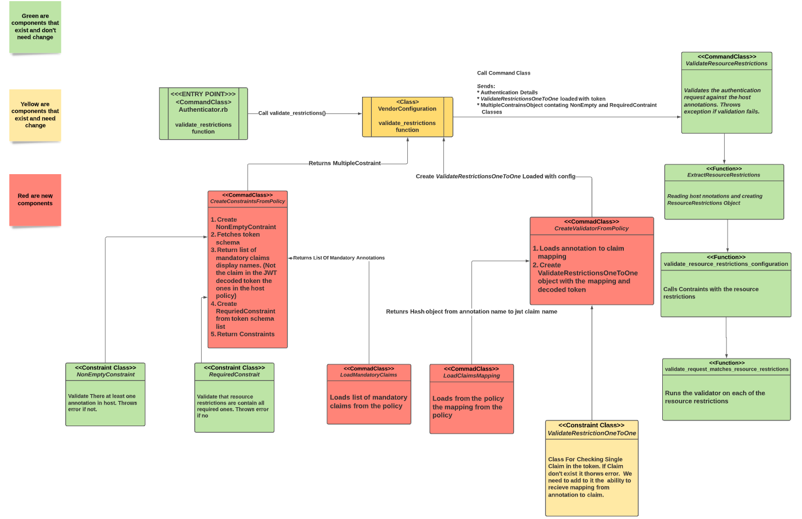

# Solution Design - Authn JWT Enforced Claims And Mapping

[//]: # "1. Design should be graphical-based and table-based - avoid long text explanations"
[//]: # "2. Design documents should not be updated after implementation"
[//]: # "3.  Design decisions should be made before writing this document, and as such this document should not include options / choices"


## Table of Contents
[//]: # "You can use this tool to generate a TOC - https://ecotrust-canada.github.io/markdown-toc/"

- [Solution Design - Authn JWT Enforced Claims And Mapping](#solution-design---authn-jwt-enforced-claims-and-mapping)
    * [Table of Contents](#table-of-contents)
    * [Glossary](#glossary)
    * [Useful Links](#useful-links)
    * [Requirements](#requirements)
    * [Solution](#solution)
        + [User Interface](#user-interface)
            - [Authenticator Policy](#authenticator-policy)
            - [Variable Values Example](#variable-values-example)
    * [Design](#design)
        + [Flow Chart](#flow-chart)
        + [Flow Explanation](#flow-explanation)
        + [Class Diagrams](#class-diagrams)
    * [Backwards Compatibility](#backwards-compatibility)
    * [Affected Components](#affected-components)
    * [Delivery Plan](#delivery-plan)
    * [Security](#security)
    * [Test Plan](#test-plan)
    * [Open Questions](#open-questions)
    * [Documentation](#documentation)
    * [Definition of Done](#definition-of-done)
    * [Solution Review](#solution-review)

## Glossary

[//]: # "Describe terms that will be used throughout the design"
[//]: # "You can use this tool to generate a table - https://www.tablesgenerator.com/markdown_tables#"

| **Term**         | **Description**                                              |
| ---------------- | ------------------------------------------------------------ |
| JWT Claims       | Claims are pieces of information asserted about a subject    |
| Host Annotation  | Defines the checks that we should do on authentication request for host. In JWT authentication its a claim check. |
| Enforced Claims | JWT-specific claims that a host must validate their existance and value |
| Claims Mapping   | Mapping between claim name and name of host annotation       |

## Useful Links
[//]: # "Add links that may be useful for the reader"

| **Name**   | **Link**                                                     |
| ---------- | ------------------------------------------------------------ |
| JWT Claims | https://auth0.com/docs/tokens/json-web-tokens/json-web-token-claims |

## Requirements
[//]: # "Elaborate on the issue you are writing a solution for"

1. Required fields
    1. In the authenticator policy, the user will have the ability to declare which claims must be in host annotations. As a result, also in the JWT token
    2. When sending an authentication request, the authenticator MUST validate those claims - existence and content
2. Mapping
    1. The user should have the ability to map a given "technical" claim name to a more familiar / business one - i.e, in git-lab. Instead of mentioning in the policy "sub" claim, the user will have the ability to mention "job"

## Solution
User will define the enforced claims and claims mapping variables in the authenticator policy. The variables will be checked in the JWT authentication request.

* The usage of this variables is optional and non enforced. User can authenticate to JWT in the same way he authenticated in stage 1. Using the feature adds more security checks to the authentication.

### User Interface

#### Authenticator Policy

Two new variables will be added to the authenticator policy:

* enforced-claims
* mapping-claims

```yaml
    - !policy
    id: conjur/authn-jwt/VendorY
    body:
    - !webservice
    
    - !variable
      id: enforced-claims
      
    - !variable
      id: mapping-claims
```

#### Variable Values Example

| Name             | Value                 | Description                                      |
| ---------------- | --------------------- | ------------------------------------------------ |
| enforced-claims | ref, sub              | List of claims as they appear in host annotation |
| mapping-claims   | branch: ref, job: sub | Mapping between host annotation to JWT claim     |

* For any claim mapped, we will add the host annotation to the `enforced-claims` variable and not the JWT claim name.
* The values above are examples and they can be any claims.
* If one of the values of this variables contain these words from deny list authentication request will be denied:
    * iss
    * exp
    * iat
    * nbf


## Design
[//]: # "Add any diagrams, charts and explanations about the design aspect of the solution. Elaborate also about the expected user experience for the feature"

The following class diagram, represent the flow of checking the enforced claims and the claim mapping.


### Flow Chart


### Flow Explanation

When validate_restrictions is called in JWTVendorConfiguration class the following will happen as a result:

1. The `validate_restrictions` function will call `CreateConstraintsFromPolicy` that create constraints object checking the hosts annotations.
    1. It create instance of `NonEmptyConstraint` to check we have at least one host annotation.
    2. Will call `LoadEnforcedClaims` command class to load the list of enforced claims for the `enforced-claims` variable. This class will create and return `RequiredConstraint` object.
        1. If variable configured but not populated error be thrown
        2. If variiable with invalid value error be thrown
        3. If variable not configured empty list will be returned
    3. Will call LoadClaimsMapping to load mapping and convert relevant enforced claims from mapping
    4. It create `RequiredConstraint` object from it
    5. Will create `NonPremmitedConstraint` from deneid claims const ("iat","exp"...)
    6. With Create `MultipleConstraints` object with all the constraint objects above and return it
2. The `validate_restrictions` functon will call `CreateValidatorFromPolicy` to create validator with the claims mapping loaded
    1. Will call the `LoadClaimsMapping` command class to get dictionary between claim to annotation.
        1. If variable configured but not populated error be thrown
        2. If variiable with invalid value error be thrown
        3. If variable not configured empty hash will be returned
    2. It create *ValidateRestrictionOneToOne* object and will return it
        1. The logic of ValidateRestrictionOneToOne will check restriction by this order:
            1. If there is mapping for it will use mapping. If the mapped claim not in token we raise error
            2. If there is no mapping we will check token has claim from annotation. If its not there we throw error
3. `ValidateResourceRestrictions` will be called with the constraints and the validator from the previous steps. This run will check the claims in the token and annotations. If anything wrong like a missing claim in the host annotation or a claim has an invalid value, an error with be thrown and the authentication request will be denied.

### Class Diagrams




## Backwards Compatibility
[//]: # "How will the design of this solution impact backwards compatibility? Address how you are going to handle backwards compatibility, if necessary"

Enforced claims and mapping are not enforced therefore the JWT authentication will remain backwards compatible.

## Affected Components

[//]: # "List all components that will be affected by your solution"
[//]: # "[Conjur Open Source/Enterprise, clients, integrations, etc.]"
[//]: # "and elaborate on the impacts. This list should include all"
[//]: # "downstream components that will need to be updated to consume"
[//]: # "new releases as these changes are implemented"

* JWT Authenticator

## Delivery Plan

| Mission                                                      | Estimation |
| ------------------------------------------------------------ | ---------- |
| Add LoadEnforcedClaims                                       | 1 SP       |
| Add NonPremmitedConstraint                                   | 1 SP       |
| Add LoadClaimsMapping                                        | 1 SP       |
| Change ValidateRestrictionOneToOne to work with mapping      | 2 SP       |
| Add CreateConstraintsFromPolicy Command Class and use it     | 2 SP       |
| Add CreateValidatorFromPolicy and use it                     | 2 SP       |
| Add status checks for enforced claims and claims mapping configuration | 3 SP       |
| Add Cucumber tests for enforced claims and mapping          | 5 SP       |
| Check "aud" annotation with list                             | 3 SP       |
| Documentation                                                |            |

## Security

* If enforced claims or clamins mapping has invalid value we should fail the authentication.

## Test Plan

Confluence: "Token Schema Test Plan"

## Open Questions

[//]: # "Add any question that is still open. It makes it easier for the reader to have the open questions accumulated here instead of them being acattered along the doc"

* What happens if host already exists and than we configure enforced claims that he doesn't check - Documentation
* What about claims that are dictioneires - Out Of Scope.

## Documentation

* When enforced claims or mapping is changed all relevant hosts need to be updated.
* When mapping of enforced claim is changed or added enforced claims need to be added.

## Definition of Done

- Solution designed is approved
- Test plan is reviewed
- Acceptance criteria have been met
- Tests are implemented according to test plan
- The behaviour is documented in Conjur Open Source and Enterprise
- All relevant components are released

## Solution Review
[//]: # "Relevant personas can indicate their design approval by approving the pull request"

| **Persona**        | **Name**     |
| ------------------ | ------------ |
| Team leader        | @benoaviram  |
| Product owner      | @hilagross   |
| System architect   | @tzheleznyak |
| Security architect | @sashacher   |
| QA architect       | @eladkug     |
