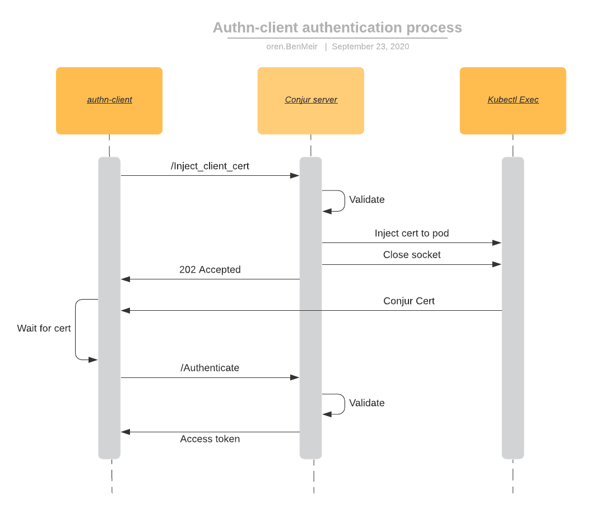

# Solution Design - Inject Client Cert fix
[//]: # "Change the title above from 'Template' to your design's title"

## Table of Contents
- [Useful links](#useful-links)
- [Background](#background)
- [Issue description](#issue-description)
- [Solution](#solution)
  * [Waiting for the injection to finish](#waiting-for-the-injection-to-finish)
  * [Inject_client_cert response code](#inject-client-cert-response-code)
  * [Cert injection implementation](#cert-injection-implementation)
    + [Option 1 - Run a parallel request to verify cert injection](#option-1---run-a-parallel-request-to-verify-cert-injection)
    + [Option 2 - Send the cert content as part of the URL](#option-2---send-the-cert-content-as-part-of-the-url)
    + [Option 3 - Client sets its State once cert is injected](#option-3---client-sets-its-state-once-cert-is-injected)
    + [Option 4 - Send cert as part of bash script](#option-4---send-cert-as-part-of-bash-script)
    + [Conclusion](#conclusion)
  * [Design](#design)
  * [Backwards compatibility](#backwards-compatibility)
  * [Performance](#performance)
  * [Security](#security)
- [Affected Components](#affected-components)
- [Cross-team dependencies](#cross-team-dependencies)
- [Test Plan](#test-plan)
- [Logs](#logs)
  * [Audit](#audit)
- [Documentation](#documentation)
- [Delivery plan](#delivery-plan)
  * [Total](#total)
  * [Parallelism](#parallelism)
  * [Spikes and researches](#spikes-and-researches)
  * [Implementation](#implementation)
  * [Testing](#testing)
  * [Demo](#demo)
    
## Useful links
[//]: # "Add links that may be useful for the reader"

- [Known issue in k8s exec](https://github.com/kubernetes/kubernetes/issues/89899)

## Background
[//]: # "Give relevant background for the designed feature. What is the motivation for this solution?"
We have an issue with the "inject client cert" process where we don't always return a correct response to the client regarding the injection success. The injection is done via a WebSocket to the Kubernetes API server where we use a "tar" command and the cert content in STDIN. There is [an issue](https://github.com/kubernetes/kubernetes/issues/89899) in k8s where messages that are sent via WebSockets to Kubectl Exec are left hanging without returning a response when using STDIN. 

## Issue description
[//]: # "Elaborate on the issue you are writing a solution for"
The current behaviour is that we close the WebSocket connection after we send the injection request to kubectl. This is not correct as this way we do not wait for kubectl to send its response.

This has 2 implications:
1. If the injection request has succeeded we will return a 200 OK response to the 'inject_client_cert' request even if the cert has not finished to be written to the pod. This can lead to a race-condition where the client will try to read the cert before it is there.
1. If the injection request has failed in the k8s API, we will not write the error to the Conjur logs, and we will falsely return a 200 OK response to the 'inject_client_cert' request

## Solution
[//]: # "Elaborate on the solution you are suggesting in this page. Address the functional requirements and the non functional requirements that this solution is addressing. If there are a few options considered for the solution, mention them and explain why the actual solution was chosen over them. Add an execution plan when relevant. It doesn't have to be a full breakdown of the feature, but just a recommendation to how the solution should be approached."

We would like to inject the cert and get an indication that the cert was injected  or the error if it was not.

Before we go into options of implementing the actual injection, we should address some other issues.

### Waiting for the injection to finish

The cert injection may take some time (up to a timeout of 5 seconds) and can block the server from handling other requests while it waits for the Kubernetes API to inject the cert. Having this in mind, it makes sense to not wait for the injection, and return the response to the authn-client as soon as we initialize the cert injection.

We may try to perform the injection in a separate thread, but it's hard to tell if this actually addresses our issue. While the main thread will indeed finish its work quick and will be free to handle other requests, we now have another thread that is busy with the cert injection. 

A better option will be to stay with the current behaviour, where we close the socket immediately after we start the cert injection. The client will handle the retries while waiting for the cert to exist on the filesystem. This lets the server handle other requests in its main thread without waiting for kubectl to inject the certificate.

However, closing the socket raises the issue that we started with - that the errors are not returned to the Conjur server (as the socket is closed) and are not written to the log. To overcome this, we will redirect the Websocket's stdout and stderr to a file inside the authn-client container. This will allow us to log the error in the client side and enhance our supportability.

We will create an issue in the authn-client to log the error if the log file exists (for forwards-compatibility - new client and old server).

### Error handling

The cert injection is separated into 2 parts of communications:

1. Conjur server -> K8s API server
2. K8s API server -> authn-client container

Respectively, we also have 2 kinds of errors:

1. Handshake errors between the Conjur server and the K8s API server
   1. These errors will be caught in the server side and will be loggen to the Conjur logs
2. Errors that occur in the injection of the file by the K8s API server
   1. These errors will be logged in the log file in the authn-client container (as described in the previous section) and will be logged in the authn-client container logs

### Inject_client_cert response code

The request doesn't wait for the injection to finish, and thus the 200 OK response code is inaccurate. It is better to return a 202 Accepted code to to indicate to the client that the server accepted the request and is now performing its actions. 

This change is backwards-compatible as the authn-client just verifies that the response code is less than 300 so changing 200 to 202 doesn't affect it.

### Cert injection implementation

Now that we decided that we will not wait for the injection, and clarified the response code, we can explore the different options that we have to inject the cert. 

**Note**: The SPDY protocol [is being deprecated](https://github.com/kubernetes/enhancements/issues/384)  so it's not an option.

TL;DR: Option 4 was chosen

#### Option 1 - Run a parallel request to verify cert injection
In this option, we send the tar request as we do today, but also create a parallel WebSocket in which we will send another request to verify that the cert was successfully injected. We have several options for the verification command:
1. Run an "ls" command on the cert path. This way we get an immediate feedback on the  cert presence. However, this may return a positive answer even if the cert is not fully injected (this assumption will be investigated as part of this effort).
1. Calculate the SHA-1 hash of the cert content before sending it and then sending  a request to get the calculated SHA-1 hash of the cert in the container. Once the two hashes are equal then we know that the cert was fully installed.

Note: we use `SHA-1` and not `MD5` as the latter is not FIPS compliant. 

#### Option 2 - Send the cert content as part of the URL
In this option, we do not use STDIN to send the cert but send it in the URL. This eliminates the bug in KubeCtl Exec as without STDIN we will get the response and would be able to know whether the injection succeeded or not, and log the outcome.

However, we may have a limit on the size of the URL and we will have an issue  if the certificate will grow in the future. To overcome this, we can split the  request. The first one will create the file. The following requests will populate it with the cert content. Then the last request will verify that the whole content has passed (with one of the methods described above). We can decide on the number  of requests dynamically according to the size of the cert.

We have a security concern with this option. While the traffic is fully encrypted when using https, including the URL, [it's still possible that the URL will be visible in certain locations](https://owasp.org/www-community/vulnerabilities/Information_exposure_through_query_strings_in_url), while the request travels to its destination. It is possible that the Kubernetes API server will not leak any information from the URL, but if the Conjur instance runs outside the cluster, it will surely pass some proxies and load balancers before it reaches Kubernetes.

Thus, we will not use this option due to security concerns.

#### Option 3 - Client sets its State once cert is injected
This option is relevant only if the "inject-client-cert" request will return a 202 Accepted response instead of 200 OK (more on that in [this section](#inject-client-cert-response-code)).

In this case, we respond with 202 Accepted to the "inject-client-cert" request and start injecting the cert in a separate thread. The server then polls on the state of the authn-client container and waits until its State changes to some  agreed State (e.g "CertInjected"). This state will be set by the authn-client once it sees that the cert is installed.

This option is not fully backwards-compatible and is quite complex so I wouldn't suggest to implement it.

#### Option 4 - Send cert as part of bash script

The issue with the STDIN that is not closing is an issue of the `tar` command that waits for more input and doesn't close the connection. Another option that we have is to change the command from `tar` to `sh` and send a bash script in the STDIN.
The script can be something like:

```
#!/bin/sh

copy_file() {
  
  cat > /tmp/conjur_cert <<EOF
#{content}
EOF
  mv /tmp/conjur_cert #{path}
  chmod #{mode} #{path}
}

copy_file 2>&1 | tee -a #{COPY_FILE_LOG_FILE}

exit
```

Note that we write the file to a temporary file and then move it to the cert path. This is done as the client has a retry mechanism on the existence of the cert file and we don't want it to return a positive answer before the certificate is fully written.

This approach has the following benefits:
1. Short URL. Certificate is in the script. (avoid issues raised from option 2)
1. Deterministic operation. You know exactly when it is done, because the connection is closed once it reaches exit.
1. Custom error handling. You can get any error you wish for, handle it properly, and send it back.
1. Versatility. Script can be customized later if needed to handle more issues in this area.
1. Simple implementation

This solution is implemented in [this PR](https://github.com/cyberark/conjur/pull/1789).

#### Conclusion

Option 2 is off the table due to security concerns.

Option 3 is off the table due to redundant complexity and backwards-compatibiliy issues.

Option 4 has the most benefits of the options and is better than option 1.

<u>Decision</u>: Option 4

### Design
[//]: # "Add any diagrams, charts and explanations about the design aspect of the solution. Elaborate also about the expected user experience for the feature"
The authentication process is depicted in the following diagram:


Note that the cert injection happens in a separate thread.

### Backwards compatibility
[//]: # "Address how you are going to handle backwards compatibility, if necessary"
We don't have backwards-compatible issues with this change as also before this change the server didn't wait for the cert to be injected. The server closed the socket to kubectl before waiting for the cert to be injected. Furthermore, the authn-client just verifies that the response code is less than 300 so changing 200 to 202 doesn't affect it.

### Performance
[//]: # "Elaborate on whether your solution will affect the product's performance, and how"
The performance of the "inject-client-cert" request will not be affected as the Websocket is still being closed immediately after we inject the cert.

### Security

[//]: # "Are there any security issues with your solution? Even if you mentioned them somewhere in the doc it may be convenient for the security architect review to have them centralized here"

1. Is it ok to pass the base64 encoded cert in the URL? Is it less secure than sending it in the STDIN?
   1. The answer is yes and thus we are not going with option 2.

## Affected Components

[//]: # "Address the components that will be affected by your solution [Conjur, DAP, clients, integrations, etc.]"
- Conjur
- DAP
- conjur-authn-k8s-client
- seed-fetcher
- secrets-provider-for-k8s
- secretless-broker

## Cross-team dependencies
[//]: # "Elaborate about your solution's requirements or needs from other teams"
We would like to get a review on the solution from @cyberark/conjur-core-team  and @cyberark/community-and-integrations-team. There are no requirements from  the Infra team.

## Test Plan
[//]: # "Fill in the table below to depict the tests that should run to validate your solution"
[//]: # "You can use this tool to generate a table - https://www.tablesgenerator.com/markdown_tables#"

### Conjur server

The current integration tests of the "inject-client-cert" request will be sufficient for this feature. we will just change them so they verify the response is 202 instead of 200.

### Conjur authenticator client

We would like to verify that the error is logged from the file in case it occurred. We will consider how such tests can be wrritten to verify it as we don't have integration tests in this project. If we will add such tests they will be in the secrets-provider.

## Logs
[//]: # "Fill in the table below to depict the log messages that can enhance the supportability of your solution"
[//]: # "You can use this tool to generate a table - https://www.tablesgenerator.com/markdown_tables#"

| **Scenario**                                             | **Log message**                                                                                    | **Log level** | **Comment**                                                                                                                                                          |
|----------------------------------------------------------|----------------------------------------------------------------------------------------------------|---------------|----------------------------------------------------------------------------------------------------------------------------------------------------------------------|
| Timeout reached for injection kubectl exec command       | Command timed out after {0} seconds in container '{1}' of pod '{2}                                 | Debug         | This message already exists. We will just add the number of seconds we waited                                                                                        |
| Before copying the cert to the container                 | Copying SSL certificate to {0-container-name}:{1-cert-file-path} in {2-pod-namespace}/{3-pod-name} | Debug         | This message already exists. Note that we don't write the log file path in the client container as it will be deleted once it is logged to the client container logs |
| After starting the cert injection and closing the socket | Initialized SSL certificate copy successfully                                                      | Debug         | Changed from "Copied SSL certificate successfully" as we don't know for sure that the cert is copied, just that we successfully started the injection                |

Additionally, we should address [this issue](https://github.com/cyberark/conjur/issues/1840) as part of this effort.

### Audit 

[//]: # "Does this solution require additional audit messages?"
There are no new audit messages in this fix. We already write the inject-client-cert request to the audit log.

## Documentation
[//]: # "Add notes on what should be documented in this solution. Elaborate on where this should be documented. If the change is in open-source projects, we may need to update the docs in github too. If it's in Conjur Open Source and/or Conjur Enterprise mention which products are affected by it"
This is an internal process so it doesn't require any new documentation. A CHANGELOG entry will be added about the response code change in "inject-client-cert"

## Delivery plan
[//]: # "Break the solution into tasks"

### Total
[//]: # "Write the total estimation"

EE: 19 days

### Parallelism

[//]: # "Suggest how many team members can work on the solution in parallel"

- 2 people can work on this solution but it's ok to have only 1.

### Implementation 
[//]: # "Note and estimate the tasks which are related to the solution's code implementation"

- `cyberark/conjur`: Implement solution according to the design
  - EE: 7 days
- `cyberark/conjur`: Fix issue - [Kubectl exec Websocket logs do not have tags](https://github.com/cyberark/conjur/issues/1840)
  - EE: 2 days
- `cyberark/conjur-authn-k8s-client`: Print error to authn-client log
  - Do we want to delete the log file after we log its content?
    - Is there a security concern here?
  - EE: 2 days

### Testing 

[//]: # "Note and estimate the tasks which are related to writing/performing tests [automation, manual tests, etc.]"

- Write tests according to the test plan
  - EE: 4 days

### Version bump

- Release new versions
  - `cyberark/conjur-authn-k8s-client` (after we print the error log)
  - `cyberark/secrets-provider-for-k8s` (after we consume the new `conjur-authn-k8s-client` version)
  - `cyberark/secretless-broker` (after we consume the new `conjur-authn-k8s-client` version)
  - `cyberark/dap-seedfetcher` (after we consume the new `conjur-authn-k8s-client` version)
  - EE: 2 days

### Demo 
[//]: # "Note and estimate the tasks which are related to creating a demo that demonstrates the solution"

- Record a demo of a successful and unsuccessful request
  - EE: 1 day