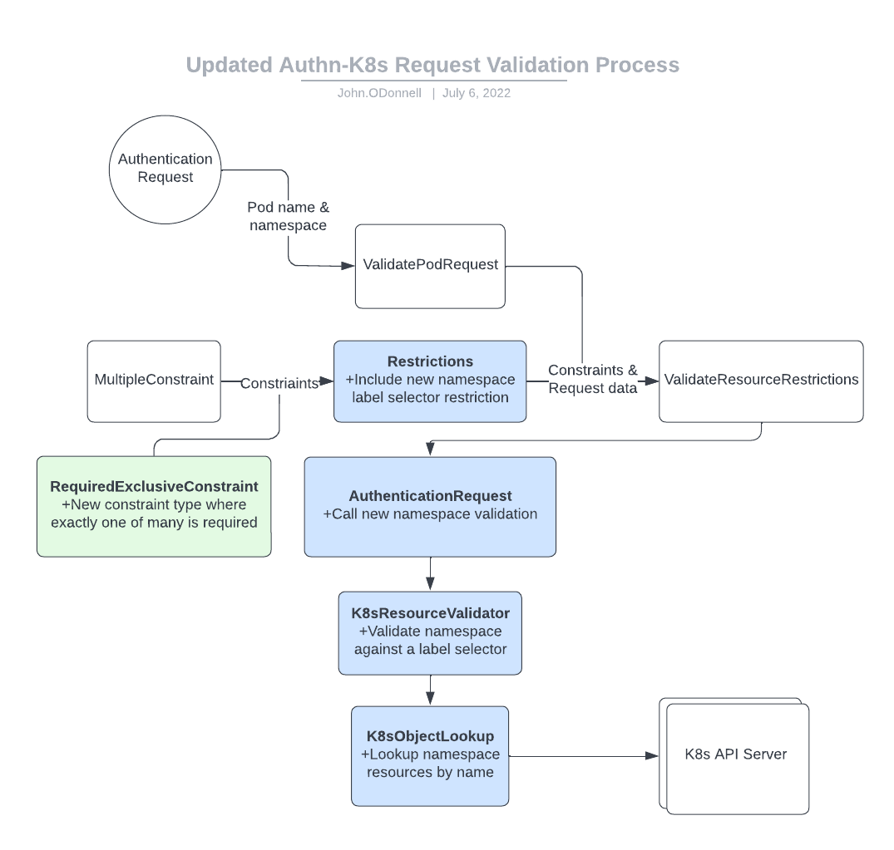
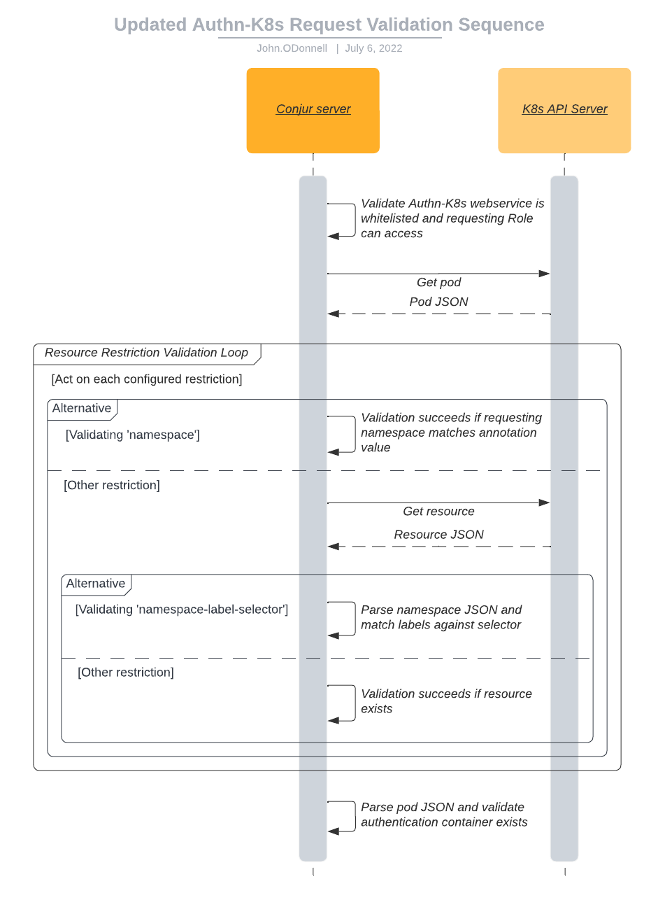

# Solution Design - Namespace Label Identity Scope for the Kubernetes Authenticator
[//]: # "Change the title above from 'Template' to your design's title"

[//]: # "General notes:"
[//]: # "1. Design should be graphical-based and table-based - avoid long text explanations"
[//]: # "2. Design documents should not be updated after implementation"
[//]: # "3. Design decisions should be made before writing this document, and as such this document should not include options / choices"


## Table of Contents
[//]: # "You can use this tool to generate a TOC - https://ecotrust-canada.github.io/markdown-toc/"

- [Solution Design - Namespace-Label Identity Scope for the Kubernetes Authenticator](#solution-design---namespace-label-identity-scope-for-the-kubernetes-authenticator)
  - [Table of Contents](#table-of-contents)
  - [Glossary](#glossary)
  - [Useful Links](#useful-links)
  - [Background](#background)
    - [Existing Kubernetes Authentication Flow](#existing-kubernetes-authentication-flow)
  - [Issue Description](#issue-description)
    - [Disadvantages of the Existing Authentication Flow](#disadvantages-of-the-existing-authentication-flow)
    - [Enter Rancher](#enter-rancher)
  - [Solution](#solution)
    - [Label-based Identity Scope](#label-based-identity-scope)
      - [Querying Labeled Namespaces](#querying-labeled-namespaces)
    - [Updates to Identity Resource Restrictions](#updates-to-identity-resource-restrictions)
      - [Namespace Label Selector](#namespace-label-selector)
    - [User Interface](#user-interface)
  - [Design](#design)
    - [Class / Component Diagrams](#class---component-diagrams)
    - [Sequence Diagrams](#sequence-diagrams)
  - [Performance](#performance)
  - [Backwards Compatibility](#backwards-compatibility)
  - [Affected Components](#affected-components)
  - [Work in Parallel](#work-in-parallel)
    - [Development Tasks](#development-tasks)
  - [Test Plan](#test-plan)
    - [Test Environments](#test-environments)
    - [Test Cases (Including Performance)](#test-cases--including-performance-)
      - [Functional Tests](#functional-tests)
      - [Security Tests](#security-tests)
      - [Error Handling / Recovery / Supportability tests](#error-handling---recovery---supportability-tests)
      - [Performance Tests](#performance-tests)
  - [Logs](#logs)
  - [Documentation](#documentation)
  - [Security](#security)
  - [Open Questions](#open-questions)
  - [Definition of Done](#definition-of-done)
  - [Solution Review](#solution-review)

<small><i><a href='http://ecotrust-canada.github.io/markdown-toc/'>Table of contents generated with markdown-toc</a></i></small>


## Glossary
[//]: # "Describe terms that will be used throughout the design"
[//]: # "You can use this tool to generate a table - https://www.tablesgenerator.com/markdown_tables#"

| **Term** | **Description** |
|----------|-----------------|
|          |                 |
|          |                 |

## Useful Links
[//]: # "Add links that may be useful for the reader"

|  **Name**   | **Link** |
|-------------|----------|
| Feature Doc |          |
| Issue       |          |
| Kubernetes Docs: Labels and Selectors | https://kubernetes.io/docs/concepts/overview/working-with-objects/labels/ |
| Proof-of-Concept branch  | https://github.com/cyberark/conjur/compare/master...authn-k8s-label-selector |

## Background
[//]: # "Give relevant background for the designed feature. What is the motivation for this solution?"

### Existing Kubernetes Authentication Flow

For context, let's lay out the basic flow of the Kubernetes Authenticator:


Note that the `Validate*` loops ensures that the requests adheres to the
authenticating host's [resource restrictions](), which are used to scope
authenticator permissions to a subset of resources in a given cluster. Resource
restrictions are configured on each host through its annotations.

The following is a policy sample that defines a Conjur host to use as an
authenticating identity, and the annotations that define its resource
restrictions:

```yaml
- !host
  id: test-app
  annotations:
    authn-k8s/namespace: <required>
    authn-k8s/authentication-container-name: <optional, defaults to "authenticator">
    authn-k8s/service-account: <optional>
    authn-k8s/deployment: <optional>
    authn-k8s/deployment-config: <optional, OpenShift only>
    authn-k8s/stateful-set: <optional>
```

To summarize:

- Hosts are required to scope permissions to at least a single namespace. All
  other restrictions reduce scope further from this baseline.
- Deployment, DeploymentConfig, and StatefulSet scopes are mutually exclusive.
- Authentication container name is not exactly a request restriction, but
  container existence is validated.

## Issue Description
[//]: # "Elaborate on the issue you are writing a solution for"

### Disadvantages of the Existing Authentication Flow

With the existing authentication flow and resource restriction requirements,
hosts can only represent workloads in, at most, a single namespace. That
namespace must be statically-named, and known prior to host configuration.

For complex environments with authenticating workloads in `n` clusters, each
with `m` namespaces, requires exactly `n` Authenticator instances, and `n * m`
namespace-scoped hosts.

There is demand for the Kubernetes Authenticator to support use-cases where the
workload identity can be associated with:

- a set of namespaces, with membership that is subject to change,
- a namespace whose name is not known ahead of time, and is subject to change.

### Enter Rancher

Demand for this feature is derived from demand for the Kubernetes Authenticator
to support Rancher as a Kubernetes management platform. Rancher uses an
abstraction called Projects, which represent unique collections of Kubernetes
namespaces, and users would like to be able to constrain workload identity to
Project-scope.

Any solution designed to fit a general multi-namespace use-case should extend to
this Rancher use-case.

## Solution
[//]: # "Elaborate on the solution you are suggesting in this page. Address the functional requirements and the non functional requirements that this solution is addressing. If there are a few options considered for the solution, mention them and explain why the actual solution was chosen over them. Add an execution plan when relevant. It doesn't have to be a full breakdown of the feature, but just a recommendation to how the solution should be approached."

When designing a solution, we want to ensure:

1. we use a sane mechanism for logically grouping namespaces,
2. that mechanism extends to the Rancher use-case,
3. we consider cases where an Authenticator instance is responsible for a large
   group of namespaces.

### Label-based Identity Scope

Kubernetes uses labels as identifying attributes of objects that are meaningful
to users, and do not influence the core system. Labels do not provide uniqueness,
and it is expected that many objects will carry the same label(s). This makes it
a prime candidate for a namespace-grouping mechanism - namespaces decorated with
the same label key-value pair can be treated as a logical group.

Using labels as a namespace grouping mechanism extends to the Rancher use-case.
When a namespace is added to a Rancher project, it is decorated with a label
`field.cattle.io/projectId`, where the label's value is the project's unique ID.
This label is actively maintained, and can't be edited by clients.

After implementing a label-based identity scope, authenticating workloads in `n`
clusters, each with `m` similarly-labeled namespaces, requires exactly `n`
Authenticator instances and `n` label-scoped hosts.

#### Querying Labeled Namespaces

The label selector is Kubernetes' core grouping primitive, so it's an early
candidate here. Label selectors have two flavors to consider:

- Equality-based selectors allow results filtering based on key-value equality,
  and include the following operations:
  - `key = value` or `key == value`
  - `key != value`
- Set-based selectors allow results filtering based on a certain label's
  inclusion in a set of accepted values, and include the following operations:
  - `key in (value1, value2)`
  - `key notin (value1, value2)`
  - `key` or `!key`

These flavors can be combined - a label selector can define multiple
comma-delimited filters, where both conditions must be satisfied. For example,
the label-selector `"key1=value1,key2 in (value2, value3)"` filters results so
listed resources must have a label `key1` set to `value1`, **and** must have a
label `key2` set to either `value2` or `value3`.

The minimum subset of label selector flavors we need to support are
**single**, **positive**, **equality-based** selectors (`=` or `==`), allowing
an identity to scope to a single group of similarly-labeled namespaces.

Should this feature also support:
| **Selector Type** | **Support?** | **Comments** |
|-------------------|--------------|--------------|
| **Multiple** positive equality-based selectors | **Nice to have, but not required** | Multiple equality-based selectors can be used to reduce scope from a single equality-based selector. An identity could authenticate workloads in a subset of namespaces in a single group based on additional labels. |
| **Negative** selectors (`!=`, `notin`, and `!`) | **No** | This feature should not support negative selectors, which would serve as a denylist in this context. Theoretically, new workloads would be able to authenticate by default, unless they reside in a denylisted namespace. An identity's scope should be meaningfully curated, not open-ended. |
| Positive **set-based** selectors (`in`) | **No** | Set-based selectors can be used to increase scope from a single equality-based selector. Support for this selector flavor would imply that a single host identity could authenticate on behalf of any number of namespace groups. This runs counter to having intentionally-scoped host identities - if two workloads are in separate namespaces, and those namespaces are designated to different sets, they should authenticate with separate identities. |
| Positive **existence-based** selectors | **No** | Existence based selectors filter results based on label keys, and does no validation on label values. While this could technically be leveraged to mimic positive equality-based selectors by using unique label keys, this would mean thoroughly polluting the label namespace. |

In Kubernetes, label selectors can only be applied to functions that list
instances of a resource type - for example, a client can query a list of
namespaces in a cluster, but limit the results to only those namespaces that
match a given selector. Using label selectors with the Kubernetes Authenticator
will require permitting its identity to `list` all namespaces in the target
cluster. This operation could be negatively affected if the target cluster is
host to so many namespaces that the list operation becomes costly.

```rb
# Retrieves all namespaces in the cluster, enforcing field selection based on
# authentication request origin namespace, and label selection based on the
# configuration of the requesting host identity
def namespace_by_label(name, label_selector)
  k8s_client_for_method("get_namespaces").get_namespaces(
    field_selector: "metadata.name=#{name}",
    label_selector: label_selector
  )
end

# Later, response object existence implies name and label match
namespace_obj = namespace_by_label("requesting_namespace", "key1=value1")
```

We can avoid the possible negative affect of a large list of namespaces by
implementing label validation Conjur-side. This operation would still require an
additional permission on the Authenticator's identity - that to `get` any
namespace in the target cluster.

```rb
# Retrieves the authentication request origin namespace
def namespace_by_name(name)
  k8s_client_for_method("get_namespace").get_namespace(name)
end

# Later, response object existence implies name match
namespace_obj = namespace_by_name("requesting_namespace")
# Parse namespace labels into a hash-map, and validate against label selectors
labels_h = namespace_obj.metadata.labels.to_h
```

### Updates to Identity Resource Restrictions

#### Namespace Label Selector

Extending the Kubernetes Authenticator to support workloads in a group of
similarly-labeled namespaces would mean adding a new resource restriction. For
example:

```yaml
- !host
  id: test-app
  annotations:
    authn-k8s/namespace-label: "conjur.org/authn-k8s-project=dev"
    authn-k8s/service-account: "test-app-sa"
```

The above host should approve certificate injection and authentication requests
from workloads with the following properties:

- the workload exists in a namespace decorated with the
  `conjur.org/authn-k8s-project` label set to the value `dev`,
- the workload is authenticating with a service account named `test-app-sa`,
- the requesting pod has a container named `authenticator`, which will serve as
  the target for certificate and access token injection.

The current set of [restrictions](https://github.com/cyberark/conjur/blob/master/app/domain/authentication/authn_k8s/consts.rb#L8)
that govern Kubernetes resource validation need to be updated. This requires a
new flavor of constraint that blends the existing [exclusive](https://github.com/cyberark/conjur/blob/master/app/domain/authentication/constraints/exclusive_constraint.rb)
and [required](https://github.com/cyberark/conjur/blob/master/app/domain/authentication/constraints/required_constraint.rb)
flavors.

```rb
module Authentication
  module Constraints
    class RequiredExclusiveConstraint

      def initialize(required_exclusive:)
        @required_exclusive = required_exclusive
      end

      def validate(resource_restrictions:)
        restrictions_found = resource_restrictions & @required_exclusive
        raise Errors::Authentication::Constraints::NewError unless restrictions_found.length == 1
      end
    end
  end
end
```

### User Interface
[//]: # "Describe user interface (including command structure, inputs/outputs, etc where relevant)"

Users will interact with this new feature when configuring host identities in
policy. All other factors in Authenticator setup are unchanged.

```yaml
- !host
  id: test-app
  annotations:
    authn-k8s/namespace-label: "key1=value1"  
```

Rancher creates a unique ID for Projects at creation. This ID needs to inform
the host identity configuration, and can be found either through Rancher's GUI,
API, or CLI.

```shell-session
# API call to retrieve the ID for a project
PROJECT_ID="$(curl -sk -H "Authorization: Bearer ${RANCHER_TOKEN}" \
  https://rancher.myorg.com/v3/projects?name=${PROJECT_NAME} \
  | jq '.data[0].id' \
  | tr -d '"' \
  | cut -d ":" -f2)"
```

```shell-session
# CLI call to retrieve the ID for a project
rancher login --token ${RANCHER_TOKEN} https://rancher.myorg.com/v3
PROJECT_ID="$(rancher project ls \
  | grep ${PROJECT_NAME} \
  | awk '{print $1}' \
  | cut -d ":" -f2)"
```

This value then informs host configuration:
```yaml
- !host
  id: test-app
  annotations:
    authn-k8s/namespace-label: "field.cattle.io/projectId=${PROJECT_ID}"
```

## Design
[//]: # "Add any diagrams, charts and explanations about the design aspect of the solution. Elaborate also about the expected user experience for the feature"

### Class / Component Diagrams
[//]: # "Describe classes that are going to be added /changes and their immediate environment. Non-changed classes may be colored differently"



### Sequence Diagrams
[//]: # "Describe main flows in system influenced by this design - using sequence diagram UML"



## Performance
[//]: # "Describe potential performance issues that might be raised by the system as well as their mitigations"
[//]: # "How does this solution affect the performance of the product?"

| **Subject** | **Description** | **Issue Mitigation** |
|-------------|-----------------|----------------------|
| **Many Similarly-Labeled Namespaces** | Using Kubernetes' native label selector implementation would mean receiving a list of all similarly-labeled namespaces, and limiting those results further based on a request's origin namespace. For a cluster with many similarly-labeled namespaces, this operation could be costly. | Instead of querying the Kubernetes API for a list of all similarly-labeled namespaces, we can get only the request's origin namespace, and then validate its labels against the configured selector locally. This means Conjur is only ever querying for a single resource instead of a open-ended multitude. |

## Backwards Compatibility
[//]: # "How will the design of this solution impact backwards compatibility? Address how you are going to handle backwards compatibility, if necessary"

This solution will not impact backwards compatibility. Configuring a host
identity with a single, hard-coded namespace will still be available with
existing configuration options.

## Affected Components
[//]: # "List all components that will be affected by your solution"
[//]: # "[Conjur Open Source/Enterprise, clients, integrations, etc.]"
[//]: # "and elaborate on the impacts. This list should include all"
[//]: # "downstream components that will need to be updated to consume"
[//]: # "new releases as these changes are implemented"

The only components affected by this solution are Conjur Open Source, in the
following modules:

- app/domain/authentication/authn_k8s
- app/domain/authentication/constraints
- app/domain/authentication/resource_restrictions

## Work in Parallel
[//]: # "How can we work in parallel for this task? How this can be done effectively without hindering the work of others who are working on different areas of the task."
[//]: # "For example, can we introduce minimal automation to run basic sanity tests to protect the work of others?"

### Development Tasks

- [ ] Community and Integrations team ramp-up: current Kubernetes Authenticator
      behavior, new Authn-K8s and existing project testing strategies, solution
      details.
- [ ] Given the name of a namespace, retrieve its labels from the K8s API server.
- [ ] Given a map of a namespace's labels and a desired label selector, validate
      that the label map adheres to the selector.
- [ ] Create and test a new `Authentication::Constraint` class that can enforce
      logical XOR on two or more resource restrictions.
- [ ] Update Authn-K8s request validation logic to use the new `Constraint`
      class to validate a request's origin namespace against a desired label.
- [ ] Test the new Authn-K8s request validation end-to-end, using either a mock
      K8s API server or live infrastructure.
- [ ] [Spike]: How should we suggest customers secure their labels?
- [ ] Perform final security review.
- [ ] Assist TW with updating Kubernetes Authenticator documentation. This
      should include:
  1. Updates to the Kubernetes/OpenShift integration documentation. This should
     include only general language about using labels to group namespaces and
     assign identity scope.
  2. Updates to the Rancher integration documentation. This can include
     Rancher-specific language regarding scoping identities to Projects.
- [ ] Perform UX review by manually following the new documentation. This will
      include creating a label-scoped identity, creating a labeled namespace,
      and authenticating a workload using labels.

## Test Plan

### Test Environments
[//]: # "Including build number, platforms etc. Considering the OS and version of PAS (PVWA, CPM), Conjur, Synchronizer etc."

End-to-end tests should be run against resources deployed in full-fledged
Kubernetes environments, to best replicate the typical user experience.

| **Platform** | **Versions** |
|--------------|--------------|
| OpenShift    | v4.8 & 9     |
| GKE          | >= v1.21     |

While this solution is designed to easily extend to a Rancher use-case, Rancher
infrastructure is not required. Testing against labeled namespaces in standard
Kubernetes should adequately validate this feature.

A recent [pull request](https://github.com/cyberark/conjur/pull/2566) in the
Conjur repo includes happy path tests for the Kubernetes Authenticator that use
in-memory mocks of a Kubernetes API server instead of live Kubernetes
infrastructure. This can be used as a basis to test this feature without waiting
for infrastructure setup and long CI builds.

### Test Cases (Including Performance)

#### Functional Tests

[//]: # "Fill in the table below to depict the tests that should run to validate your solution"
[//]: # "You can use this tool to generate a table - https://www.tablesgenerator.com/markdown_tables#"

| **Title** | **Given** | **When** | **Then** | **Comment** |
|-----------|-----------|----------|----------|-------------|
| **Login Happy Path** | Given the Kubernetes Authenticator `${service_id}` is configured to validate namespaces with label `x=y` | When a certificate injection request is received from a namespace labeled `x=y` | Then authentication succeeds with a 202 status, certificate injection, and [new log **4**](#logs) | |
| **Authentication Happy Path** | Given the Kubernetes Authenticator `${service_id}` is configured to validate namespaces with label `x=y` | When an authentication request is received from a namespace labeled `x=y` | Then authentication succeeds with a 200 status, an access token, and [new log **4**](#logs) | |

#### Security Tests

[//]: # "Fill in the table below to depict the tests that should run to validate your solution"
[//]: # "You can use this tool to generate a table - https://www.tablesgenerator.com/markdown_tables#"

| **Title** | **Given** | **When** | **Then** | **Comment** |
|-----------|-----------|----------|----------|-------------|
|           |           |          |          |             |
|           |           |          |          |             |

#### Error Handling / Recovery / Supportability tests

[//]: # "Fill in the table below to depict the tests that should run to validate your solution"
[//]: # "You can use this tool to generate a table - https://www.tablesgenerator.com/markdown_tables#"

| **Title** | **Given** | **When** | **Then** | **Comment** |
|-----------|-----------|----------|----------|-------------|
| **Misconfigured Authenticator** | Given that a policy file defines a Kubernetes Authenticator identity with both `authn-k8s.[namespace\|namespace-label]` annotations | When the identity authenticates with Conjur | Authentication should fail with a 401 response and [new log **0**](#logs). | |
| **Misconfigured Identity** | Given that the Kubernetes Authenticator is configured to validate a namespace label, and its identity does not have permission to `get` namespaces in a cluster | When an authentication request is received | Then the request fails with a 404 response and a KubeClient log indicating the namespace was not found | |
| **Misconfigured Namespace** | Given that a Kubernetes Authenticator is configured to authenticate requests from namespaces with the label `x=y` | When a requesting namespace does not have the label `x=y` | Then the request fails with a 401 response and [new log **1**](#logs) | |
| **Misconfigured Label** | Given that a policy file defines a Kubernetes Authenticator identity with the `authn-k8s/namespace-label` annotation, but its value does not adhere to the format `<key>=<value>` | When the identity authenticates with Conjur | Authentication should fail with a 403 response and [new log **2**](#logs) | |

#### Performance Tests

[//]: # "Fill in the table below to depict the tests that should run to validate your solution"
[//]: # "You can use this tool to generate a table - https://www.tablesgenerator.com/markdown_tables#"

| **Scenario** | **Spec** | **Environment(s)** | **Comments** |
|--------------|----------|--------------------|--------------|
|              |          |                    |              |

## Logs
[//]: # "If the logs are listed in the feature doc, add a link to that section. If not, list them here."
[//]: # "You can use this tool to generate a table - https://www.tablesgenerator.com/markdown_tables#"

| **ID** | **Scenario** | **Log message** |
|--------|--------------|-----------------|
| 0 | An authenticating host is configured with either both or none of `authn-k8s/namespace` or `authn-k8s/namespace-label` | Role must have exactly one of the following required constraints: {0} |
| 1 | An authenticating host is configured with `authn-k8s/namespace-label`, but the authenticating namespace does not conform | Kubernetes namespace {0} does not match label-selector {1} |
| 2 | An authenticating host is configured with `authn-k8s/namespace-label`, but its format does not match `"<key1>=<value1>"` | Invalid namespace label selector {0}: must adhere to format "\<key1>=\<value1>" |
| 3 | Kubernetes Authenticator begins validating `authn-k8s/namespace-label` restriction | Validating resource restriction on request: 'namespace-label' |
| 4 | Kubernetes Authenticator successfully validates `authn-k8s/namespace-label` restriction | Validated K8s resource. Type:'namespace-label', Selector:'{0}', Namespace:'{1}' |

## Documentation
[//]: # "Add notes on what should be documented in this solution. Elaborate on where this should be documented, including GitHub READMEs and/or official documentation."

The new configuration option should be included in the official documentation
describing application identity and permission granularity for the Kubernetes
Authenticator:

- [ ] Enterprise documentation, [here](https://docs.cyberark.com/Product-Doc/OnlineHelp/AAM-DAP/Latest/en/Content/Integrations/k8s-ocp/k8s-appid-in-k8s.htm?tocpath=Integrations%7COpenShift%252FKubernetes%7C_____2#KubernetesresourcesobjectsinConjur)
- [ ] Open Source documentation, [here](https://docs.conjur.org/Latest/en/Content/Integrations/k8s-ocp/k8s-app-identity.htm?tocpath=Integrations%7COpenShift%252FKubernetes%7CSet%20up%20applications%7C_____5#DefineKubernetesresourcesobjectsasConjuridentities)

The new Rancher integration documentation should include this effort, as it
enables scoping authentication to a Rancher Project. This documentation is not
live currently.

## Security
[//]: # "Are there any security issues with your solution? Even if you mentioned them somewhere in the doc it may be convenient for the security architect review to have them centralized here"

| **Security Issue** | **Description** | **Resolution** |
|--------------------|-----------------|----------------|
| **Added Permissions** | The Authenticator identity needs a new permission to get any namespace in a cluster. | This is necessary, and an improvement over requiring permission to list all namespaces in a cluster. List permission means the identity can discover unknown resources, but get permission requires knowledge of existing resources. |
| **Over-scoping** | If this feature leverages the full scope of Kubernetes' native label selector implementation, set-based selectors would allow an identity to scope to any number of namespace groups. | This feature should only accept a single, positive, equality-based label selector as a resource restriction. This means an identity can only scope to a single group of similarly-labeled namespaces. |

## Open Questions
[//]: # "Add any question that is still open. It makes it easier for the reader to have the open questions accumulated here instead of them being acattered along the doc"

1. Authentication Container Name

   The handshake between the Kubernetes Authenticator and a given workload is
   configuration-based, and not credential-based. Essentially, if a workload is
   deployed and configured in accordance with a host identity's resource
   restrictions, we can trust that it was deployed knowingly and is legitimate.

   That said, once a label-based namespace restriction is implemented, we should
   pay attention to how this affects the other types of resource restrictions.
   For example, consider the following host:

   ```yaml
   - !host
     id: test-app
     annotations:
       authn-k8s/namespace-label: "conjur.org/project=devNamespaces"
       authn-k8s/authentication-container-name: "authenticator"
       authn-k8s/service-account: "test-app-sa"
   ```

   The `test-app` host will be able to authenticate on behalf of workloads in
   any namespace with the right label - however, each workload must host a
   container named `authenticator`, and belong to a service account named
   `test-app-sa`. Enforcing configuration across similarly-labeled namespaces is
   a good way to justify this scope of identity privilege, but it also means
   that workloads across namespace groups either:

   - must use the same type of authentication sidecar (`authenticator`,
     `secrets-provider-for-k8s`)
   - must use a standard, and possibly misrepresentative, container name for all
     authentication sidecars

   It might be useful for each workload's authentication container name to be
   configured as annotations on a Pod, so that authentication container can be
   defined on a workload-basis instead of a namespace-group-basis.

   We might be starting to shard configuration, though. If this feature is
   extended to include a per-Pod authentication container name, a given host
   will be configured across policy annotations, namespace labels, and pod
   labels.

   This restriction may not be a barrier to acceptance, and shouldn't obstruct a
   complete solution.

2. Rancher uses
   [field management](https://kubernetes.io/docs/reference/using-api/server-side-apply/#field-management)
   to maintain labels describing Project memberships server-side.

   For our users that want to use labeled namespace groups in vanilla
   Kubernetes, should we suggest field management to secure labels? Should we
   provide a suggested implementation?

   Is this something that can be achieved by simply restricting `create`,
   `update` and `patch` permissions on namespace resources?

## Definition of Done

- Solution designed is approved 
- Test plan is reviewed
- Acceptance criteria have been met
- Tests are implemented according to test plan 
- The behaviour is documented in Conjur Open Source and Enterprise
- All relevant components are released

## Solution Review
[//]: # "Relevant personas can indicate their design approval by approving the pull request"

| **Persona**        | **Name** |
|--------------------|----------|
| Team leader        |          |
| Product owner      |          |
| System architect   |          |
| Security architect |          |
| QA architect       |          |
