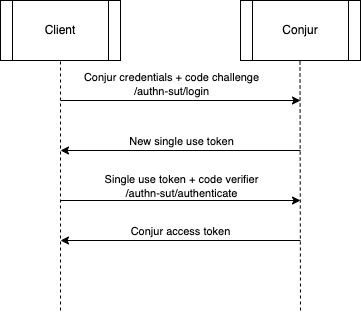
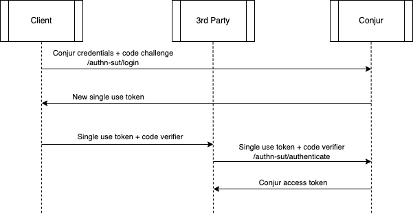
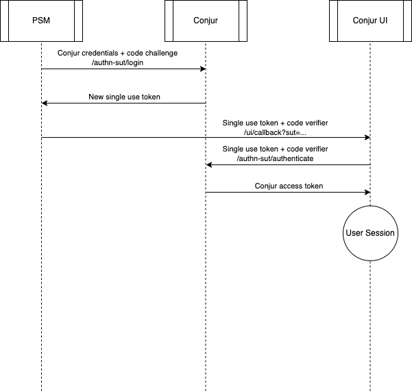

# Single Use Token (SUT) Authenticator

## Overview/Introduction

The Single Use Token (SUT) Authenticator is a new authenticator for Conjur that
will allow users to authenticate to Conjur using a single-use token. A user will
be able to generate a single use token by providing their username and password
to a new API endpoint. The user will then be able to use the token to
authenticate to Conjur.

## Summary of Existing Functionality

There is currently no way to create a single-use token for authenticating to
Conjur.

## Requirements

The driver behind this effort is to enable integration between Conjur UI and
PSM. That integration will require a mechanism for generating a single-use token
that can be used to authenticate to Conjur. The requirements for this effort are
as follows:

### Feature Spec for Conjur UI-PSM Integration (CNJR-2392)

> Privileged Session Manager (PSM) enables users to log on to remote
> machines/applications securely through a proxy machine facilitating
> streamlined and native workflows for the IT admins. Conjur is now going to
> integrate with PSM providing integrity across Cyberark products and easy
> access to the Conjur UI via PSM.
>
> In order for PSM to connect to the Conjur UI, a new API(s) would be provided
> that PSM could call to establish the UI session and login the user directly
> into the main UI dashboard, without showing the initial login screen. More
> details will be added in the solution design (TBD).
>
> The overall UX will remain the same where users will continue to use the
> existing workflow of logging onto the PVWA, clicking connect on a defined
> Conjur instance 1 and connecting through PSM straight into the Conjur UI
> console.

The SUT authenticator will be the mechanism used to authenticate the user to
Conjur when they click "Connect" on a Conjur instance in PVWA. PSM will query
Conjur to generate a SUT for the user using their stored username and password
or API key. PSM will then pass the SUT to the Conjur UI via a URL parameter. The
Conjur UI will use the SUT to authenticate the user to Conjur and start a
session.

## Out-of-scope

- SUTs will not be able to be used to authenticate to Conjur via the CLI
  - SUTs are intended to be used in automated processes. The CLI is intended to
    be used by humans (developers, operators, etc.)
  - There is no technical reason we couldn't support it, there's just no reason
    to do so.
- There are many possible use cases for SUTs. This effort will focus on the
  basic use case necessary for Conjur UI-PSM integration. Additional use cases
  may be considered in the future.
- The PSM integration itself will not be part of this effort. This effort will
  only focus on the SUT authenticator and the API endpoint for generating SUTs.
  The PSM team will implement the PSM integration in a separate effort in the
  PSM codebase.
- The SUT expiration time will be a fixed value. In the future we may want
  to allow the expiration time to be configured via policy to allow for
  different use cases, but that will not be part of this effort.
- There is an idea to provide a way for clients to register a key pair to use for
  signing the SUT generation request. This would allow us to verify that the
  request came from a trusted client. This would significantly increase the
  complexity of the implementation and is not necessary for the initial use
  case. We can consider this in the future if there is a need for it.
- We will not be including a mechanism to revoke SUTs (other than manual
  deletion from the database). This is not necessary due to the short TTL of the
  SUTs. The time it would take to find and delete a SUT from the database would
  likely be longer than the time it would take for the SUT to expire.

## Design

### High-Level Design

#### Workflows

##### Basic SUT Workflow

The following diagram shows the basic workflow for using a SUT to authenticate
to Conjur. The first step is to call the
`POST /authn-sut/<account>/login` endpoint with the user's
credentials and a code challenge to generate a SUT. The SUT and code verifier
are then passed to the `POST /authn-sut/<account>/<login>/authenticate`
endpoint to authenticate the user to Conjur and retrieve a short-lived auth
token.

Note: In this use case it would be simpler to just use the standard Conjur
authenticator. This is only included to illustrate the simplest possible use
case for the SUT authenticator.



##### 3rd Party Client Workflow

The following diagram shows the workflow for using a SUT to authenticate to
Conjur on behalf of a 3rd party client. The first step is to call the
`POST /authn-sut/<account>/login` endpoint with the user's
credentials and a code challenge to generate a SUT. The SUT and code verifier
are then handed off to the 3rd party client. The 3rd party client then calls the
`POST /authn-sut/<account>/<login>/authenticate`
endpoint with the SUT and code verifier to authenticate the user to Conjur and
retrieve a short-lived auth token. This way the 3rd party client never has
access to the user's credentials.



##### PSM Integration Workflow

The following diagram shows the workflow for using a SUT to authenticate to
Conjur via the PSM integration. The first step is to call the
`POST /authn-sut/<account>/login` endpoint with the user's
credentials and a code challenge to generate a SUT. The SUT and code verifier
are then passed to the Conjur UI via URL parameters:
`GET <conjur-ui-url>/ui/callback?sut=<sut>&code_verifier=<code_verifier>`.
The Conjur UI then calls the `POST /authn-sut/<account>/<login>/authenticate`
endpoint with the SUT and code verifier to authenticate the user to Conjur and
retrieve a short-lived auth token. The Conjur UI then starts a session for the
user.



##### Log Messages

##### Error Log level

| | Scenario | Log message |
|--- |-----------------------------------------------------------------------  |----------------------------------------------------------------------------------------|
| 1  | Authenticator is not enabled (in DB/ENV)                                | Authenticator '{0-authenticator-name}' is not enabled                                                 |
| 2  | Webservice is not defined in a Conjur policy                            | Webservice '{0-webservice-name}' not found                                          |
| 3  | User or host is not permitted to authenticate with the webservice               | '{0-role-name}' does not have 'authenticate' privilege on {1-service-name}             |
| 4  | User or host is not defined in Conjur                                           | '{0-role-name}' wasn't found                                                           |
| 5  | Login error                               | Login error: ...                                     |
| 6  | Missing SUT in /authenticate request body | Single use token not provided    |
| 7  | SUT not found for user, or expired | Single use token is invalid    |
| 8  | Missing code challenge in /login request body | Code challenge not provided    |
| 9  | Invalid code challenge in /login request body | Code challenge not valid    |
| 10 | Invalid code challenge algorithm in /login request headers | Code challenge algorithm not supported    |
| 11 | Missing code challenge algorithm in /login request headers | Code challenge algorithm not provided    |
| 12 | Missing code verifier in /authenticate request body | Code verifier not provided    |
| 13 | Code verifier does not match code challenge | Invalid code verifier    |

##### Warn Log level

| | Scenario | Log message |
|--- |-----------------------------------------------------------------------  |----------------------------------------------------------------------------------------|
| 1  | Attempt to use SUT for different user | Single use token for {0-role-name} is not valid for {1-role-name}    |
| 2  | Attempt to use SUT that expires in the distant future | Single use token for {0-role-name} expires in the distant future and may have been tampered with   |

###### Debug Log level

|    | Scenario                                              | Log message                                                                            |
|--- |-------------------------------------------------------|----------------------------------------------------------------------------------------|
| 1  | After validating SUT | Single use token for {0-role-name} has been validated successfully                |
| 2  | Attempt to use expired SUT | Single use token for {0-role-name} has expired    |
| 3  | Attempt to use used SUT | Single use token for {0-role-name} has already been used    |

##### Audit Log Messages

Same as other authenticators - one message for successful authentication, one for failed authentication, with
two additional events:

- Attempt to use SUT for a different user
- Attempt to use SUT that expires in the distant future (tampered expiration time)

#### Policy

As with other authenticators, the SUT authenticator will be disabled by default.
It will be enabled by creating an authenticator policy resource in Conjur and
adding it to the list of enabled authenticators in the Conjur configuration, for
example in the `CONJUR_AUTHENTICATORS` environment variable.

The authenticator webservice must be declared in Conjur policy:

```yml
- !policy
  id: conjur/authn-sut
  body:
  - !webservice

  - !group 
    id: authenticatable
    annotations:
      description: Group with permission to authenticate using this authenticator

  - !permit
    role: !group authenticatable
    privilege: [ read, authenticate ]
    resource: !webservice
```

and the `authenticatable` group can be used to entitle a user(s) to use the
authenticator:

```yml
- !grant
  role: !group conjur/authn-sut/authenticatable
  member: !user <username>
```

It will not be possible to define more than one SUT authenticator. There is no
need for a new status endpoint for this authenticator.

#### API

We will need two new API endpoints for the SUT authenticator:

##### `POST /authn-sut/<account>/login`

This endpoint will be used to generate a SUT for a user. The user will provide
their username and password (or API key) in the `Authentication` header using the
standard format for HTTP Basic authentication.

Additionally, the client will provide a Code Challenge in the request body and a Code Challenge Algorithm
in the headers. For example:

Headers:

```txt
Authorization: Basic ...
Code-Challenge-Algorithm: sha256
```

Body:

```json
{
  "code_challenge": "3iod..."
}
```

For more details on the code challenge, see the [Code Verifier and Code Challenge](#code-verifier-and-code-challenge) section.

The endpoint will return a SUT that can be used to authenticate the user to Conjur.

The format of the URL matches the existing authenticator endpoints for authn and
authn-ldap. However, the request action for authn-sut is `POST` instead of `GET`
since we need to send a code challenge in the request body.

##### `POST /authn-sut/<account>/<login>/authenticate`

This endpoint will be used to authenticate a user to Conjur using a SUT. The
user will provide the SUT and code verifier in the request body.
The endpoint will verify that the SUT is valid and has not expired, and that
the code verifier matches the code challenge associated with the SUT. If this
is the case, the endpoint will return a short-lived Conjur auth token.

Example request body:

```json
{
  "single_use_token": "lkduj...",
  "code_verifier": "3iod..."
}
```

The format of the URL matches the existing authenticator endpoint for
authn-ldap.

For more details on the code challenge, see the [Code Verifier and Code Challenge](#code-verifier-and-code-challenge) section.

### Low Level Design

#### Data Model

The SUT will be a cryptographically secure, random string. It will be generated
by the Conjur server and stored in the database. The SUT will be associated with
the user and expiration time. The SUT will be deleted once it is utilized
to authenticate the user to Conjur.

When we store the SUT in the database, we will store a hash of the SUT instead
of the SUT itself. This will prevent an attacker with access to the database
from being able to use the SUTs to authenticate to Conjur. The SUT will be
hashed using a cryptographically secure hash function, such as SHA-256. When a
user presents a SUT to authenticate to Conjur, we will hash the SUT and compare
it to the hash stored in the database. We do not need to salt the hash since the
SUT is already a cryptographically secure random string, as opposed to a
password which is likely to be reapeated across users.

When hashing the token, we should include the user/role ID in the hash to
prevent an attacker from using a SUT for a different user by changing the
user/role ID in the database. For instance, we could hash the SUT and user ID
together, separated by a delimiter, and store the hash in the database. When
authenticating with the SUT, we would hash the SUT and user ID together and
compare it to the hash stored in the database.

Example: `SHA256("lkduj...account:user:john.doe")`

##### SUT Format

We cannot use JWTs for the SUT as we need the ability to revoke the SUT after it
is used, a feature not easily implemented with JWTs. This would make it
impossible to prevent replay attacks.

##### SUT Expiration and Revocation

The SUT will have a short expiration time, on the order of 20-30 seconds. This is
enough time to allow the client to use the SUT to authenticate to Conjur, even
in the case of network latency, but short enough to limit the window of
opportunity for an attacker to steal and use the SUT.

Additionally, only one SUT will be valid at a time for a given user. If a new
SUT is generated for a user, the previous SUT will be deleted.

When a SUT is used (or revoked), it will be deleted from the database. In
regards to deleting expired SUTs, we can either choose to delete them when
creating new SUTs, or we can create a service to periodically delete them. The
former option is simpler, but the latter option may be more performant. The
specifics of this effort will be left to be determined as part of the
implementation. In any case, when deleting used or expired SUTs, we must not
cascade the delete since this would delete any related audit logs.

###### Expiration Sanity Check

When attempting to authenticate with a SUT, we will perform a sanity check to
ensure that the SUT has not beed modified in the database to have an expiration
time far in the future. We should check the expiration time against the current
time plus the default expiration interval. If it's beyond this time, we should
treat the SUT as expired and delete it from the database. We should additionally
log a warning message and an audit log.

##### Code Verifier and Code Challenge

As an additional layer of security, the client will generate a code verifier,
which can be a Guid or other cryptographically secure random string. The code
will then be hashed and sent along with the login request to be associated
with the generated SUT. This hashed code verifier, known as the code
challenge, will be stored by Conjur along with the SUT. When the client
attempts to authenticate with the SUT, they will also send the code verifier
(in plain text form), and Conjur will hash it and compare it to the stored
code challenge.

Initially we will support the SHA-256 algorithm for the code challenge. In the
future we may want to support additional algorithms. We should require the
client to specify the algorithm in the request headers, despite only supporting
one algorithm for now, to allow for future expansion without breaking API
compatibility.

The code challenge and code verifier flow are modeled after OIDC PKCE.

##### Example Database Table

| role_id | token_hash | code_challenge | code_challenge_algorithm | expires_at |
|---------|------------|----------------|--------------------------|------------|
| account:user:john.doe | lkduj...  | 3iod... | sha256 | 2023-09-28 12:08:23 |
| account:user:demo.user | 2k1g2...  | kld80... | sha256 | 2023-09-28 12:09:45 |

For this example, we would need a migration to add the `authn_sut_tokens` table.
That would look something like this:

```ruby
Sequel.migration do
  change do
    create_table :authn_sut_tokens do
      primary_key :token_hash, type: String
      foreign_key :role_id, :roles, type: String, null: false, on_delete: :cascade
      String :code_challenge, null: false
      String :code_challenge_algorithm, null: false
      DateTime :expires_at, null: false
      index [:token_hash, :expires_at], unique: true
    end
  end
end
```

#### Authenticator

The SUT authenticator will be implemented as a new authenticator plugin. The
implementation will follow the existing authenticator plugin pattern, as
documented in [AUTHENTICATORS.md](../AUTHENTICATORS.md)

## Security

Due to the fact that this feature will be used to authenticate to Conjur, it is
critical that the implementation is secure. Threat modeling should be performed
before implementation begins to identify potential security issues and ensure
that they are addressed. There should be an additional security review of the
implementation before it is merged.

Much of the security of this feature will be provided by the underlying
authenticator architecture, so we only need to be concerned with the security of
the SUT and the implementation of the SUT authenticator plugin.

We should make sure to look carefully at our handling of sensitive data in
memory. In Ruby, this is primarily done by avoiding the passing around of
secrets from one method to another, ensuring that they can be garbage collected
as soon as possible. It is also a good idea to set variables to `nil` after they
are no longer needed to remove the values from memory. In terms of what
sensitive data we will be handling, this will include Single Use Tokens as well
as Code Challenges and Code Verifiers. We should ensure that we follow these
best practices for handling these values.

## Testing

### Unit Tests

Unit tests should cover virtually all lines of code in the implementation. In particular,
the following scenarios should be covered by RSpec controller tests:

| Scenario | Path Type | Test Purpose | Failure Scenarios | Details |
|----------|-----------|--------------|-------------------|---------|
| Generate SUT | Happy | Verify that a SUT can be generated for a user | | |
| Generate SUT - Invalid credentials | Sad | Verify that a SUT cannot be generated for a user with invalid credentials | | |
| Generate SUT - Authenticator not defined in policy | Sad | Verify that a SUT cannot be generated with an authenticator that is not defined in policy | | |
| Generate SUT - Invalid authenticator | Sad | Verify that a SUT cannot be generated for a user with an invalid authenticator | | |
| Generate SUT - Disabled authenticator | Sad | Verify that a SUT cannot be generated for a user with a disabled authenticator | | |
| Generate SUT - Authenticator not enabled for user | Sad | Verify that a SUT cannot be generated for a disabled user | | |
| Generate SUT - Missing code challenge | Sad | Verify that a SUT cannot be generated without a code challenge | | |
| Generate SUT - Invalid code challenge | Sad | Verify that a SUT cannot be generated with an invalid code challenge (eg too short or long) | | |
| Generate SUT - Missing code challenge algorithm | Sad | Verify that a SUT cannot be generated without a code challenge algorithm | | |
| Generate SUT - Invalid code challenge algorithm | Sad | Verify that a SUT cannot be generated with an invalid code challenge algorithm | | |
| Authenticate with SUT | Happy | Verify that a user can authenticate to Conjur with a SUT | | |
| Authenticate with SUT - Invalid SUT | Sad | Verify that a user cannot authenticate to Conjur with an invalid SUT | | |
| Authenticate with SUT - Expired SUT | Sad | Verify that a user cannot authenticate to Conjur with an expired SUT | | |
| Authenticate with SUT - Used SUT | Sad | Verify that a user cannot authenticate to Conjur with a used SUT | | |
| Authenticate with SUT - Authenticator not defined in policy | Sad | Verify that a user cannot authenticate to Conjur with an authenticator that is not defined in policy | | |
| Authenticate with SUT - Invalid authenticator | Sad | Verify that a user cannot authenticate to Conjur with an invalid authenticator | | |
| Authenticate with SUT - Disabled authenticator | Sad | Verify that a user cannot authenticate to Conjur with a disabled authenticator | | |
| Authenticate with SUT - Authenticator not enabled for user | Sad | Verify that a user cannot authenticate to Conjur with a disabled user | | |
| Authenticate with SUT - Incorrect user | Sad | Verify that a user cannot authenticate to Conjur with a SUT for a different user | | |
| Authenticate with SUT - Tampered expiration | Sad | Verify that a user cannot authenticate to Conjur with a SUT that expires in the distant future | | |
| Authenticate with SUT - Missing code verifier | Sad | Verify that a user cannot authenticate to Conjur without a code verifier | | |
| Authenticate with SUT - Invalid code verifier | Sad | Verify that a user cannot authenticate to Conjur with an invalid code verifier | | |
| Generate & Authenticate - Multiple SUTs | Sad | Generate two SUTs for a user. Verify that the first one cannot be used after the second is created. | | |

### Integration Tests

Integration tests should cover the following scenarios:

| Scenario | Path Type | Test Purpose | Failure Scenarios | Details |
|----------|-----------|--------------|-------------------|---------|
| Generate SUT | Happy | Verify that a SUT can be generated for a user | | |
| Generate SUT - Invalid credentials | Sad | Verify that a SUT cannot be generated for a user with invalid credentials | | |
| Authenticate with SUT | Happy | Verify that a user can authenticate to Conjur with a SUT | | |
| Authenticate with SUT - Invalid SUT | Sad | Verify that a user cannot authenticate to Conjur with an invalid SUT | | |
| Generate & Authenticate - Multiple SUTs | Sad | Generate two SUTs for a user. Verify that the first one cannot be used after the second is created. | | |

Tests should include verification that the SUT is not logged.

## Documentation

We will need to create an artifact to provide to the tech writers that describes
the steps necessary to enable the SUT authenticator and use it. It will need to
include the policy required to enable the authenticator and the API endpoints.
It can be mostly copied from this design document.

We may or may not need to update the customer-facing documentation at this
point, since this is intended to only be used by PSM initially. We will however
need documenation to provide to the PSM team, and to admins who want to enable
the PSM integration.

## Project Cost & Schedule

For the following table, "Effort" is estimated in terms of developer days. "Risk"
is an estimate of the risk of missing said estimate. Low risk means high likelihood
of hitting the estimate, while high risk means low likelihood of hitting the estimate.

| Task | Jira ID | Effort | Risk |
|------|---------|--------|------|
| Solution Design | CNJR-2514 | 4 | Low |
| Threat Modeling | CNJR-2927 | 3 | Low |
| Implement SUT Generator | CNJR-2928 | 5 | Low |
| Create SUT Generator Feature Tests | CNJR-2929 | 3 | Low |
| Implement SUT Authenticator | CNJR-2930 | 5 | Low |
| Create SUT Authenticator Feature Tests | CNJR-2931 | 3 | Low |
| Create End-to-End Tests | CNJR-2932 | 4 | Low |
| Create service or logic to delete expired SUTs | CNJR-2933 | 5 | Medium |
| Implementation Security Review | CNJR-2934 | 3 | Low |
| Update OpenAPI Spec | CNJR-2948 | 2 | Medium |
| Conjur UI support | CNJR-2935 | 4 | Low |
| Documentation for tech writers | CNJR-2936 | 2 | Low |
| Total | | 43 | Low |
