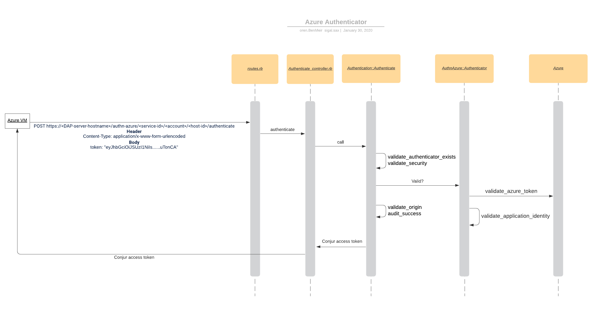

# Solution Design - Azure Authenticator

## Table of Contents

- [Glossary](#glossary)
- [Useful Links](#useful-links)
- [Issue description](#issue-description)
- [Solution](#solution)
    - [Azure Application Identity](#azure-application-identity)
    - [Design](#design)
        - [Authentication Flow](#authentication-flow)
        - [Azure authenticator class](#azure-authenticator-class)
    - [Backwards compatibility](#backwards-compatibility)
    - [Performance](#performance)
    - [Affected Components](#affected-components)
- [Test plan](#test-plan)
- [Logs](#logs)
- [Docs](#docs)
- [Version update](#version-update)
- [DoD](#dod)
- [Open Questions](#open-questions)

## Glossary

| Term                                   | Description                                                                                                                                                                                     |
|----------------------------------------|-------------------------------------------------------------------------------------------------------------------------------------------------------------------------------------------------|
| Active Directory (AD)                  | an access management service that allows users to sign-in and access resources based on privileges granted to them                                                                              |
| Active Directory (AD) tenant           | a dedicated instance of AD for the organization (AAM for example)                                                                                                                               |
| Azure Resource Manager                 | the service that is used to provision resources. When creating a new VM, it receives a request upon instance (VM) creation and gives the instance a system-assigned managed identity.           |
| Service principle                      | object representation of VM instance in AD. This object holds information defining its permissions on resources                                                                                 |
| Client ID                              | unique identifier generated by Azure AD tied to application and service principal during initial provisioning. This client ID is used to identify the object that is requesting an access token |
| System-assigned identity               | an identity for an instance in AD that is trusted. The identity is tied to the resource and abides to its lifecycle. In other words, if the resource is delete so to will the identity.         |
| User-assigned identity                 | an identity for an instance in AD that is trusted. This identity can be assigned to 1+ Azure services instances and is independent of instance lifecycle                                        |
| Azure Instance Metadata Service (IMDS) | a REST endpoint accessible to all VMs created via the Azure Resource Manager. Resources in Azure request access tokens from the Azure Instance Metadata service endpoint                        |
| JWT                                    | JSON-based access token that asserts claims (logged in, etc)         

## Useful links

- [Azure Spike Ramp-up training exercise](https://ca-il-confluence.il.cyber-ark.com/display/rndp/Azure+Spike+Ramp-up#AzureSpikeRamp-up-/)

- [Delivery Plan - Conjur Azure Authenticator](https://ca-il-confluence.il.cyber-ark.com/display/rndp/Delivery+Plan+-+Conjur+Azure+Authenticator)

## Issue description

Many of our customers are using Azure as their main cloud provider. Therefore we want to enable Azure resources to authenticate according to Azure 
properties and get back a Conjur access token in order to retrieve secrets from our providers. At current, customers can authenticate their Azure 
VMs with Conjur by creating a Conjur host identity for their Azure resources. The Azure resource would then receive an API key as part of the 
creation of a Conjur identity which they must use to connect to targets. This is not optimal nor convenient because we are not allowing the 
resources to authenticate based on their Azure identity and demand that the resource hold an extra secret, the Conjur-given API key.

## Solution

We will add a new authenticator to Conjur, which users can authenticate with from Azure VMs. As mentioned in the feature doc, before any authentication 
request is sent to Conjur, the admin will load the authenticator policy: 

```yaml
# policy id needs to match the convention `conjur/authn-azure/<service ID>`
- !policy
  id: conjur/authn-azure/prod
  body:
  - !webservice
    - !variable
        id: provider-uri # https://sts.windows.net/TENANT_ID
  - !group apps
  
  - !permit
    role: !group apps
    privilege: [ read, authenticate ]
    resource: !webservice
```

### Azure Application Identity

To authenticate with Conjur, Azure-specific fields will need to be provided in the host annotations of the Conjur host identity for the Azure resource, 
specifically subscription-id, resource-group, and user/system-assigned-identity. These fields will be used to confirm the identity of the Azure resource 
sending the authentication request by comparing the Azure token information with the host annotations that are defined in the above policy.

A Conjur host will be defined as follows with their annotations holding Azure-specific identification properties.

```yaml
- !policy 
  id: azure-apps 
  body: 
  - !host 
    id: test-app 
    annotations: 
    authn-azure/subscription-id: test-subscription 
    authn-azure/resource-group: test-group 
    authn-azure/user-assigned-identity: test-app-pipeline 
OR 
    authn-azure/system-assigned-identity: ie_qWCXhXxt1zIEsu4c7acQVGn4
```
 
#### Multiple-assigned identity for host - NOT FOR NOW

We may allow hosts to be defined with both "authn-azure/user-assigned-identity" and "authn-azure/system-assigned-identity". This way such a host can 
authenticate a token with a user-assigned id as well as a token with a system-assigned id. As a first step we will not develop - nor test - such a use-case.

### Design

#### Authentication Flow

This flow assumes that the VM already exists in Azure, and that an authn-azure authenticator and a Conjur host were loaded.




1. Azure VM sends the following request to Conjur:
    ```yaml
    POST https://<DAP-server-hostname>/authn-azure/<service-id>/<account>/<host-id>authenticate
    Header 
    
    Content-Type: application/x-www-form-urlencoded
    Body 
    
     token: "eyJhbGciOiJSUzI1NiIs......uTonCA"
    ```

1. An already existing route will be used (post '/:authenticator(/:service_id)/:account/:id/authenticate' => 'authenticate#authenticate') that will forward the request to the AuthenticationController. 

1. The request will then be forwarded to the Authentication::Authenticate CommandClass. This CommandClass holds a collection of general authenticator validations that will take place.

1. The two first general validations include validate_authenticator_exists and validate_security. 
    
    1. validate_authenticator_exists ensures that the authenticator sent as part of the request URI is one that we support (authn-k8s, authn-azure, etc.).

    1. validate_security validates that the Azure authenticator has been defined correctly in policy and the host is permitted to authenticate to the webservice.

1. The next validation, validate_credentials calls the authenticator's valid? function. If so, Azure-specific authenticator validations will be triggered. 

    1. validate_azure_token (see below for a more detailed explanation of the function).
    
    1. validate_application_identity, the Conjur identity host annotations for the Azure VM and the properties extracted from the "xms_mirid" field of the Azure token provided by the Azure VM are compared (see below for a more detailed explanation of the function).

1. Once the Azure authenticator-specific validations have passed, the general authenticator validations can continue.
    1. validate_origin checks the origin of the request to determine if the origin of the request is restricted.
    
    1. audit_success writes the event to the audit logs

1. If all validations pass, an audit entry is written to audit logs and a Conjur access token will be returned to the Azure requesting resource. This Conjur access token will be used for all further communications between the Azure resource and Conjur.

#### Azure authenticator class
 
 ```ruby
require 'command_class'

module Authentication
  module AuthnAzure

    Err = Errors::Authentication::AuthnAzure
    Authenticator = CommandClass.new(
      dependencies: {
       ...
      },
      inputs: [:authenticator_input]
    ) do
      
	  # Azure authenticator checks
      def call
        validate_azure_token
        validate_application_identity
      end

      private

      ...
    end
 ```
 
#### validate_azure_token

The Azure token validation checks the signature and claims of the Azure token to ensure that the token was issued by Azure Active Directory. To do this we need to:
1. Discover the Oauth 2.0 provider - in this case the Azure AD is the Oauth 2.0 provider. Its URl will be retrieved from the "provider-uri" variable defined in the authenticator policy
1. Retrieve JWKs from the discovery endpoint - These keys are used for the token validation
1. Decode and verify the token using the JWKs.

Steps 1 & 2 may seem familiar as they are the exact steps that we perform in the OIDC Authenticator. This is because OIDC is Oauth 2.0 based. We will take advantage on this and use the 3rd party used in the OIDC Authenticator to perform steps 1 & 2 in our authenticator.
Unfortunately, the 3rd party used in the OIDC Authenticator does not implement an access token decoding. Thus, to perform step 3, we will need another 3rd party - the "jwt" gem. 

As you can see in the following blueprint for the `validate_azure_token` implementation, it will use `AuthnOidc`'s `FetchProviderCertificate` class to retrieve the JWKs and will use them to decode the token, using `JWT`'s `decode` function:
```
require 'jwt'

module Authentication
  module AuthnAzure
    DecodeAndVerifyToken = CommandClass.new(
      dependencies: {
        fetch_provider_certificate: ::Authentication::AuthnOidc::FetchProviderCertificate.new,
      },
      inputs:       %i(provider_uri token_jwt)
    ) do

      def call
		certs = @fetch_provider_certificate.(
		  provider_uri: @provider_uri
		)     

		# indicate that we should verify the issuer and audience claims
		options = { iss: provider_uri, verify_iss: true, verify_aud: true }

        @decoded_token = JWT.decode(
          @token_jwt,
          @certs, # JWKs retrieved from the 
          true, # tells the decoder to verify the token
          options
        )
      end
    end
  end
end
```
 
#### validate_application_identity

The validate_application_identity function will validate if the Azure VM can authenticate with Conjur and fetch secrets based on information extracted from the provided Azure token. 
This function will parse the `xms_mirid` field of the Azure token provided by the Azure VM, extracting resource group, system/user assigned identity, and client ID. Once extracted, we will compare them to the annotations of the Conjur host for this Azure resource. If they match, the Azure VM resource will receive a Conjur access token in return. All further requests that this Azure VM sends will need to have this Conjur access token in the header.

### Backwards compatibility

None because this is a new feature.

### Performance

Azure authenticator performance should conform with our other authenticators with an average call time of 1 second.

### Affected Components

- Conjur

- DAP

## Test Plan

TBT

## Logs

|    | Scenario                                                              | Log message                                                                            | Notes                                                                                | Status | Exists?                                       |
|--- |-----------------------------------------------------------------------|----------------------------------------------------------------------------------------|--------------------------------------------------------------------------------------|--------|-----------------------------------------------|
| 1  | AuthenticatorNotWhitelisted (in DB/ENV)                               | {0-authenticator-name}' is not enabled                                                 |                                                                                      |        | Yes                                           |
| 2  | WebserviceNotFound (in Conjur)                                        | Webservice '{0-webservice-name}' wasn't found                                          |                                                                                      |        | Yes                                           |
| 3  | WebserviceNotFound (in Conjur)                                        | '{0-role-name}' does not have 'authenticate' privilege on {1-service-name}             |                                                                                      |        | Yes                                           |
| 4  | RoleNotFound (Host/User not defined in Conjur)                        | '{0-role-name}' wasn't found                                                           |                                                                                      |        | Yes                                           |
| 5  | ProviderDiscoveryTimeout (couldn't make connection with provider-uri) | Azure Identity Provider failed with timeout error (Provider URI: '{0}'). Reason: '{1}' |                                                                                      |        | Yes (needed to be generalized)                |
| 6  | ProviderTokenInvalid (failed to confirm token signature of provider)  | Failed to confirm signature of '{0-token}' issued by (Provider URI: '{1}'              |                                                                                      |        | No                                            |
| 7  | MissingRequestParam                                                   | Field '{0-field-name}' is missing or empty in request body                             | "Token" not in body of request                                                       |        | Yes (must extract authn-request body)         |
| 8  | TokenFieldNotFoundOrEmpty                                             | Field '{0-field-name}' not found or empty in token                                     |                                                                                      |        | No (for OIDC but need to be more generalized) |
| 9  | InvalidApplicationIdentity                                            | Azure application identity field '{0-field-name}' does not match Azure token           | 1+ of the fields in the Azure token don't match the Conjur host identity annotations |        | No                                            |
 
## Docs

## Version update

- Conjur

- DAP

## DoD

- [ ] Solution design is pushed to GH and project-artifacts slack channel for early feedback
- [ ] Solution designed is approved
- [ ] Test plan is approved
- [ ] Security review was done
- [ ] Implement Azure authn functionality
- [ ] Azure VM can authenticate to Conjur using the Conjur authn-azure authenticator and get Conjur access token
- [ ] Tests are implemented according to test plan and all tests pass
    - [ ] Integration tests exist
    - [ ] Unit tests exist
- [ ] Security action items were taken care of
- [ ] Performance tests were done and align with SLA
- [ ] Logs were reviewed by TW and PO
- [ ] Documentation has been written and reviewed by PO and TW for both DAP and Conjur
- [ ] Engineer(s) that were not involved in the project use documentation to authenticate with Conjur using Azure
- [ ] Versions are bumped in all relevant projects
   - [ ] Conjur
   - [ ] DAP
 
## Open questions

- Do we want to develop a mechanism to support a request body with more than one field (currently, we have only "token", but we may want to add more fields later).
