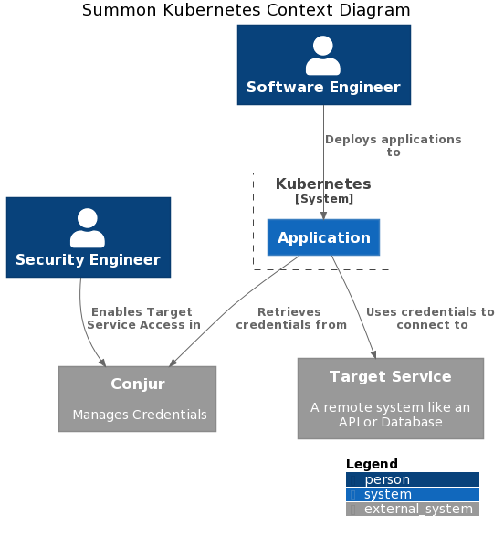
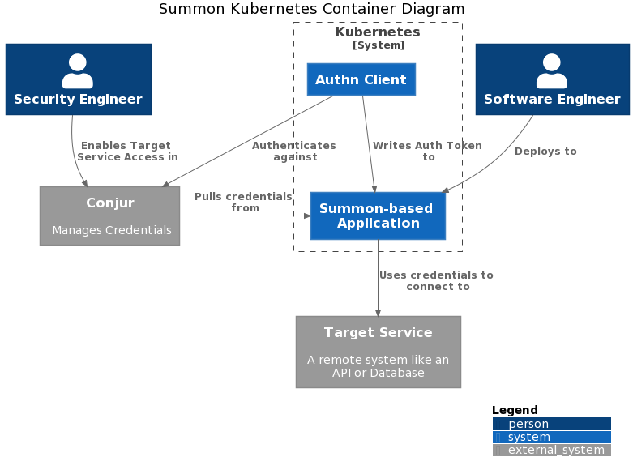
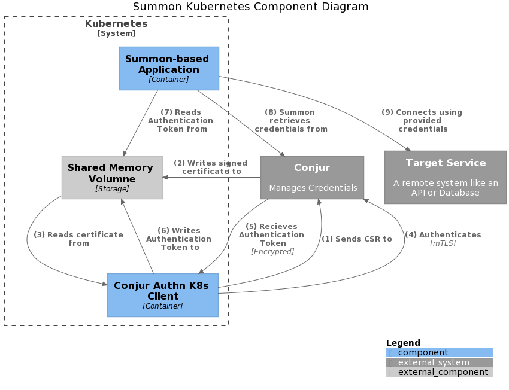

# Simplified Kubernetes Application Credentials with Summon

## Design

The following diagrams are in the spirit of the [C4 Diagraming Model](https://c4model.com/)

### System Context

> A System Context diagram provides a starting point, showing how the software system in scope fits into the world around it.

### Container

> A Container diagram zooms into the software system in scope, showing the high-level technical building blocks.

### Component

> A Component diagram zooms into an individual container, showing the components inside it.

