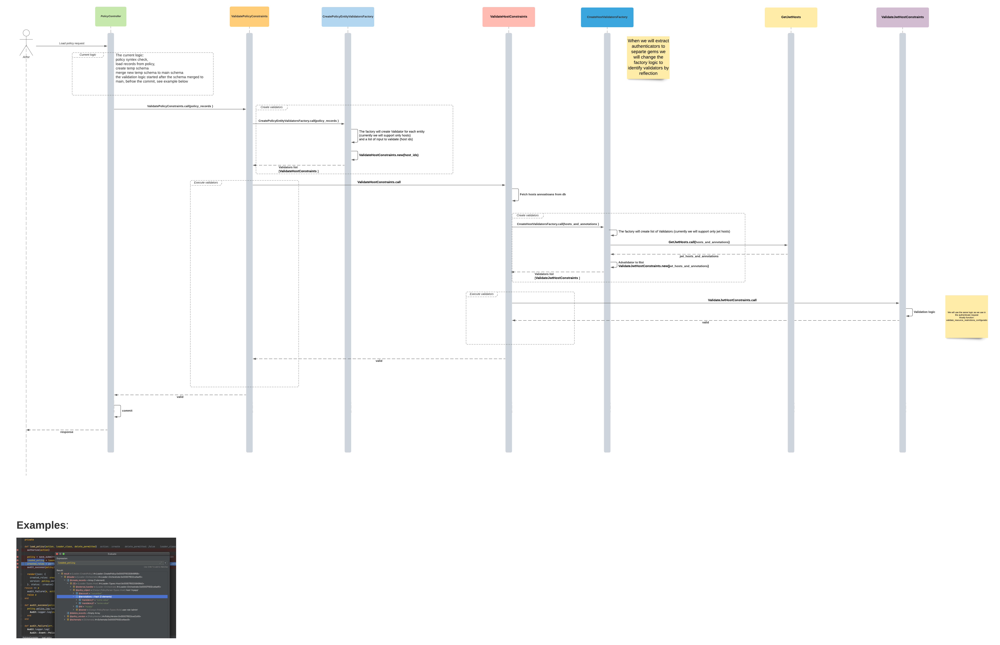
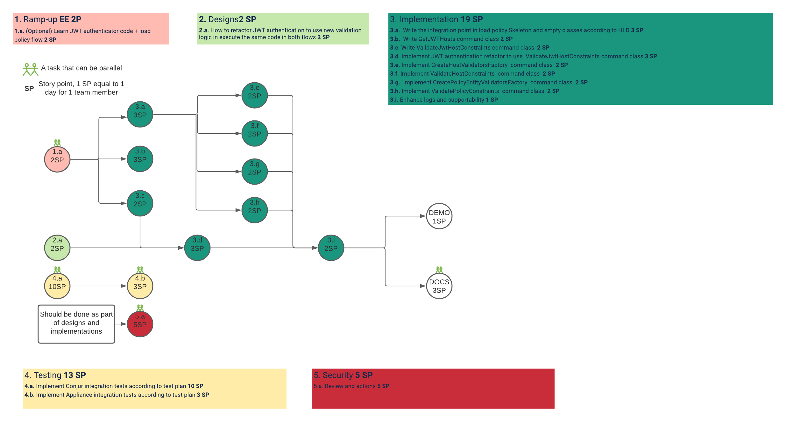

# Solution Design - Load policy validation

## Table of Contents
* [Glossary](#glossary)
* [Useful Links](#useful-links)
* [Issue Description](#issue-description)
* [Solution](#solution)
   + [Solution - scope](#solution---scope)
   + [User Interface](#user-interface)
* [Design](#design)
   + [Flow Diagrams](#flow-diagrams)
   + [Sequence Diagrams](#sequence-diagrams)
      - [Sequence Diagrams - additional info](#sequence-diagrams---additional-info)
* [Performance](#performance)
* [Backwards Compatibility](#backwards-compatibility)
* [Affected Components](#affected-components)
* [Test Plan](#test-plan)
   + [Out of Scope](#out-of-scope)
   + [Prerequisites](#prerequisites)
* [Documentation](#documentation)
* [Security](#security)
* [Infrastructure](#infrastructure)
* [Audit](#audit)
* [Open Questions](#open-questions)
* [Delivery Plan](#delivery-plan)
   + [Total 1st milestone EE 45](#total-1st-milestone-ee-45)
      - [Ramp-up EE 2](#ramp-up-ee-2)
      - [Designs EE 2](#designs-ee-2)
      - [Implementations EE 19](#implementations-ee-19)
      - [Testing EE 13](#testing-ee-13)
      - [Security EE 5](#security-ee-5)
      - [Docs EE 3](#docs-ee-3)
      - [Demo EE 1](#demo-ee-1)
* [Definition of Done](#definition-of-done)
* [Solution Review](#solution-review)

## Useful Links
- [Feature doc](https://ca-il-jira.il.cyber-ark.com:8443/browse/ONYX-8566)
- [UX research page](https://ca-il-confluence.il.cyber-ark.com.mcas.ms/display/rndp/JWT+Authenticator+-+load+policy+validation)
- [JWT authenticator stage 1.1 feature doc](https://ca-il-confluence.il.cyber-ark.com.mcas.ms/display/rndp/JWT+Authenticator+-+re-scope#JWTAuthenticatorrescope-Stage1.1-SimplegenericJWTauthenticatorwithtokenschema)


## Issue Description
In misconfiguration errors, for example:

for hosts without JWT **mandatory** annotation,

We are failing at JWT authentication request with 401 error and with no additional data in the response, which is a bad UX.
By adding the load policy validation it is improving the UX, and will help the customer to create a valid policies.


## Solution
For better UX we want to perform policy validation steps in order to identify configuration errors as early as possible. 

### Solution - scope
This solution is creating a generic infrastructure for all policy entities validation.
And focusing on Host with JWT authenticator annotations as first use case to implement on this new suggested infrastructure.

### UX
#### Load JWT policy without mandatory JWT annotation
1. Define JWT authenticator policy 
2. Populate (not developed yet feature) mandatory claims value with: sub, aud
3. Load the following host policy:
```yaml
- !host
 id: testapp
 annotations:
   authn-jwt/okta/aud: some-value
```
4. Failed on load policy validation: missing mandatory claims `sub` for host `testapp`
5. Fix policy and load again
```yaml
- !host
 id: testapp
 annotations:
   authn-jwt/okta/aud: some-value
   authn-jwt/okta/sub: some-value
```
6. 200 OK

## Design
The following diagrams, represent a new policy validation layer which will be triggered as part of the load policy request,
As the final state after the current logic.


### Flow Diagrams
In our use case, Host with JWT authenticator annotations validation:
1. Conjur admin define JWT authenticator 
2. Conjur admin load a policy of Host to be authenticated with JWT authenticator
3. New policy validation layer is triggered and validate if the host is configured correctly 
4. Host authenticate using JWT authenticator, due to above validation there are no configuration errors at the authenticate request stage

### Sequence Diagrams


#### Sequence Diagrams - additional info
1. Policy validation entry point:
As described in the diagram the validation will be triggered as the final new stage of the current logic (read below),
   which will call to a new command class `ValidatePolicyConstraints` with the input of the policy entities 
   records (see example in the end the of the diagram) from the user body request.
   
Load policy current logic - 
   for the load policy rest requests put/post/patch the current logic in high level is:
       
- policy syntax check
- load records from policy 
- create temp schema
- merge new temp schema to main schema 
- the validation logic will start after the schema merged to main

The motivation to integrate at this point is to not duplicate the implemented logic of the DB merge 
which is the current way of updating the DB with the policy input.

2. new ValidatePolicyConstraints command class - is responsible to validate all the policy entities 
   (host,user,webservice) which were sent by the user in load policy request.
   
    Note: in this design we will validate only hosts 
   
3. new CreatePolicyEntityValidatorsFactory command class - is responsible to create a list of validators as the amount 
   of the different policy entities types in the records input.
   
    Note: in this design we will create only `ValidateHostConstraints` with all the hosts ids in his belly 
   
4. new ValidateHostConstraints command class - is responsible to validate a list of host ids which are initialized in his creation.
   the flow is to fetch the host annotations from the DB (from the main schema after the merge) and to 
   use the `CreateHostValidatorsFactory` to create hosts authenticators validators.
   
5. new CreateHostValidatorsFactory command class - is responsible to create a list of validators as the amount
   of the different hosts authenticators types
   
    Note: 
    - in this design we will create only `ValidateJwtHostConstraints` which is validator for hosts with JWT annotations
    - this class can be refactored to use reflection if in the future we will want the separate the authenticator logic 
    to a different gems 
      
6. new GetJwtHosts command class - is responsible to get a lists of host and annotations and to return only the hosts which are 
related the JWT authenticator
   
7. new ValidateJwtHostConstraints command class - is responsible to to perform the validation logic as written in the requirements,
for all annotations have values.
   
    Note: we will refactor the current code of the authentication flow to use this new command class as well 
   

   

## Performance
* We will have a performance degradation in policy load action, 
  we will know the degradation percent after we will implements the performance tests.

## Backwards Compatibility
* Host with JWT annotations that were loaded successfully in the current Conjur version 
  will probably failed in load policy since they need modifications to answer the new constraints. 

## Affected Components
* All components, the load policy is a main feature

## Test Plan
Note: this is an high level test plan, we will need to extend and challenge it as this feature will enter into
development stage

#### Regression 
Valid policy without Hosts entities, policy validation is not activated, look for new logs, 200 OK

Invalid policy with syntax error, policy validation is not activated, Same error as previous version

Load policy without permissions,  policy validation is not activated, Same error as previous version

Load policy with empty value,  policy validation is not activated, Same error as previous version

Load policy with just policy id,  policy validation is not activated, Same error as previous version

#### Functionality 
Load policy with 1 host with JWT annotations, policy validation is  activated with expected output
* Write both success and failure scenarios 

Load nested policies with 5 hosts with JWT annotations, policy validation is  activated with expected output
* Write both success and failure scenarios 

Load hosts with and without JWT annotations in same policy,  policy validation is  activated with expected output
* Write both success and failure scenarios 

#### Performance
Run performance tests of load policy before and after the feature with and without JWT hosts 

#### Load
Load policy with 100 host with JWT annotations, policy validation is  activated with expected output

### Out of Scope
* This design do not handled the upgrade process and how to migrate invalid hosts from 
old version to new version.

## Documentation
* We will need to document the UX for all kinds of put/post/patch in case of changing/not changing
the DB, since the validation occurs only on the DB final state.
  So there are possible use cases were the policy input will be invalid 
  (For example: empty annotations), but the validation will passed successfully since the DB may not changed.

## Security
* Please read the following [private slack thread](https://conjurhq.slack.com/archives/C01UYV6J4P5/p1626157936037000)

## Infrastructure
None.

## Audit
* No need for new audit records 

## Open Questions
None.

## Delivery Plan

### 1st plan - 1 milestone Total EE 45



#### Ramp-up EE 2
* (Optional) Learn JWT authenticator code + load policy flow **EE 2**

#### Designs EE 2
* How to refactor JWT authentication to use new validation logic in execute the same code in both flows **EE 1**

#### Implementations EE 19
* Write the integration point in load policy Skeleton and empty classes according to HLD **EE 3**
* Write GetJWTHosts command **class EE 2**
* Write ValidateJwtHostConstraints command class **EE 2**
* Implement JWT authentication refactor to use ValidateJwtHostConstraints command class **EE 3**
* Implement CreateHostValidatorsFactory command class **EE 2**
* Implement ValidateHostConstraints command class **EE 2**
* Implement CreatePolicyEntityValidatorsFactory command class **EE 2**
* Implement ValidatePolicyConstraints command class **EE 2**
* Enhance logs and supportability **EE 1**

#### Testing EE 13
* Implement Conjur integration tests according to test plan **EE 10**
* Implement Appliance integration tests according to test plan **EE 3**

#### Security EE 5
* Review and actions **EE 5**

#### Docs EE 3

#### Demo EE 1

### 2nd plan - 2 milestones Total EE 45

#### M1 - Load policy infrastructure  SP 19

**Implementations** - 16 SP
* No need of 3.d

**Designs** - 0 SP

**Ramp-up** - (optional) 1 SP

**Testings** - 0 SP

**Security** - 2 SP
* Just review since the feature is not active

**Demo** - 0

**Docs** - 0

#### M2 - Adding JWT validation SP 26
Rest of the work of M1


## Definition of Done

- Solution designed is approved 
- Test plan is reviewed
- Acceptance criteria have been met
- Tests are implemented according to test plan 
- The behaviour is documented in Conjur Open Source and Enterprise
- All relevant components are released

## Solution Review
| **Persona**        | **Name** |
|--------------------|----------|
| Team leader        |          |
| Product owner      |          |
| System architect   |          |
| Security architect |          |
| QA architect       |          |
