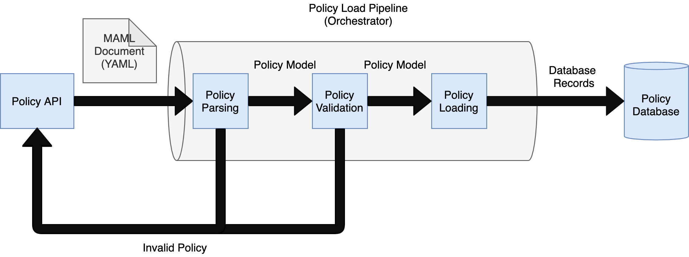
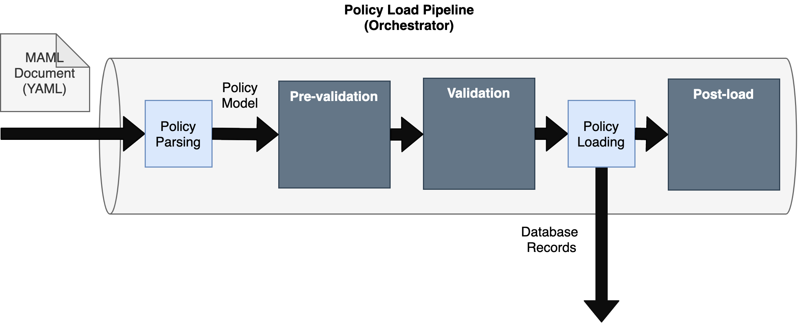

# Policy Load Controllers

## Motivation

Conjur Policy in Machine Authorization Markup Language (MAML) is a key component
of DevOps secrets management with Conjur. However, interacting with policy directly
is cumbersome and error-prone. Futher, the policy required for enterprise access
management is expansive in scope and scale. Operating effectively at this scale
requires robust automation and validation. Policy load controllers provide a
powerful system to gain operational efficiencies through policy automation and
validation.

Policy automation is promoted by the current design and architecture by providing
policy-as-code in a standardized format (MAML, an extension of YAML) and an API
for programmitically managing policy. These are leveraged today the PAS Synchronizer
and field-developed tools such as the [CyberArk PKI Service](https://github.com/infamousjoeg/cyberark-aam-pkiaas).
However, policy automation and validation in this manner requires deploying
additional development resources and infrastructure. Futher, bespoke automation
like this is not easily shared or reused across customers.

This is not only an end-user automation challenge either, there are CyberArk R&D
features such as automating authn-k8s certificate generation and validating 
authenticator policy that is difficult to implement in an obvious manner because
of the current policy load implementation.

## Overview

The idea behind policy load controllers is to model policy loading as a pipeline,
where policy documents enter through the API and the result of the
pipeline is either an invalid policy response or a valid policy loaded into the
Conjur database.



With the policy load pipeline, we can now allow additional actions to be introduced
in the various pipeline phases to provide additional automation and
validation in an extensible and structured manner.



In this example design, there are three distinct phases of the pipeline that
policy load controllers can hook into to extend policy automation and validation:

- **Pre-validation**

    In this phase, the policy model itself may be mutated based on
    automation logic.

    For example, a simplified `authn-k8s` policy might leave
    out the variable declarations for the internal CA certificate and key:

    ```yaml
    - !policy
      id: conjur/authn-k8s/<AUTHENTICATOR_ID>
      body:
      - !webservice
    ```

    And a pre-validation extension can then expand this to include the variables
    needed, so that the effective policy after mutation becomes:

    ```yaml
    - !policy
      id: conjur/authn-k8s/<AUTHENTICATOR_ID>
      body:
      - !webservice
      
      - !policy
        id: ca
        body:
        - !variable cert
        - !variable key
    ```

    This can also be leveraged to provide additional policy templating, such that
    custom policy objects, for example a `database`:

    ```yaml
    - !resource
      kind: database
      id: my-app-database
    ```

    Can be expanded through a policy load controller to become the effective
    policy:

    ```yaml

    - !policy
      id: my-app-database
      body:
      - !variable username
      - !variable password
      - !variable host
      - ...
    ```

- **Validation**

    Validation is the policy load phase when the policy model is inspected to
    ensure it adheres to business rules. This could, for example, ensure a host
    for k8s authentication includes all of the expected annotation.

    If enabled through plugins, this can also be extended to support customer-
    specific business logic for valid access management policy.

- **Post-load**

    Once a valid policy is loaded, this is an opportunity for post-processing
    extensions to perform actions such as intialize new variable values, or
    trigger events for other systems.

    For, example, a post-load extension for `authn-k8s` would be to intialize
    the CA certificate and private key values it will use for certificate
    signing and verification.

    This would also be an alternative implementation for more general variable
    provision [as proposed here](https://github.com/cyberark/conjur/blob/variable-provision-proposal/design/proposals/variable_provision.md).

## References

This design is heavily inspired by [Kubernetes Admission Controllers](https://kubernetes.io/blog/2019/03/21/a-guide-to-kubernetes-admission-controllers/)
when loading resource manifests in Kubernetes.
