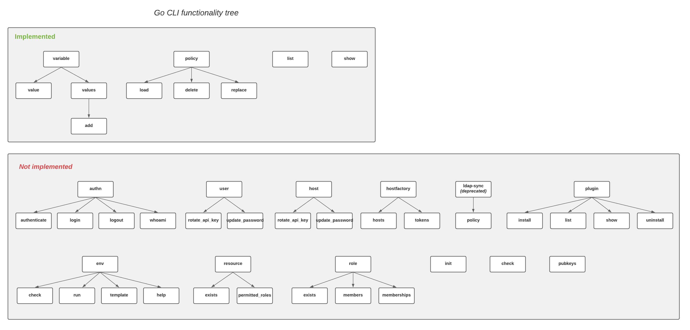
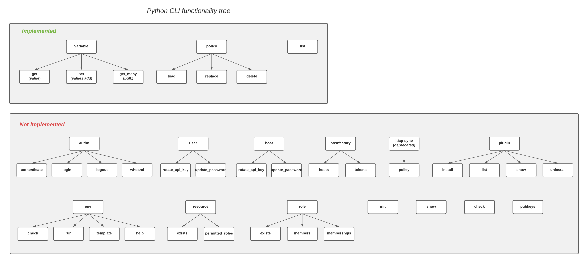

# Spike - Containerless CLI

## Table of Contents

[//]: # "You can use this tool to generate a TOC - https://ecotrust-canada.github.io/markdown-toc/"

  * [Useful links](#useful-links)
  * [Background](#background)
      - [Requirements](#requirements)
  * [Research](#research)
      - [Estimation](#estimation)
      - [Takeways and recommendation](#takeways-and-recommendation)
  * [Documentation](#documentation)
  * [Open questions](#open-questions)
  * [Implementation plan](#implementation-plan)

## Useful links

[//]: # "Add links that may be useful for the reader"

| **Term**                                              | **Description**                                              |
| ----------------------------------------------------- | ------------------------------------------------------------ |
| Epic                                                  | https://github.com/cyberark/conjur/issues/1892               |
| Ruby CLI                                              | https://github.com/cyberark/conjur-cli                       |
| Go CLI                                                | https://github.com/cyberark/conjur-cli-go                    |
| Python CLI                                            | https://github.com/cyberark/conjur-api-python3               |
| [FPM](https://github.com/jordansissel/fpm)            | For building packages for multiple platforms (RPM, DEB, OS X) |
| [Debify](https://github.com/conjurinc/debify)         | Build a package from a Ruby gem                              |
| [Ruby packager](https://github.com/pmq20/ruby-packer) | Packs Ruby application into a single executable for increased portability |

## Background

[//]: # "Give relevant background for the designed feature. What is the motivation for this solution?"

This document is one piece in the bigger piece of the Dockerless puzzle. In this document we will discuss possible options for a containerless CLI and present a recommendation for which one we should pursue.

In addition, regardless of how Conjur is deployed delivering and officially supporting a CLI that does not require Docker allows our solution to be portable and more easily attainable.

#### Requirements

The CLI design should answer the following requirements:

*Core functionality*

1. We should support `init`, `authn` (`login`, `authenticate`),  `policy (load)`, and `fetch secrets` functionalities. Open for discussion: `list`, `show, ` `rotate_api_key` (`host` / `user`).

*Deployment*

1. Provide a manual and automated way to deploy the CLI
2. Require a maximum of 2 steps
3. ***Recommendation:*** cross-platform deployment (Linux, Windows, macOS) should all have the same flow

## Research

[//]: # "Elaborate on the issue you are writing a solution for"

Currently, we provide 3 CLIs that can be used to interface with Conjur, Ruby, Go, Python. We will explore and differentiate each in terms of their functionality, quality, UX, testing, security and what it is required to deploy them.

|            | Functionality                                                |
| ---------- | ------------------------------------------------------------ |
| Ruby CLI   | Most expressive coverage                                     |
| Go CLI     | Implementation is limited with poor architectural design. We could salvage what is currently in-place but it was recommended by the core contributor to rethink the architecture and even perform a complete rewrite. |
| Python CLI | Implements half of the desired functionality but more mature than Go CLI. |

The following are mappings of functionalities for both Go and Python CLIs.





|            | Quality                                                 |
| ---------- | ------------------------------------------------------- |
| Ruby CLI   | Widely used<br />***Status***: Stable                   |
| Go CLI     | Not "community" level certified <br />***Status***: POC |
| Python CLI | ***Status***: Community/alpha level                     |


|            | UX                                                           |
| ---------- | ------------------------------------------------------------ |
| Ruby CLI   | What we are familiar with. Unintuitive and inconsistent CLI command construction. See list below for more thorough examples |
| Go CLI     | Similar to Ruby CLI                                          |
| Python CLI | More straightforward approach. For example, when setting a Conjur secret,  `conjur-cli variable set my_id supersecretvarid`. See list below |

#### Ruby/Go CLI UX

The following are examples of *just* *some* of flaws in our current Ruby/Go CLI UX.

*Verb/noun placement*

Our Ruby and Go CLI commands are current inconsistent in their construction. It is not consistent if the noun or the verb comes first. For example, we currently have `conjur variable` (noun) and `conjur show`  (verb)

*Unintuitive command construction*

When running `conjur variable value <variable_id>`, a secret value will be returned but when looking at just the command, it is unclear what the purpose of the command is. For a more straightforward approach, the command for displaying a secret value could be `conjur get <variable_id>` or `conjur show <variable_id>`.  

Another example of uninuitive command construction would be trying to understand what the difference between `conjur variable value`  is and `conjur variable values` without using the `--help` flag or reading documentation.

*Permitted edge cases*

We are currently not blocking the chaining of illogical flagging. For example, `conjur policy load --delete --replace foo foo.yml` does not lead to an error.

#### Python CLI UX

The Python CLI has a more straightforward experience. For example, when setting and getting variables, the user will run

```
conjur-cli variable set my_var_id mysupersecretvar
conjur-cli variable get my_var_id
```

For policy maintaince the outcome of the command is very clear. Unlike the Ruby/Go CLI, there is no chance of an unpredictable outcome because running `replace` and `delete`  would lead to an error.

```bash
conjur-cli policy apply root ./path_to_policy.yml
conjur-cli policy replace root ./path_to_policy.yml
conjur-cli policy delete root ./path_to_policy.yml*
```


To use the Python CLI, users can provide the information usually found in their `.netrc` / `.conjurrc` files as command line arguments. For example:

```
conjur-cli --insecure -l https://conjur.myorg.com ... -u sigal.sax -p 2ec....gv63 \
  variable get foo/bar
```

|            | Deployment                                                   |
| ---------- | ------------------------------------------------------------ |
| Ruby CLI   | Currently, the Ruby CLI can be deployed in the following ways:<br />1. Deploy to Docker container (**not** applicable for our use-case)<br />2. Deploy with specific Ruby version (`gem install conjur-cli`)<br />Which means that the CLI is not plug-and-play and has prerequisites |
| Go CLI     | The CLI is compiled down to a binary. A different binary is need to be compiled for each platform but no other requirements or installers are needed to launch the Go CLI. |
| Python CLI | The Python CLI can deployed in the following ways:<br />1. Install CLI via PIP (Python **is** required on machine)<br />2. Runnable executable (Python **is** **not** required on the machine)<br />The CLI is delivered as a [standalone executable](https://github.com/cyberark/conjur-api-python3/releases/tag/v0.0.5), packed with the required runtime and dependencies. For this option there is no need for Python or other prerequisites to be installed on machine. |

#### Deployment of Ruby CLI

To deploy the Ruby CLI, a certain Ruby version needs to be installed on the machine. Because we cannot assume machines have connection to the internet, we will need to either figure out how to either:

1. Create an executable that contains all dependencies.
2. Create a package that will install the CLI and all its dependencies. For REHL and Centos, we would supply users with a RPM package. For macOS, we would supply them with PKG and so on. We will need to provide different installation packages for each platform (rpm, pkg, deb, etc).
3. Create zip that will extract all content into a target folder and load CLI and its dependencies.

Ruby bumps versions often and it is likely that the newer version of platforms will come with the newer Ruby versions. The newer version of Ruby might break a dependency we relay on to run the CLI. If this is the case, the Ruby CLI will not work, making it difficult to make this Ruby CLI portable. We can request that users install a certain version but changing Ruby versions is not a non-trival undertaking.

#### Deployment of Go CLI

The Go CLI is compiled down to a single executable binary. Go gives us the [ability to cross-build executables](https://www.digitalocean.com/community/tutorials/how-to-build-go-executables-for-multiple-platforms-on-ubuntu-16-04) so we don't need to hop to specific platform to compile the code. 

#### Deployment of Python CLI

The Python CLI is [single executable](https://github.com/cyberark/conjur-api-python3/releases/tag/v0.0.5), packed with the required runtime and dependencies. For this option there is no need for Python or other prerequisites to be installed on machine. Each executable will need to be bundled on each supported platform. 

***NOTE***: Many platforms (except for Linux) require signed executables so might be an extra step in the deployment process

|            | Testing                                                      |
| ---------- | ------------------------------------------------------------ |
| Ruby CLI   | Tested very well                                             |
| Go CLI     | Pipeline maintained but the testing is not at the level it needs to be. Existing functionality will demand additional testing. <br />Considering the limited implemented functionality, new tests will need to be added if we choose to expand. |
| Python CLI | Tested very well                                             |

None of our CLIs test against other platforms besides Linux.

|            | Security |
| ---------- | -------- |
| Ruby CLI   | See scan |
| Go CLI     | See scan |
| Python CLI | See scan |

#### CLI commands to be supported

The CLI should support the following commands:

*Core* -  `init`, `authn` (`login`, `authenticate`),  `policy (load)`, `list`, `show `, `rotate_api_key` (`host` / `user`) and `fetch secrets`

*Additional we might want to consider* - `resource`, `role`, `check`, `help`

#### Estimation

The following table summarizes the findings criteria detailed above and translates them to numbered equivalents. 

1 - the least work

3 - the most work

|            | Functionality | Quality | UX   | Deployment | Testing | Security |
| ---------- | ------------- | ------- | ---- | ---------- | ------- | -------- |
| Ruby CLI   | 1             | 1       | 2    | 3          | 1       | See scan |
| Go CLI     | 3             | 3       | 3    | 2          | 3       | See scan |
| Python CLI | 2             | 2       | 1    | 1          | 2       | See scan |

Ruby CLI ~11 weeks

- Ramp-up on creating packages and create design for CLI (~1 week)
- Provide package (rpm, pkg, deb, etc) / [deliver as executable](https://www.ruby-toolbox.com/categories/packaging_to_executables) (CLI + dependencies) (~3 week)
- Expand current testing if needed (~1 week)
- Build infrastructure for testing on new platforms (Windows, macOS, REHL environments) (~3 weeks)
- Run a few CLI commands on new supported platforms (Windows, macOS environments) (~2 weeks)
- Close open issues (~1 week)

Python CLI ~13 weeks

- Python ramp-up and create design for CLI (~1 week)
- Implement logic to fill in functionality gaps (7 CLI commands, ~3 weeks)
  - `init`, `authn` (`login`, `authenticate`), `show `, `rotate_api_key` (`host` / `user`)
- Write associated tests for new implementation (~3 weeks)
- Build infrastructure for testing on new platforms (Windows, macOS environments) (~3 weeks)
- Run a few of them on different supported platforms (Windows, macOS, REHL environments) (~2 weeks)
- Close open issues (~1 week)
- Add documentation

Go CLI - Complete rewrite (~18+ weeks)

- Create design for CLI
- CLI Ramp up
- Redesign CLI
- Implement new CLI commands and logic
- Write tests for new functionality
- Might need to redesign and build new infrastructure for environment testing (Windows, macOS, REHL environments)
- Run a few CLI commands on new supported platforms (Windows, macOS, REHL environments)
- Add documentation

#### Takeways and recommendation

Ruby requires the least amount of work in terms of what is already fuctionally supported but its UX is not intuitive. As part of its deployment, the CLI requires a specific version of Ruby installed on the machine to run the CLI.

Machines may not have internet access so we will need to pre-package Ruby and other dependencies and deliver as with an installer.

Go CLI would require a full rewrite due to it's limited functionality, test coverage, and architectural flaws. 

Python has most of the basic actions needed to interface with the Conjur server. We will need to fill in the gaps but is architecturally more stable and well tested. The Python CLI we deliver an executable so the user will not need install additional dependencies.

##### Recommendation

Python CLI because of its better design and it acts as a great point of entry. In terms of a model and architectural design, it is where we want to be so it is a great first step into reforming our APIs.

## Documentation

[//]: # "Add notes on what should be documented in this solution. Elaborate on where this should be documented. If the change is in open-source projects, we may need to update the docs in github too. If it's in Conjur and/or DAP mention which products are affected by it"

The CLI that we choose will require documentation.

Ruby CLI has documentation but we will need to update according to platforms we will support

Go CLI documentation can be taken from Ruby CLI because UX is the same

Python CLI hasn't been clearly documented. Therefore we will need to add documentation

## Open questions

[//]: # "Add any question that is still open. It makes it easier for the reader to have the open questions accumulated here istead of them being acattered along the doc"

Packaging:

1. For Ruby CLI, if we want to package the CLI + dependencies + Ruby how would we provide an installation package for windows / macOS? For example, in REHL we can use RPM.
2. For the Python CLI, would the [linux package](https://github.com/cyberark/conjur-api-python3/releases/tag/v0.0.5 ) run on all Linux distributions (Debian, REHL)?
3. What is the effort required to bring each CLI to GA quality?

