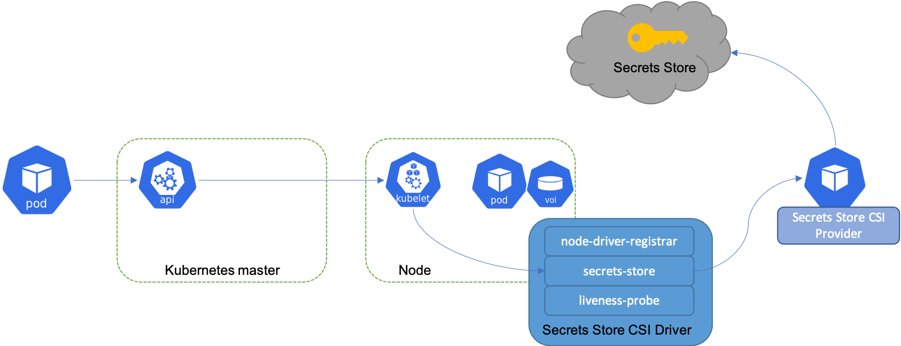
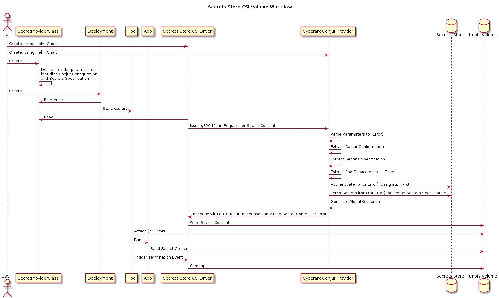

# Solution Design - CyberArk Conjur Provider for Secret Store CSI Driver

- [Glossary](#glossary)
- [Useful links](#useful-links)
- [Issue description](#issue-description)
- [Out of scope](#out-of-scope)
- [Solution](#solution)
  - [UX](#ux)
  - [Development Tasks](#development-tasks)
    - [Implementation Tasks](#implementation-tasks)
    - [Testing Tasks](#testing-tasks)
    - [Documentation Tasks](#documentation-tasks)
    - [Release Tasks](#release-tasks)
    - [Continuous Improvement](#continuous-improvement)
  - [Design](#design)
    - [Class diagram](#class-diagram)
    - [User flow](#user-flow)
  - [Implementation plan](#implementation-plan)
    - [Designs](#designs)
    - [Implementation](#implementation)
    - [Testing](#testing)
    - [Nice-to-haves](#nice-to-haves)
- [Backwards compatibility](#backwards-compatibility)
- [Performance](#performance)
- [Affected Components](#affected-components)
- [Security](#security)
- [Test Plan](#test-plan)
- [Logs](#logs)
- [Documentation](#documentation)
- [Open questions](#open-questions)

## Glossary

- **Kubernetes**: An open-source system for automating deployment, scaling, and management of containerized applications.

- **CyberArk Conjur**: A secrets management service that secures secrets used by machines and users, providing high scalability, flexibility, and a strong security model.

- **Container Storage Interface (CSI) Driver**: A standard for exposing arbitrary block and file storage systems to containerized workloads on Container Orchestration Systems.

- **Secrets Store CSI Driver**: A Kubernetes Container Storage Interface (CSI) Driver that provides secure access to secrets from secret stores. It operates as a bridge between the Kubernetes and the Secret Store (CyberArk Conjur, in our case).

- **authn-jwt**: An authentication method used by Conjur that authenticates the service via JSON Web Tokens (JWT). In this scenario, it uses the service account token of the Kubernetes workload to authenticate.

- **Helm**: The package manager for Kubernetes that simplifies deployment and configuration of applications on Kubernetes.

## Useful links

- [Kubernetes Documentation](https://kubernetes.io/docs/home/)
- [CyberArk Conjur Documentation](https://docs.conjur.org/Latest/en/Content/Home.htm)
- [Secrets Store CSI Driver](https://github.com/kubernetes-sigs/secrets-store-csi-driver)
- [CSI Specification](https://github.com/container-storage-interface/spec)
- [Helm Documentation](https://helm.sh/docs/)
- [CSI Driver & Provider Best Practices](https://secrets-store-csi-driver.sigs.k8s.io/topics/best-practices.html)

## Issue description

The Secrets Store CSI Driver `secrets-store.csi.k8s.io` allows Kubernetes to mount multiple secrets, keys, and certs stored in enterprise-grade external secrets stores into their pods as a volume. Once the Volume is attached, the data in it is mounted into the container's file system. The driver features a pluggable provider interface developers can implement that defines the actions of the Secrets Store CSI driver. The driver uses gRPC to communicate with the provider, which implements a gRPC server. 



Please consult the [Secrets Store CSI Driver the documentation](https://secrets-store-csi-driver.sigs.k8s.io/providers#implementing-a-provider-for-secrets-store-csi-driver
) for more details.

Our goal here is to implement a CyberArk Conjur provider for the Secrets Store CSI driver. This provider will authenticate to and fetch secrets from Conjur. These secrets are then made available to Kubernetes pods, providing a seamless and secure method of managing secrets. 

The value of the provider is that it has the focused responsibility of providing the capability of fetching secret content from CyberArk Conjur. The grander responsibility of coordinating with the lifecycle of a workload and creating volume mounts etc. falls on the Secrets Store CSI Driver.

## Out of scope

The following are outside the scope of this design:

- Using Kubernetes API to extract Conjur Configuration or Secret Specification. This will provider a better mechanism for handling the various bits of cofiguration required by Conjur. In this first pass the `SecretsProviderClass` will hold all configuration related information.
- Adopting the same Secret Specification format as Secrets Provider
- Details on setting up CyberArk Conjur.
- Integration with other Kubernetes CSI drivers.
- Management of secrets within CyberArk Conjur.

## Solution

The CyberArk Conjur provider is a gRPC server that listens on a Unix domain socket. It implements [the `CSIDriverProviderServer` interface](https://github.com/kubernetes-sigs/secrets-store-csi-driver/blob/2f3535d4e318a35b76bafb728650a15271f8d4d1/provider/v1alpha1/service_grpc.pb.go#L77-L84), which is defined by the Secrets Store CSI Driver project. 

The interface currently has 2 methods, `Version` for metadata and version information and `Mount` for handling secret content requests. The bulk of the work for the provider will be to implement the `Mount` method which takes arguemnt  `MountRequest`, containing configuration parameters and the Kubernetes service account token of the requesting workload. The provider will use the Kubernetes service account token to authenticate to Conjur via the the `authn-jwt` authenticator. Once, authenticated the provider must fetch the appropriate secrets, and incorporate the values into the `MountResponse`. These secrets are then made available to Kubernetes pods, providing a seamless and secure method of managing secrets. 


Please consult the [Secrets Store CSI Driver the documentation](https://secrets-store-csi-driver.sigs.k8s.io/providers#implementing-a-provider-for-secrets-store-csi-driver
) for more details.

A proof of concept (POC) has been created as part of this solution design. The POC is available at [./conjur_csi_provider_poc](./conjur_csi_provider_poc). The primrary motivation behind the POC is to validate assumptions, though it can also be used as a foundation during the implementation phase of this solution design. The POC demonstrates the complete workflow of an application consuming secrets, written into an attached volume at startup by the POC provider that authenticates and fetches secrets from Conjur.

### UX

Here we describe the end-to-end user experience of using the CyberArk Conjur Provider for the Secrets Store CSI Driver.

1. Prerequisites:
    - A functional Kubernetes Cluster.
    - Helm.
2. Deploy (or update) Conjur Provider
    - Configure the CyberArk Conjur provider by providing necessary credentials and settings specific to the Conjur environment.
    - Deploy the CyberArk Conjur provider's Helm chart, tailored to automate and simplify the setup process.
    - The provider is deployed as a DaemonSet. Each node has its own provider instace.
3. Deploy Secrets Store CSI Driver
    - Deploy the Secrets Store CSI Driver's Helm chart with the necessary configurations.
4. Create `SecretProviderClass`
    - Create a `SecretProviderClass` custom resource that defines the provider configurations and parameters, along with optional `secretObjects` if needed  (see Kubernetes Secrets sync below).
    - This resource specifies the type of provider and the parameters required to communicate with the secret store.
    ```yaml
    apiVersion: secrets-store.csi.x-k8s.io/v1alpha1
    kind: SecretProviderClass
    metadata:
      name: conjur-provider
    spec:
      provider: conjur
      parameters:
        authnUrl: https://conjur-auth.some-org.com # optional, defaults to applianceUrl value
        applianceUrl: https://conjur.some-org.com
        account: some-org
        authnLogin: path/to/some-policy/some-host
        policyPath: path/to/some-policy/with-secrets # defaults to /
        secrets: |
          - "file/path/to/secret/db/username": "conjur/path/to/db/username" # key is file path, value is conjur path
          - "file/path/to/secret/db/password": "conjur/path/to/db/password"
    ```
5. Update application deployment manifest
    - Update your application's deployment YAML to incorporate the Secrets Store CSI Driver.
    ```yaml
    apiVersion: v1
    kind: Pod
    metadata:
      name: mypod
    spec:
      containers:
      - name: mycontainer
        image: myimage
        volumeMounts:
        - name: secrets-store-inline
          mountPath: "/mnt/secrets-store"
          readOnly: true
      volumes:
      - name: secrets-store-inline
        csi:
          driver: secrets-store.csi.k8s.io
          readOnly: true
          volumeAttributes:
            secretProviderClass: "conjur-provider"
    ```
6. Run workloads
    - Upon pod startup or restart, the Secrets Store CSI Driver initiates communication with the CyberArk Conjur provider.
    - Secrets are fetched and stored in a mounted volume within the pod as `tmpfs`.
    - If secrets retrieval or volume mounting encounters errors, the pod's startup process will halt. This precaution ensures that workloads do not initiate without successful secrets provisioning. The system leaves breakcrumbs of the error in different places e.g. in pod lifecycle events, and in the provider logs.
    - TODO: confirm if there are retries or caching

7. Verification
    - Validate the successful injection of secrets by inspecting the mounted volume, confirming the presence of expected secret content.
    - Verify the application's capability to access these secrets as files within the mounted volume.
8. Optional: Sync with Kubernetes Secrets
    - Optionally, enable synchronization with Kubernetes secrets through the `secretObjects` field in the `SecretProviderClass`.
    - This automatically populates Kubernetes secrets based on the fetched content, enhancing flexibility and aligning with Kubernetes native workflows.
9. Optional: Set as Environment Variables
    - When needed, configure environment variables within your application's deployment YAML to reference secrets from Kubernetes secrets.
    - Alternatively, application pods can directly access secrets from the mounted volume.
10. Optional: Enable Auto Rotation (alpha)
    - To enable dynamic secret updates without restarting pods, consider enabling auto rotation.
    - Activate the `--enable-secret-rotation` feature gate within the Secrets Store CSI Driver pods.
11. Application Scaling and Maintenance
    - As your application scales and pods are added or replaced, the Secrets Store CSI Driver ensures consistent secret mounting based on the `SecretProviderClass`.
12. Continuous Monitoring
    - Continuously monitor your application and the Secrets Store CSI Driver for optimal performance.

### Development Tasks

The implementation of the CyberArk Conjur provider for the Kubernetes Secrets Store CSI Driver will require several tasks to be completed. These tasks can be grouped into several categories: implementation, testing, documentation, and release.

#### Implementation Tasks

1. **Implement the Conjur Provider**: Develop a Go-based application that uses the CyberArk Conjur API to authenticate and fetch secrets. This application should implement the `CSIDriverProviderServer` interface, which includes the `Mount` and `Version` methods. These methods will need to communicate with the CyberArk Conjur API to fetch secrets and return them to the Secrets Store CSI Driver.

2. **Create the Helm Charts**: Develop the necessary Kubernetes resource definitions (Deployment, Service, etc.) and values files to manage the deployment of the Conjur provider. This Helm chart will allow users to easily deploy and configure the Conjur provider in their Kubernetes clusters.

3. **Integration with CyberArk Conjur**: The logic for the provider to authenticate with the Conjur API and fetch secrets needs to be developed. This will involve using the `authn-jwt` authenticator for authentication with the workload service account token and making API calls to fetch secrets. `conjur-api-go` supports the `authn-jwt` authenticator but we need to update it to allow passing in the service account token as an argument, as opposed to environment variable.

4. **Secret File Writing**: The logic for writing the fetched secrets to files at the path specified by the Secrets Store CSI Driver needs to be implemented.

5. **Error Handling**: Robust error handling should be implemented. This includes handling errors during authentication, secret fetching, and file writing. It also includes returning informative error messages to the Secrets Store CSI Driver.

6. **Logging**: Implement logging throughout the provider to assist with debugging and troubleshooting.

7. **Implement Health Check**: Implement a health check mechanism to monitor the status of the provider. This could involve creating a `/healthz` endpoint in the provider's application that returns HTTP 200 when the provider is running properly, or using Kubernetes liveness and readiness probes.

8. **Setup Linting**: Setup linting tools for Go (such as `golangci-lint` or `go vet`) to identify syntactic errors, problematic constructs, and departures from style guidelines. This will help in maintaining high-quality, idiomatic Go code.

9. **Setup Continuous Integration (CI)**: Setup a CI/CD pipeline to automatically build the provider, run tests, perform linting, and create Docker images on each commit or pull request. This will ensure code quality and prevent integration issues.

#### Testing Tasks

1. **Unit Testing**: Develop unit tests for all core functionality, including authentication, secret fetching, file writing, and error handling. These tests should mock the Conjur API and file system.

2. **Integration Testing**: Develop integration tests that run against a live Conjur instance and a Secrets Store CSI Driver instance. These tests should cover both successful operation and failure modes.

3. **Performance Testing**: Develop performance tests to ensure that the provider operates efficiently and does not negatively impact Kubernetes workload performance.

#### Documentation Tasks

1. **User Guide**: Write a user guide explaining how to use the CyberArk Conjur provider with the Secrets Store CSI Driver. This should include examples of how to specify secrets in Kubernetes workload manifests.

2. **Installation Guide**: Write a guide detailing how to install the CyberArk Conjur provider and integrate it with a running instance of the Secrets Store CSI Driver.

3. **Troubleshooting Guide**: Write a guide providing solutions for common problems that may occur when using the CyberArk Conjur provider.

#### Release Tasks

1. **Code Review**: Conduct a thorough code review of the entire provider. This should include a review of the code itself, the unit tests, and the integration tests.

2. **Security Audit**: Conduct a security audit to ensure that the provider securely handles sensitive data such as the service account token and the fetched secrets.

3. **Version Tagging**: Tag the first stable release of the provider. Use Semantic Versioning for version numbers.

4. **Release Announcement**: Write and publish a release announcement. This should include an overview of the CyberArk Conjur provider, links to the installation guide and user guide, and information about how to get support.

5. **Package the Release**: Package the provider as a Helm chart or an Operator for easy installation in Kubernetes clusters.

#### Continuous Improvement

1. **Feedback and Improvement**: Post deployment, feedback from users will be necessary to make continuous improvements to the solution. Set up channels for users to provide feedback and report issues. Implement a process for triaging and addressing this feedback in future releases??

### Design

#### Class diagram

The `CSIDriverProviderServer` interface includes the `Mount` and `Version` methods:

1. `Mount`: Invoked by the Secrets Store CSI Driver during the volume mount phase. The `MountRequest` object passed to this method contains several important fields:

   - `Attributes`: A string containing JSON-encoded attributes. These attributes contain properties needed for the provider to fetch secrets, such as the `authnUrl` and secret IDs. This is a flexible mechanism that allows for a variable set of attributes based on the provider's requirements.

   - `Secrets`: A string containing JSON-encoded secrets. These secrets contain sensitive data such as the Kubernetes service account token, which is used for authenticating with Conjur via the `authn-jwt` authenticator.

   - `TargetPath`: The path where the Secrets Store CSI Driver expects the secrets files to be written. The provider is responsible for fetching the requested secrets and writing them to this path.

   - `Permission`: A string containing JSON-encoded file permissions. These are the permissions that should be applied to the files containing the secrets.

   The `Mount` method's responsibilities are to authenticate with the Conjur instance, fetch the secrets specified in the `Attributes`, write these secrets to files at the `TargetPath`, and then return a `MountResponse` to the Secrets Store CSI Driver. The `MountResponse` includes metadata about the fetched secrets, such as their IDs and versions.

2. `Version`: Invoked by the Secrets Store CSI Driver to discover the provider's version information. This method returns a `VersionResponse` object that includes the version of the provider protocol, and the name and version of the provider's runtime.


#### User flow

Below is an a diagram that captures the workflow of using the proposed provider.



1. The user deploys the CyberArk Conjur provider using Helm. This involves configuring the Helm chart with the necessary parameters and deploying it to their Kubernetes cluster.
1. The user create an instance of the `SecretProviderClass` custom resource object for the CyberArk Conjur provider.
1. The user specifies, inside the Kubernetes workload manifests, the usage of the CyberArk Conjur provider by reference to the `SecretProviderClass` object.
1. The user deploys the workload.
1. When a pod associated with the workload starts, the Secrets Store CSI driver initiates communication with the CyberArk Conjur provider via the gRPC interface.
1. The CyberArk Conjur provider authenticates to the Conjur instance via authn-jwt using the service account token of the workload.
1. The CyberArk Conjur provider fetches the requested secrets from Conjur.
1. The fetched secrets are mounted into the pod's file system via the Secrets Store CSI driver.
1. The application in the pod can then consume the secrets.


### Implementation plan

#### Designs

- Design the UI/UX of the CyberArk Conjur provider e.g. the mechanism for specifying the secrets to fetch and where to write them

#### Implementation

- Implement the CyberArk Conjur provider according to the design.
- Create Helm charts for the deployment of the CyberArk Conjur provider.
- Implement logging and error handling in the CyberArk Conjur provider.

#### Testing

- Develop and run unit tests for the CyberArk Conjur provider.
- Develop and run integration tests that involve the Secrets Store CSI driver and the CyberArk Conjur provider.
- Develop and run end-to-end tests that cover the entire secret retrieval process, from Kubernetes workloads to fetching secrets from CyberArk Conjur.

#### Nice-to-haves

Nice-to-haves are additional features that, while not strictly necessary, could significantly enhance the user experience and the utility of the provider.
These features will likely not be included in the initial release of the CyberArk Conjur provider, but could be implemented in subsequent releases based on user feedback and the evolving needs of the Kubernetes community.

Here are some of the potential nice-to-have features:

1. **Reference Other Kubernetes Resources**: This feature would allow users to point the CyberArk Conjur provider to other Kubernetes resources. For instance, users could point to a 'golden' ConfigMap that contains Conjur configuration data. This would provide a dynamic and centralized way to manage Conjur configurations, and would be especially useful in large deployments where multiple applications are interacting with Conjur.

2. **Configurable Secret Templates**: Similar to the 'push-to-file' functionality in the Conjur Secrets Provider, the CyberArk Conjur provider could offer the ability to configure templates for writing secrets. This would give users the flexibility to customize the structure and format of the secret data that is written to their applications. For example, a user might want secrets to be written as a JSON object, as key-value pairs, or in another format that suits their application.

3. **Supported Provider Status**: While it's important for the Conjur provider to be functional and reliable, achieving the status of a 'supported provider' in the Kubernetes Secrets Store CSI Driver project would be a significant accomplishment. This would entail meeting certain criteria set by the Kubernetes community, including thorough documentation, robust testing, active maintenance, and more. Achieving this status would give users greater confidence in using the Conjur provider, and it could lead to increased adoption and feedback, helping to drive continuous improvement of the provider.


## Backwards compatibility

The solution is implemented as a new provider for the Secrets Store CSI Driver and will not impact existing providers or Kubernetes workloads not using this new provider.

## Performance

Performance of this solution depends on the responsiveness of the CyberArk Conjur instance and the network latency between the Kubernetes cluster and the Conjur instance. The CyberArk Conjur provider itself introduces minimal overhead as it simply passes secrets from Conjur to the Secrets Store CSI driver.

## Affected Components

- **New Component:** CyberArk Conjur provider for Secrets Store CSI driver.
- **Existing Component:** Secrets Store CSI driver.

## Security

The solution upholds high standards of security:

1. Communication between the CyberArk Conjur provider and Conjur happens over a secure channel.
2. `authn-jwt` ensures strong authentication with the use of cryptographically verifiable service account tokens.

## Test Plan

A comprehensive testing strategy will be employed:

1. **Unit tests:** Test individual functions and methods in the CyberArk Conjur provider.
2. **Integration tests:** Test the interaction of the CyberArk Conjur provider with the Secrets Store CSI driver and Conjur.
3. **End-to-end tests:** Test the entire workflow from a Kubernetes workload to fetching secrets from Conjur.

## Logs

Both the Secrets Store CSI driver and the CyberArk Conjur provider will generate logs. These will provide insights into authentication, secret retrieval, and error conditions. We only have explicit control of the provider logs.

## Documentation

The documentation will cover:

1. The deployment and configuration of the CyberArk Conjur provider.
2. The creation and usage of a `SecretProviderClass` that utilizes the CyberArk Conjur provider.
3. The configuration of Kubernetes workloads to use the CyberArk Conjur provider.

## Open questions
