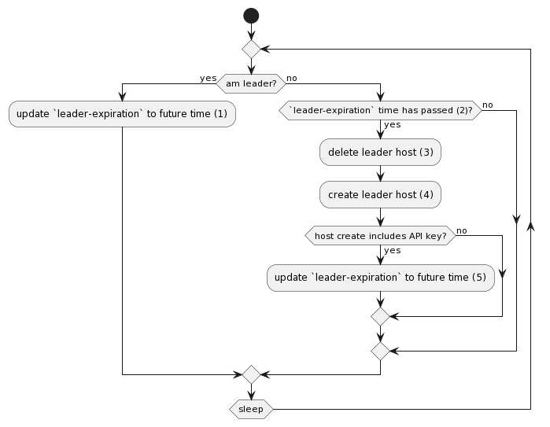

# Synchronizer Auto-Failover

The following is an overview of the workflow for a Vault Sychronizer to gain leadership:



Given the following Policy:
```yml
- !policy
  id: conjur
  body:
  - !policy
    id: vault-synchronizer
    body:
    - !variable leader-expiration

    # The Group all Synchronizer hosts need to be added to.
    - !group members

    - !permit
        role: !group members
        privileges: [ read, execute, update ]
        resources:
      - !variable leader-expiration

      - !policy
        id: leader
        owner: !group members

      - !policy
        id: vault-lines-of-business
        owner: !group members
        body:
        - !variable
              id: lob-1
              mime_type: application/json
        - !variable
              id: lob-2
              mime_type: application/json
```

The following are the steps (using the API) listed above:

1. Update `leader-expiration` to future time:

    ```sh
    POST /secrets/{account}/variable/conjur%2Fvault-synchronizer%2Fleader-expiration

    Time.now() + <time in seconds> // Save as Unix epoch time
    ```

1. `leader-expiration` time has passed:

    ```sh
    GET /secrets/{account}/variable/conjur%2Fvault-synchronizer%2Fleader-expiration
    ```

    Then compare returned Unix epoch time time to current Unix epoch time.

1. Delete leader host:

    ```sh
    PUT /policies/{account}/policy/conjur%2Fvault-synchronizer%2Fleader

    # Policy to delete the current leader
    - !delete
      record: !host current-leader
    ```

1. Create leader host:

    ```sh
    POST /policies/{account}/policy/conjur%2Fvault-synchronizer%2Fleader

    # Policy to delete the current leader
    - !host
      id: current-leader
      annotations:
        host: "<this synchronizer's host name>"
    ```

      If the above command returns a JSON object with an API, this Synchronizer is the new leader.  If not, another Synchronizer won.

      The annotation provides an indicator of the "current leader".

1. Update `leader-expiration` to future time:

    ```sh
    POST /secrets/{account}/variable/conjur%2Fvault-synchronizer%2Fleader-expiration

    Time.now() + <time in seconds> // Save as Unix epoch time
    ```
